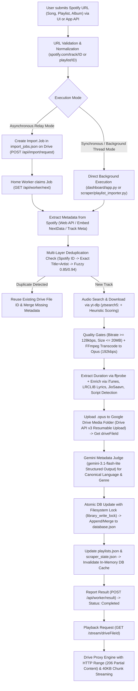

# Technical Context Package: Cloud Music Player (Wavify Backend & Dashboard)

> **Document Purpose**: Complete, authoritative, and lossless architectural, functional, and implementation specification for the Cloud Music Player (Wavify) ecosystem. This document contains complete source code for critical pipelines, full API specifications, schema definitions, and risk analysis to serve as an autonomous pairing context for AI and human engineers.

---

## 1. Project Overview

### 1.1 Directory Tree (3 Levels Deep)
```text
cloud-music-player/
  .env
  .gitignore
  PROJECT_CONTEXT.md
  README.md
  backfill_playlists.py
  check_track_page.py
  cleaned_saavn_data.json
  database.json
  jiosaavn.html
  oauth_credentials.json
  oauth_credentials.json.json
  oauth_setup.py
  patch.py
  patch2.py
  requirements.txt
  runtime.txt
  test_artists.py
  test_playlists.py
  test_stream.py
  token.json
.agents/
.github/
  workflows/
    keep_alive.yml
    music_crawler.yml
dashboard/
  app.py
  drive_client.py
  import_queue.py
  static/
    auth.js
    script.js
    style.css
  templates/
    gemini_backfill.html
    imported_playlists.html
    index.html
local_media/
scraper/
  admin_wipe_fields.py
  album_art_resolver.py
  artist_manager.py
  compressor.py
  downloader.py
  drive_uploader.py
  duration_resolver.py
  gemini_import_pipeline.py
  gemini_metadata_judge.py
  gemini_reporter.py
  gemini_schema.py
  lyrics_resolver.py
  main.py
  metadata_enricher.py
  operation_lock.py
  playlist_importer.py
  playlist_manager.py
  spotify_charts.py
  spotify_library_importer.py
  state_manager.py
  track_utils.py
  utils.py
  output/
temp/
  Interpol - Iron City.mp4
  generate_project_context.py
  scraper.pid
  test_fixes.py
tests/
  test_import_relay.py
worker/
  __init__.py
  home_worker.py
```

### 1.2 Tech Stack & Exact Dependency Versions
The project is built on Python 3.11 with a lightweight Flask backend and a modern vanilla JavaScript / CSS frontend dashboard. It integrates with Google Drive for cloud media storage and database persistence, Spotify Web API & embed scraping for catalog ingestion, `yt-dlp` and `FFmpeg` for audio streaming/transcoding, and Google Gemini for AI-driven metadata categorization.

#### Exact Environment Specifications
- **Runtime**: Python `3.11.9` (as defined in `runtime.txt`)
- **Web Framework**: Flask `3.1.3` (Werkzeug `3.1.8`, Jinja2 `3.1.6`, Click `8.4.2`, Blinker `1.9.0`, ItsDangerous `2.2.0`)
- **Package Manager**: `pip` (Python Virtual Environment `.venv`)
- **Core Dependencies (from `.venv` / `requirements.txt`)**:
  - `Flask==3.1.3`
  - `google-api-python-client==2.198.0` (Google Drive API v3)
  - `google-auth==2.56.0` & `google-auth-httplib2==0.4.0` (Google OAuth 2.0 & Service Account Auth)
  - `google-genai==2.11.0` (Google Gemini GenAI SDK)
  - `yt-dlp==2026.7.4` (YouTube Audio Scraping & Candidate Extraction)
  - `requests==2.34.2` (Synchronous HTTP Client)
  - `python-dotenv==1.2.2` (Environment Variable Management)
  - `pydantic==2.13.4` & `pydantic_core==2.46.4` (Structured Gemini Schema Enforcement)
  - `cryptography==49.0.0` (Cryptographic tokens & OAuth signature handling)
  - `urllib3==2.7.0` & `httplib2==0.32.0`
- **System Binaries**:
  - `ffmpeg` (Audio demuxing and transcoding to 192kbps Opus)
  - `ffprobe` (Accurate stream duration and codec probe)
- **Frontend Stack**:
  - Vanilla JavaScript (ES6+ Modules / Async-Await / Custom Events)
  - Vanilla CSS3 (Custom Properties / CSS Grid / Flexbox / Glassmorphism)
  - Semantic HTML5 (Flask Jinja2 Templates)
  - No CSS preprocessors or JS build bundles required (zero build step)

### 1.3 Entry Points
1. **Backend Web Server / API**:
   - Primary Entry Point: [`dashboard/app.py`](file:///c:/Users/Athul%20A%20Dileep/Athul/cloud-music-player/dashboard/app.py)
   - Serves the management dashboard, exposes REST API routes for playback streaming (`/stream/<drive_file_id>`), library mutations, job queuing, and background task management.
2. **Worker Daemon (Local Home PC Relay)**:
   - Primary Entry Point: [`worker/home_worker.py`](file:///c:/Users/Athul%20A%20Dileep/Athul/cloud-music-player/worker/home_worker.py)
   - Runs as a standalone background daemon on a trusted machine with YouTube access to pull queued import jobs (`/api/worker/next`), process downloads locally, upload audio to Google Drive, and report results back (`/api/worker/result`).
3. **Scheduled / Manual Crawler CLI**:
   - Primary Entry Point: [`scraper/main.py`](file:///c:/Users/Athul%20A%20Dileep/Athul/cloud-music-player/scraper/main.py)
   - Executes scheduled scraping workflows (e.g. GitHub Actions daily workflow `.github/workflows/music_crawler.yml`), chart scraping, deduplication, batch downloads, metadata backfills, and Gemini classification passes.
4. **OAuth 2.0 Token Generation CLI**:
   - Primary Entry Point: [`oauth_setup.py`](file:///c:/Users/Athul%20A%20Dileep/Athul/cloud-music-player/oauth_setup.py)
   - Runs a local browser authentication flow with `oauth_credentials.json` to generate `token.json` with Google Drive scopes.
5. **Frontend / UI Entry Points**:
   - Main Dashboard: [`dashboard/templates/index.html`](file:///c:/Users/Athul%20A%20Dileep/Athul/cloud-music-player/dashboard/templates/index.html) (routed via `GET /`)
   - Imported Playlists Manager: [`dashboard/templates/imported_playlists.html`](file:///c:/Users/Athul%20A%20Dileep/Athul/cloud-music-player/dashboard/templates/imported_playlists.html) (routed via `GET /imported-playlists`)
   - AI Database Backfill Studio: [`dashboard/templates/gemini_backfill.html`](file:///c:/Users/Athul%20A%20Dileep/Athul/cloud-music-player/dashboard/templates/gemini_backfill.html) (routed via `GET /gemini-backfill`)
   - Client Scripts: [`dashboard/static/script.js`](file:///c:/Users/Athul%20A%20Dileep/Athul/cloud-music-player/dashboard/static/script.js) and [`dashboard/static/auth.js`](file:///c:/Users/Athul%20A%20Dileep/Athul/cloud-music-player/dashboard/static/auth.js)
   - Stylesheet: [`dashboard/static/style.css`](file:///c:/Users/Athul%20A%20Dileep/Athul/cloud-music-player/dashboard/static/style.css)

### 1.4 Local Execution & Testing Commands

#### Running the Backend Web Server
```powershell
# Activate Virtual Environment (Windows PowerShell)
.venv\Scripts\Activate.ps1

# Run the Flask App directly (Default port: 5000)
python dashboard/app.py

# Or using Flask CLI
$env:FLASK_APP = "dashboard.app"
flask run --port 5000
```

#### Running the Home Import Worker Daemon
```powershell
$env:PYTHONPATH = "."
python worker/home_worker.py
```

#### Running Scraper and Backfill Tasks
```powershell
# Run the daily crawler (reads songs_per_run from config or env)
python scraper/main.py

# Run standalone artist or playlist verification scripts
python test_artists.py
python test_playlists.py
```

#### Running Unit and Integration Tests
```powershell
# Set PYTHONPATH to project root and run unittest discovery
$env:PYTHONPATH = "."
python -m unittest discover -s tests
```

### 1.5 Required Environment Variables / Config Keys
The system relies on keys defined in `.env` or system environment variables:

| Environment Variable | Category | Description |
|---|---|---|
| `GOOGLE_SERVICE_ACCOUNT` | Google Cloud | JSON string of Google Cloud Service Account credentials (fallback auth for Drive API). |
| `GDRIVE_FOLDER_ID` | Google Drive | Root Google Drive folder ID hosting project artifacts and database files. |
| `GDRIVE_DB_FILE_ID` | Google Drive | Explicit Drive file ID of `database.json` for O(1) retrieval without searching. |
| `GDRIVE_MEDIA_FOLDER_ID` | Google Drive | Dedicated Drive folder ID where `.opus` audio files are stored. |
| `GEMINI_API_KEY` | Google AI | API key for Google Gemini model (`gemini-3.1-flash-lite`) used for metadata categorization. |
| `SPOTIFY_CLIENT_ID` | Spotify Web API | Client ID from Spotify Developer Portal. |
| `SPOTIFY_CLIENT_SECRET` | Spotify Web API | Client Secret from Spotify Developer Portal. |
| `SPOTIFY_REFRESH_TOKEN` | Spotify Web API | Long-lived OAuth refresh token with library read scopes. |
| `SPOTIFY_ACCESS_TOKEN` | Spotify Web API | (Optional) Static bearer token fallback for Spotify Web API calls. |
| `WAVIFY_WORKER_TOKEN` | Worker Relay Auth | Pre-shared bearer token for securing `/api/worker/*` endpoints between Render and Home PC. |
| `RENDER_BASE_URL` | Worker Relay Auth | Base HTTPS URL of the hosted Render deployment (e.g. `https://wavify-proxy.onrender.com`). |
| `WORKER_POLL_INTERVAL_SECONDS` | Worker Relay | Polling interval (in seconds) for `worker/home_worker.py` when queue is idle (default: 10). |
| `DASHBOARD_WRITE_TOKEN` / `API_WRITE_TOKEN` / `APP_WRITE_TOKEN` | API Security | Secret tokens required in headers (`X-Dashboard-Token` / `X-App-Token` / `Authorization`) for state-modifying POST/DELETE routes. |
| `OAUTH_TOKEN` | Google OAuth | JSON string of `token.json` written on startup for cloud deployment without file uploads. |
| `OAUTH_CREDENTIALS` | Google OAuth | JSON string of `oauth_credentials.json` written on startup. |
| `LASTFM_API_KEY` | Multi-Provider Enricher | (Optional) Last.fm API Key used in fallback album/artist image search. |
| `TEMP_DIR` | Filesystem | (Optional) Custom path for staging downloads (defaults to `./temp`). |
| `SONGS_PER_RUN` | Scraper | (Optional) Number of tracks to download per automated crawler run (default: 5 or 7). |

---

## 2. Spotify-to-Drive Download Pipeline

### 2.1 Step-by-Step Flow Architecture



#### Detailed Phase Breakdown:
1. **Request Intake & Normalization**:
   - URLs are received at `/api/import/request`, `/api/add-song`, `/api/app/song/add`, `/api/playlist/start`, or `/api/playlist/queue/start`.
   - `_normalize_spotify_playlist_url` and `_canonical_import_url` extract standard IDs and sanitize query parameters.
2. **Metadata Extraction**:
   - `scraper/spotify_charts.py` (`get_track_by_spotify_url`): Scrapes `https://open.spotify.com/embed/track/<id>` extracting `__NEXT_DATA__` JSON with title, artists, duration, and album art. Falls back to scraping `og:title` / `og:description` meta tags.
   - `scraper/spotify_library_importer.py` (`fetch_spotify_library_playlist_tracks`): Uses Spotify Web API `GET /v1/playlists/<id>/tracks` with OAuth2 Bearer token (paginated, 50 tracks/chunk) to retrieve official titles, artists, album names, album art images, and durations.
   - `scraper/playlist_importer.py` (`scrape_spotify_embed_playlist`): Scrapes Spotify embed playlist pages for unauthenticated batch extraction.
3. **Deduplication Matrix**:
   - Handled across `scraper/state_manager.py` (`is_duplicate`) and `scraper/track_utils.py` (`find_existing_track`).
   - **Layer 1**: Spotify ID match against `scraper_state.json` `downloaded_ids` and `database.json`.
   - **Layer 2**: Exact normalized `title + artist` match against database.
   - **Layer 3**: Fuzzy sequence matching via `difflib.SequenceMatcher` against all existing records (threshold 0.85 in scraper state, 0.94 in track utils).
4. **Audio Search, Scoring, & Quality Enforcement**:
   - Handled in `scraper/downloader.py` (`download_track`).
   - Executes `yt-dlp` query `ytsearch5:{safe_artist} - {safe_title} official audio`.
   - Heuristically scores search results: adds points for artist channel (+15), VEVO (+8), Topic channels (+8), official title (+5), audio (+3); deducts points for covers (-25), fan-made (-20), reactions (-30), karaoke (-25), mashups (-15).
   - Validates file size (max 20MB) and audio bitrate (`abr` >= 128 kbps).
   - Uses `FFmpeg` (`FFmpegExtractAudio`) to transcode native streams into `.opus` at `192kbps` with standard Opus sample rate (48kHz).
5. **Local Metadata Enrichment**:
   - Handled in `scraper/metadata_enricher.py` (`enrich_track_metadata`).
   - **Duration**: `ffprobe` probes the downloaded file for exact integer seconds.
   - **Artwork & Genre**: Queries Apple iTunes Search API (`find_itunes_track_metadata`) with fallback to Deezer, JioSaavn, Last.fm, and Cover Art Archive (`scraper/album_art_resolver.py`). Upgrades iTunes art from `100x100` to `600x600bb`.
   - **Lyrics**: Queries LRCLIB (`lrclib.net/api/get` and `/api/search`) for plain and synchronized `.lrc` lyrics; falls back to JioSaavn (`saavn.dev`) and Lyrics.ovh (`scraper/lyrics_resolver.py`).
   - **Language & QA**: Analyzes Unicode character scripts in lyrics text (Devanagari, Malayalam, Tamil, Telugu, Kannada, Latin) and flags mixed-script lyrics (`lyricsStatus: "needs_review"`).
6. **Google Drive Upload**:
   - Handled in `scraper/drive_uploader.py` (`upload_track`) and `dashboard/drive_client.py` (`upload_media`).
   - Executes a resumable upload of the `.opus` file to `GDRIVE_MEDIA_FOLDER_ID`, returning a unique Google Drive file ID (e.g. `1JGo8S2-WagATODLDmPHcmvlWMC59nZOL`).
7. **Gemini AI Classification**:
   - Handled in `scraper/gemini_import_pipeline.py` and `scraper/gemini_metadata_judge.py`.
   - Submits structured JSON candidates to `gemini-3.1-flash-lite` using Pydantic `BatchMetadataResponse` schema.
   - Restricts language to canonical Wavify set (`english`, `hindi`, `tamil`, `malayalam`, `indian`, `spanish`, `korean`, `french`, `unknown`) and canonical genre buckets. Only suggestions with confidence > 0.6 are applied.
8. **Atomic Database Mutation**:
   - Enclosed in `library_write_lock` (`scraper/operation_lock.py`).
   - Downloads live `database.json`, constructs a normalized track schema (`scraper/track_utils.py`), merges or appends the record, and uploads back to Drive.
   - If an existing duplicate was uploaded concurrently, the newly uploaded media file is immediately deleted from Drive to prevent orphaned storage waste.
   - In-memory cache `_db_cache` is invalidated via `invalidate_db_cache()`.
9. **Streaming & Playback Delivery**:
   - Handled in `dashboard/app.py` (`stream_track` at `GET /stream/<drive_file_id>`).
   - Proxies Google Drive binary stream through `https://drive.usercontent.google.com/download?id=<id>&export=download&authuser=0&confirm=t`.
   - Automatically detects and parses HTML confirmation pages (for large files) to follow the real download link, or falls back to Google Drive API (`https://www.googleapis.com/drive/v3/files/<id>?alt=media&key=<key>`).
   - Forwards client `Range` header and responds with HTTP `206 Partial Content`, `Content-Range`, `Content-Length`, `Accept-Ranges: bytes`, and streams in 40 KB chunks.

---

### 2.2 Complete Source Code of Every File in the Spotify-to-Drive Flow
### File: `dashboard/import_queue.py`

```python
"""Small persistent import queue stored alongside database.json in Google Drive."""

import datetime
import uuid

from dashboard.drive_client import download_json, search_file_by_name, upload_json
from scraper.drive_uploader import get_db_file_id
from scraper.operation_lock import library_write_lock


QUEUE_FILENAME = "import_jobs.json"
TERMINAL_STATUSES = {"completed", "failed"}


class ImportJobNotFound(KeyError):
    pass


class ImportJobConflict(RuntimeError):
    pass


def _utc_now():
    return datetime.datetime.utcnow().isoformat() + "Z"


def _queue_location():
    _, parent_id = get_db_file_id()
    if not parent_id:
        raise RuntimeError("Could not determine the Google Drive database folder for import jobs.")
    return parent_id, search_file_by_name(QUEUE_FILENAME, parent_id)


def _load_jobs_unlocked(parent_id, file_id):
    if not file_id:
        return []
    data = download_json(file_id)
    if not isinstance(data, list):
        raise RuntimeError(f"{QUEUE_FILENAME} must contain a JSON array.")
    return data


def _save_jobs_unlocked(parent_id, file_id, jobs):
    return upload_json(file_id, jobs, QUEUE_FILENAME, parent_id=parent_id)


def create_import_job(url, job_type, requested_by=None):
    now = _utc_now()
    job = {
        "job_id": str(uuid.uuid4()),
        "url": url,
        "type": job_type,
        "requested_by": requested_by,
        "status": "pending",
        "created_at": now,
        "updated_at": now,
        "started_at": None,
        "finished_at": None,
        "result": None,
        "error": None,
    }

    with library_write_lock("import_jobs"):
        parent_id, file_id = _queue_location()
        jobs = _load_jobs_unlocked(parent_id, file_id)
        jobs.append(job)
        _save_jobs_unlocked(parent_id, file_id, jobs)
    return job


def get_import_job(job_id):
    parent_id, file_id = _queue_location()
    jobs = _load_jobs_unlocked(parent_id, file_id)
    for job in jobs:
        if job.get("job_id") == job_id:
            return job
    raise ImportJobNotFound(job_id)


def claim_next_import_job():
    """Claim the oldest pending job. This relay intentionally supports one worker."""
    with library_write_lock("import_jobs"):
        parent_id, file_id = _queue_location()
        jobs = _load_jobs_unlocked(parent_id, file_id)
        pending = [job for job in jobs if job.get("status") == "pending"]
        if not pending:
            return None

        job = min(pending, key=lambda item: item.get("created_at") or "")
        now = _utc_now()
        job["status"] = "processing"
        job["started_at"] = now
        job["updated_at"] = now
        job["error"] = None
        _save_jobs_unlocked(parent_id, file_id, jobs)
        return job


def set_import_job_result(job_id, status, result=None, error=None):
    if status not in TERMINAL_STATUSES:
        raise ValueError("Worker result status must be 'completed' or 'failed'.")

    with library_write_lock("import_jobs"):
        parent_id, file_id = _queue_location()
        jobs = _load_jobs_unlocked(parent_id, file_id)
        job = next((item for item in jobs if item.get("job_id") == job_id), None)
        if not job:
            raise ImportJobNotFound(job_id)

        # Result reporting is idempotent so the home worker can safely retry HTTPS.
        if job.get("status") in TERMINAL_STATUSES:
            if job.get("status") == status:
                return job
            raise ImportJobConflict(f"Job {job_id} is already {job.get('status')}.")
        if job.get("status") != "processing":
            raise ImportJobConflict(f"Job {job_id} is not processing.")

        now = _utc_now()
        job["status"] = status
        job["result"] = result if status == "completed" else None
        job["error"] = str(error) if error else None
        job["updated_at"] = now
        job["finished_at"] = now
        _save_jobs_unlocked(parent_id, file_id, jobs)
        return job

```


### File: `worker/home_worker.py`

```python
"""Single-job Wavify import relay for a trusted home PC."""

import logging
import os
import sys
import time

import requests
from dotenv import load_dotenv


PROJECT_ROOT = os.path.dirname(os.path.dirname(os.path.abspath(__file__)))
if PROJECT_ROOT not in sys.path:
    sys.path.insert(0, PROJECT_ROOT)
load_dotenv(os.path.join(PROJECT_ROOT, ".env"))

from dashboard.drive_client import delete_file, download_json
from scraper.downloader import download_track
from scraper.drive_uploader import get_db_file_id, update_database, upload_track
from scraper.metadata_enricher import enrich_track_metadata
from scraper.playlist_importer import get_playlist_status, run_playlist_import, start_playlist_import
from scraper.spotify_charts import get_track_by_spotify_url
from scraper.state_manager import is_duplicate, load_state, save_state
from scraper.track_utils import find_existing_track


logging.basicConfig(
    level=logging.INFO,
    format="%(asctime)s - home_worker - %(levelname)s - %(message)s",
)
logger = logging.getLogger("home_worker")

WORKER_TEMP_SUFFIXES = (".part", ".opus", ".webm", ".m4a", ".mp3", ".ogg", ".wav", ".mp4")


def _temp_dir():
    return os.environ.get("TEMP_DIR") or os.path.join(PROJECT_ROOT, "temp")


def _temp_snapshot():
    temp_dir = _temp_dir()
    os.makedirs(temp_dir, exist_ok=True)
    return {entry.name for entry in os.scandir(temp_dir) if entry.is_file()}


def _cleanup_new_temp_files(before):
    temp_dir = _temp_dir()
    for entry in os.scandir(temp_dir):
        if not entry.is_file() or entry.name in before:
            continue
        if not entry.name.lower().endswith(WORKER_TEMP_SUFFIXES):
            continue
        try:
            os.remove(entry.path)
        except OSError as cleanup_error:
            logger.warning("Could not remove worker temporary file %s: %s", entry.name, cleanup_error)


def _existing_tracks():
    db_file_id, _ = get_db_file_id()
    if not db_file_id:
        return []
    data = download_json(db_file_id)
    if isinstance(data, list):
        return data
    if isinstance(data, dict) and isinstance(data.get("tracks"), list):
        return data["tracks"]
    return []


def process_song(job):
    metadata = get_track_by_spotify_url(job["url"])
    title = metadata["title"]
    artist = metadata["artist"]
    spotify_id = metadata.get("spotify_id")
    requested_by = job.get("requested_by")
    tracks = _existing_tracks()
    scraper_state = load_state()
    candidate = {"title": title, "artist": artist, "spotify_id": spotify_id}

    if is_duplicate(candidate, scraper_state, tracks):
        existing, _ = find_existing_track(tracks, candidate)
        return {
            "type": "song",
            "title": title,
            "artist": artist,
            "driveFileId": (existing or {}).get("driveFileId") or (existing or {}).get("id"),
            "skipped_duplicate": True,
        }

    temp_dir = _temp_dir()
    os.makedirs(temp_dir, exist_ok=True)
    local_path = None
    uploaded_id = None
    try:
        local_path = download_track(title, artist, temp_dir, track_id=spotify_id)
        enriched = enrich_track_metadata(
            title,
            artist,
            local_file_path=local_path,
            source="home_relay_song",
        )
        uploaded_id = upload_track(local_path)
        db_metadata = {
            "title": title,
            "artist": artist,
            "album": enriched.get("album", "Single"),
            "genre": enriched.get("genre", metadata.get("genre", "Unknown")),
            "duration": enriched.get("duration", "--:--"),
            "durationSeconds": enriched.get("durationSeconds"),
            "spotify_id": spotify_id,
            "album_art": enriched.get("album_art") or metadata.get("album_art"),
            "language": enriched.get("language", metadata.get("language", "unknown")),
            "source": "home_relay_song",
            "requestedBy": requested_by,
            "lyrics": enriched.get("lyrics"),
            "syncedLyrics": enriched.get("syncedLyrics"),
            "lyricsStatus": enriched.get("lyricsStatus", "ok"),
        }

        try:
            update_result = update_database(uploaded_id, db_metadata)
        except Exception:
            try:
                delete_file(uploaded_id)
            except Exception as cleanup_error:
                logger.warning("Could not delete uploaded media after database failure: %s", cleanup_error)
            uploaded_id = None
            raise

        final_drive_id = uploaded_id
        if isinstance(update_result, dict) and update_result.get("duplicate"):
            final_drive_id = update_result.get("track_id") or uploaded_id
            if uploaded_id and final_drive_id != uploaded_id:
                try:
                    delete_file(uploaded_id)
                except Exception as cleanup_error:
                    logger.warning("Could not delete duplicate uploaded media: %s", cleanup_error)
                uploaded_id = None

        latest_state = load_state()
        if spotify_id and spotify_id not in latest_state.setdefault("downloaded_ids", []):
            latest_state["downloaded_ids"].append(spotify_id)
        title_key = f"{title} {artist}"
        if title_key not in latest_state.setdefault("downloaded_titles", []):
            latest_state["downloaded_titles"].append(title_key)
        save_state(latest_state)

        return {
            "type": "song",
            "title": title,
            "artist": artist,
            "driveFileId": final_drive_id,
            "skipped_duplicate": False,
        }
    finally:
        if local_path and os.path.exists(local_path):
            try:
                os.remove(local_path)
            except OSError as cleanup_error:
                logger.warning("Could not remove temporary audio file: %s", cleanup_error)


def process_playlist(job):
    playlist_id = start_playlist_import(
        job["url"],
        device_id=job.get("requested_by"),
        imported_via="home_worker",
    )
    run_playlist_import(playlist_id, source_override="home_relay_playlist")
    state = get_playlist_status(playlist_id)
    if state.get("status") == "failed":
        raise RuntimeError(state.get("error") or "Playlist import failed")
    return {
        "type": "playlist",
        "playlist_id": playlist_id,
        "playlist_name": state.get("playlist_name"),
        "status": state.get("status"),
        "processed": state.get("processed", 0),
        "downloaded": state.get("downloaded", 0),
        "skipped": state.get("skipped", 0),
        "failed": state.get("failed", 0),
    }


def process_job(job):
    if job.get("type") == "song":
        return process_song(job)
    if job.get("type") == "playlist":
        return process_playlist(job)
    raise ValueError(f"Unsupported import job type: {job.get('type')}")


class HomeWorker:
    def __init__(self):
        base_url = os.environ.get("RENDER_BASE_URL", "").strip().rstrip("/")
        token = os.environ.get("WAVIFY_WORKER_TOKEN", "").strip()
        if not base_url:
            raise RuntimeError("RENDER_BASE_URL is required.")
        if not base_url.lower().startswith("https://") and "localhost" not in base_url.lower():
            raise RuntimeError("RENDER_BASE_URL must use HTTPS (localhost is allowed for testing).")
        if not token:
            raise RuntimeError("WAVIFY_WORKER_TOKEN is required.")

        self.base_url = base_url
        self.poll_interval = max(1, int(os.environ.get("WORKER_POLL_INTERVAL_SECONDS", "10")))
        self.session = requests.Session()
        self.session.headers.update({"Authorization": f"Bearer {token}"})

    def next_job(self):
        response = self.session.get(f"{self.base_url}/api/worker/next", timeout=30)
        response.raise_for_status()
        return response.json().get("job")

    def report_until_accepted(self, payload):
        while True:
            try:
                response = self.session.post(
                    f"{self.base_url}/api/worker/result",
                    json=payload,
                    timeout=30,
                )
                response.raise_for_status()
                return
            except requests.RequestException as error:
                logger.error("Could not report job result; retrying in %s seconds: %s", self.poll_interval, error)
                time.sleep(self.poll_interval)

    def run_forever(self):
        logger.info("Home import worker started; polling %s", self.base_url)
        while True:
            try:
                job = self.next_job()
                if not job:
                    time.sleep(self.poll_interval)
                    continue

                job_id = job.get("job_id")
                logger.info("Processing %s job %s", job.get("type"), job_id)
                temp_before = _temp_snapshot()
                try:
                    result = process_job(job)
                    payload = {
                        "job_id": job_id,
                        "status": "completed",
                        "result": result,
                        "error": None,
                    }
                    logger.info("Job %s completed locally", job_id)
                except Exception as error:
                    logger.exception("Job %s failed", job_id)
                    payload = {
                        "job_id": job_id,
                        "status": "failed",
                        "result": None,
                        "error": str(error),
                    }
                finally:
                    _cleanup_new_temp_files(temp_before)
                self.report_until_accepted(payload)
            except requests.RequestException as error:
                logger.warning("Render is unavailable; retrying in %s seconds: %s", self.poll_interval, error)
                time.sleep(self.poll_interval)
            except Exception:
                logger.exception("Unexpected worker loop error; retrying in %s seconds", self.poll_interval)
                time.sleep(self.poll_interval)


if __name__ == "__main__":
    try:
        HomeWorker().run_forever()
    except KeyboardInterrupt:
        logger.info("Home import worker stopped")
    except Exception as startup_error:
        logger.error("Home import worker could not start: %s", startup_error)
        raise SystemExit(1)

```


### File: `scraper/downloader.py`

```python
import os
import time
import random
import logging
import subprocess
import yt_dlp

# Configure logger
logger = logging.getLogger(__name__)
if not logger.handlers:
    handler = logging.StreamHandler()
    formatter = logging.Formatter('%(asctime)s - %(name)s - %(levelname)s - %(message)s')
    handler.setFormatter(formatter)
    logger.addHandler(handler)
    logger.setLevel(logging.INFO)

def check_ffmpeg_available():
    """
    Checks if ffmpeg is available in the system PATH.
    """
    try:
        # Run ffmpeg -version with subprocess to verify if it is in PATH
        result = subprocess.run(['ffmpeg', '-version'], stdout=subprocess.PIPE, stderr=subprocess.PIPE)
        return result.returncode == 0
    except FileNotFoundError:
        return False
    except Exception as e:
        logger.warning(f"Error checking ffmpeg presence: {e}")
        return False

def sanitize_filename(filename):
    """
    Removes characters that are invalid in Windows/Unix filenames.
    """
    invalid_chars = '<>:"/\\|?*'
    for char in invalid_chars:
        filename = filename.replace(char, '')
    return filename.strip()

def choose_best_video(entries, artist):
    """
    Heuristically filters search results to prefer official artist uploads
    and music videos over fan uploads or covers.
    """
    if not entries:
        return None
        
    best_entry = None
    highest_score = -100
    artist_lower = artist.lower()
    
    for entry in entries:
        score = 0
        channel = entry.get('channel', '').lower()
        title = entry.get('title', '').lower()
        
        # Positive indicators:
        if artist_lower in channel:
            score += 15
        if 'vevo' in channel or 'vevo' in title:
            score += 8
        if 'topic' in channel:
            score += 8
        if 'official' in title:
            score += 5
        if 'audio' in title:
            score += 3
        if 'video' in title:
            score += 2
            
        # Negative indicators (avoid covers, fan-made, reactions, etc.):
        if 'cover' in title and 'cover' not in artist_lower:
            score -= 25
        if 'fan made' in title or 'fan-made' in title or 'fanmade' in title:
            score -= 20
        if 'reaction' in title:
            score -= 30
        if 'mashup' in title:
            score -= 15
        if 'karaoke' in title:
            score -= 25
            
            
        logger.debug(f"Candidate: '{title}' by channel '{channel}' - Score: {score}")
        
        if score > highest_score:
            highest_score = score
            best_entry = entry
            
    if highest_score < 0:
        return None
        
    return best_entry if best_entry else entries[0]

def download_track(title, artist, output_dir, track_id=None, cancel_check_callback=None):
    """
    Downloads the best quality audio for a track using yt-dlp.
    Searches YouTube, enforces quality controls, and saves as '{track_id}.opus' (or fallback).
    Returns the absolute path of the downloaded file.
    """
    # Create output directory if it doesn't exist
    if not os.path.exists(output_dir):
        os.makedirs(output_dir)
        
    # Respect random delay before starting the query to avoid bot detection
    delay = random.uniform(1.5, 4.0)
    logger.info(f"Waiting {delay:.2f} seconds before searching YouTube...")
    time.sleep(delay)
    
    # Clean the artist/title to form a safe query
    safe_artist = sanitize_filename(artist)
    safe_title = sanitize_filename(title)
    
    if track_id:
        out_filename = sanitize_filename(str(track_id))
    else:
        out_filename = f"{safe_artist} - {safe_title}"
    
    search_query = f"ytsearch5:{safe_artist} - {safe_title} official audio"
    logger.info(f"Searching YouTube for: '{search_query}'")
    
    # We will search first without downloading to examine uploader, size, and bitrate
    ydl_opts_search = {
        'format': 'bestaudio/best',
        'quiet': True,
        'extract_flat': True,  # Fetch metadata without downloading
        'prefer_free_formats': True,
        'socket_timeout': 30,
        'retries': 3,
        'extractor_args': {'youtube': {'player_client': ['ios', 'android', 'web']}},
    }
    if os.path.exists('/tmp/cookies.txt'):
        ydl_opts_search['cookiefile'] = '/tmp/cookies.txt'
    
    try:
        with yt_dlp.YoutubeDL(ydl_opts_search) as ydl:
            search_results = ydl.extract_info(search_query, download=False)
            entries = search_results.get('entries', [])
            
        if not entries:
            raise ValueError(f"No search results found on YouTube for query: {search_query}")
            
        # Score and sort all entries
        scored_entries = []
        artist_lower = artist.lower()
        for entry in entries:
            score = 0
            channel = entry.get('channel', '').lower()
            title = entry.get('title', '').lower()
            
            # Positive indicators:
            if artist_lower in channel:
                score += 15
            if 'vevo' in channel or 'vevo' in title:
                score += 8
            if 'topic' in channel:
                score += 8
            if 'official' in title:
                score += 5
            if 'audio' in title:
                score += 3
            if 'video' in title:
                score += 2
                
            # Negative indicators (avoid covers, fan-made, reactions, etc.):
            if 'cover' in title and 'cover' not in artist_lower:
                score -= 25
            if 'fan made' in title or 'fan-made' in title or 'fanmade' in title:
                score -= 20
            if 'reaction' in title:
                score -= 30
            if 'mashup' in title:
                score -= 15
            if 'karaoke' in title:
                score -= 25
                
            scored_entries.append((score, entry))
            
        # Sort by score descending
        scored_entries.sort(key=lambda x: x[0], reverse=True)
        
        # Filter out candidates that do not meet the minimum score threshold
        MIN_SCORE_THRESHOLD = 0
        valid_entries = [(s, e) for s, e in scored_entries if s >= MIN_SCORE_THRESHOLD]
        
        if not valid_entries:
            raise ValueError(f"No YouTube candidates met the minimum score threshold of {MIN_SCORE_THRESHOLD} for query: {search_query}")
        
        last_error = None
        for score, entry in valid_entries:
            video_url = entry.get('url') or entry.get('webpage_url') or f"https://www.youtube.com/watch?v={entry.get('id')}"
            logger.info(f"Attempting download for: '{entry.get('title')}' ({video_url}) [Score: {score}]")
            
            try:
                # Now extract the full details of this selected video
                ydl_opts_info = {
                    'format': 'bestaudio/best',
                    'quiet': True,
                    'prefer_free_formats': True,
                    'socket_timeout': 30,
                    'retries': 3,
                    'extractor_args': {'youtube': {'player_client': ['ios', 'android', 'web']}},
                }
                if os.path.exists('/tmp/cookies.txt'):
                    ydl_opts_info['cookiefile'] = '/tmp/cookies.txt'
                with yt_dlp.YoutubeDL(ydl_opts_info) as ydl:
                    video_info = ydl.extract_info(video_url, download=False)
                    
                # Quality control checks:
                
                # 1. Check file size limits (20MB)
                filesize = video_info.get('filesize') or video_info.get('filesize_approx')
                if filesize:
                    size_mb = filesize / (1024 * 1024)
                    logger.info(f"Target stream size: {size_mb:.2f} MB")
                    if filesize > 20 * 1024 * 1024:
                        logger.warning(f"Track exceeds size limit of 20MB. Trying next candidate.")
                        continue
                else:
                    logger.warning("Filesize could not be determined. Proceeding with caution.")
                    
                # 2. Check bitrate limits (minimum 128kbps)
                formats = video_info.get('formats', [])
                audio_formats = [f for f in formats if f.get('vcodec') == 'none' and f.get('acodec') != 'none']
                if not audio_formats:
                    audio_formats = [f for f in formats if f.get('acodec') != 'none']
                    
                audio_formats.sort(key=lambda x: x.get('abr') or x.get('tbr') or 0, reverse=True)
                best_format = audio_formats[0] if audio_formats else {}
                
                abr = best_format.get('abr') or best_format.get('tbr') or 0
                logger.info(f"Target format audio bitrate (abr): {abr} kbps")
                
                if abr > 0 and abr < 128:
                    logger.warning(f"Best available audio bitrate is below 128kbps (Actual: {abr} kbps). Trying next candidate.")
                    continue
                    
                # Check source codec
                source_codec = best_format.get('acodec', '')
                logger.info(f"Source audio codec is: '{source_codec}'")
                
                # Configure the downloader options
                ffmpeg_available = check_ffmpeg_available()
                out_filename = f"{safe_artist} - {safe_title}"
                final_opus_path = os.path.join(output_dir, f"{out_filename}.opus")
                
                ydl_opts_download = {
                    'format': 'bestaudio/best',
                    'outtmpl': os.path.join(output_dir, f"{out_filename}.%(ext)s"),
                    'max_filesize': 20 * 1024 * 1024,
                    'quiet': False,
                    'prefer_free_formats': True,
                    'socket_timeout': 30,
                    'retries': 3,
                    'extractor_args': {'youtube': {'player_client': ['ios', 'android', 'web']}},
                }
                if os.path.exists('/tmp/cookies.txt'):
                    ydl_opts_download['cookiefile'] = '/tmp/cookies.txt'
                    
                if cancel_check_callback:
                    def yt_dlp_progress_hook(d):
                        if cancel_check_callback():
                            raise Exception("Download cancelled by user")
                    ydl_opts_download['progress_hooks'] = [yt_dlp_progress_hook]

                
                if ffmpeg_available:
                    pp_opts = {
                        'key': 'FFmpegExtractAudio',
                        'preferredcodec': 'opus',
                    }
                    if 'opus' not in source_codec.lower():
                        logger.info("Source is not Opus. Transcoding to Opus at 192kbps.")
                        pp_opts['preferredquality'] = '192'
                    else:
                        logger.info("Source is already Opus. Remuxing without re-encoding.")
                        
                    ydl_opts_download['postprocessors'] = [pp_opts]
                else:
                    logger.warning("ffmpeg is not available. Downloading track in native format.")
                    
                # Execute the download
                with yt_dlp.YoutubeDL(ydl_opts_download) as ydl:
                    ydl.download([video_url])
                    
                # Verify output file path
                if os.path.exists(final_opus_path):
                    logger.info(f"Successfully saved track as Opus: {final_opus_path}")
                    return os.path.abspath(final_opus_path)
                    
                # If yt-dlp failed to convert, or if ffmpeg was not available during download, let's search for native file formats
                for ext in ['webm', 'm4a', 'mp3', 'ogg', 'wav']:
                    native_path = os.path.join(output_dir, f"{out_filename}.{ext}")
                    if os.path.exists(native_path):
                        if ffmpeg_available:
                            logger.info(f"Converting {ext} to opus using ffmpeg directly: {native_path}")
                            try:
                                subprocess.run([
                                    'ffmpeg', '-y', '-i', native_path,
                                    '-c:a', 'libopus', '-b:a', '192k',
                                    final_opus_path
                                ], check=True, stdout=subprocess.PIPE, stderr=subprocess.PIPE)
                                os.remove(native_path)
                                return os.path.abspath(final_opus_path)
                            except subprocess.CalledProcessError as e:
                                logger.error(f"FFmpeg manual conversion failed: {e.stderr.decode('utf-8', errors='ignore')}")
                                return os.path.abspath(native_path)
                        elif ext == 'webm' and 'opus' in source_codec.lower():
                            os.rename(native_path, final_opus_path)
                            logger.info(f"Renamed native webm/opus file to .opus: {final_opus_path}")
                            return os.path.abspath(final_opus_path)
                        else:
                            logger.warning(f"Saved track in native format due to missing ffmpeg: {native_path}")
                            return os.path.abspath(native_path)
                            
            except Exception as e:
                logger.warning(f"Failed download attempt for '{entry.get('title')}' using url '{video_url}': {e}")
                last_error = e
                continue
                
        if last_error:
            raise last_error
        raise ValueError(f"No suitable search results could be successfully downloaded for: {search_query}")
        
    except Exception as e:
        logger.error(f"Failed to download track '{artist} - {title}': {e}", exc_info=True)
        raise

```


### File: `scraper/drive_uploader.py`

```python
import os
import sys
import datetime
import logging
from dotenv import load_dotenv

# Configure logger
logger = logging.getLogger(__name__)
if not logger.handlers:
    handler = logging.StreamHandler()
    formatter = logging.Formatter('%(asctime)s - %(name)s - %(levelname)s - %(message)s')
    handler.setFormatter(formatter)
    logger.addHandler(handler)
    logger.setLevel(logging.INFO)

# Load env variables from .env in project root
project_root = os.path.dirname(os.path.dirname(os.path.abspath(__file__)))
env_path = os.path.join(project_root, '.env')
load_dotenv(dotenv_path=env_path)

# Add project root to sys.path to resolve dashboard package imports
if project_root not in sys.path:
    sys.path.append(project_root)

from dashboard.drive_client import upload_media, download_json, upload_json, list_files, delete_file
from scraper.album_art_resolver import resolve_album_art
from scraper.operation_lock import library_write_lock
from scraper.track_utils import (
    build_track_record,
    drive_id,
    extract_tracks,
    find_existing_track,
    merge_track,
    normalize_track_schema,
    replace_tracks,
    utc_now_iso,
)

def upload_database_json_locked(db_file_id, db_data, parent_folder_id):
    with library_write_lock("database"):
        return upload_json(db_file_id, db_data, 'database.json', parent_id=parent_folder_id)


def fetch_album_art(track_name, artist_name):
    """
    Resolves high-resolution album art from the shared multi-provider resolver.
    Returns None if no confident result is found.
    """
    try:
        return resolve_album_art(track_name, artist_name)
    except Exception as e:
        logger.warning(f"fetch_album_art: Failed for '{track_name}' by '{artist_name}': {e}")
        return None

def get_db_file_id():
    """
    Finds the database.json file on Google Drive, checking both the main folder
    and any 'database' subfolder. Returns a tuple: (db_file_id, parent_folder_id)
    """
    db_file_id = os.environ.get('GDRIVE_DB_FILE_ID')
    folder_id = os.environ.get('GDRIVE_FOLDER_ID')
    
    if db_file_id:
        return db_file_id, folder_id
        
    logger.info(f"GDRIVE_DB_FILE_ID not set. Searching for 'database.json' in folder: {folder_id}")
    files = []
    try:
        files = list_files(folder_id)
    except Exception as e:
        logger.error(f"Failed to list files in root folder {folder_id}: {e}")
        
    db_folder_id = None
    for f in files:
        if f.get('name') == 'database.json':
            db_file_id = f.get('id')
            logger.info(f"Found 'database.json' in root folder with ID: {db_file_id}")
            return db_file_id, folder_id
        elif f.get('name') == 'database' and f.get('mimeType') == 'application/vnd.google-apps.folder':
            db_folder_id = f.get('id')
            
    # If not found in root, check inside the 'database' subfolder if it exists
    if db_folder_id:
        logger.info(f"Searching for 'database.json' inside 'database' subfolder: {db_folder_id}")
        try:
            sub_files = list_files(db_folder_id)
            for sf in sub_files:
                if sf.get('name') == 'database.json':
                    db_file_id = sf.get('id')
                    logger.info(f"Found 'database.json' inside database subfolder with ID: {db_file_id}")
                    return db_file_id, db_folder_id
        except Exception as e:
            logger.error(f"Failed to list files in subfolder {db_folder_id}: {e}")
            
    # Default back to folder_id or db_folder_id if not found (for uploader target parent)
    target_parent = db_folder_id if db_folder_id else folder_id
    return None, target_parent

def upload_track(file_path, metadata=None):
    """
    Uploads the .opus file to the Google Drive media folder.
    Returns the Drive file ID of the uploaded file.
    """
    try:
        if not os.path.exists(file_path):
            raise FileNotFoundError(f"Local file does not exist: {file_path}")
            
        media_folder_id = os.environ.get('GDRIVE_MEDIA_FOLDER_ID')
        if not media_folder_id:
            raise ValueError("GDRIVE_MEDIA_FOLDER_ID environment variable is not set.")
            
        filename = os.path.basename(file_path)
        logger.info(f"Uploading file '{filename}' to Google Drive media folder ID: {media_folder_id}")
        
        drive_file_id = upload_media(file_path, media_folder_id, filename)
        logger.info(f"Successfully uploaded track to Drive. ID: {drive_file_id}")
        return drive_file_id
        
    except Exception as e:
        logger.error(f"Failed to upload track: {e}", exc_info=True)
        raise

def update_database(drive_file_id, metadata):
    """
    Downloads database.json from Drive, appends the new track details,
    and uploads the updated database back to Drive.
    """
    try:
        metadata = dict(metadata)
        title = metadata.get('title', 'Unknown Title')
        artist = metadata.get('artist', 'Unknown Artist')
        metadata["album_art"] = metadata.get("album_art") or metadata.get("albumArt") or fetch_album_art(title, artist)

        with library_write_lock("database"):
            db_file_id, parent_folder_id = get_db_file_id()

            db_data = []
            if db_file_id:
                logger.info(f"Downloading existing database.json (ID: {db_file_id}) from Drive...")
                db_data = download_json(db_file_id)
            else:
                logger.info("database.json not found on Drive. Creating a fresh index list.")

            tracks, was_dict = extract_tracks(db_data)
            now = utc_now_iso()
            new_track = build_track_record(drive_file_id, metadata, now=now)

            existing, reason = find_existing_track(tracks, new_track)
            if existing:
                existing_id = drive_id(existing)
                metadata["id"] = existing_id
                metadata["driveFileId"] = existing_id
                changed = merge_track(existing, new_track, now=now)
                if changed:
                    db_data = replace_tracks(db_data, tracks, was_dict)
                    upload_json(db_file_id, db_data, 'database.json', parent_id=parent_folder_id)
                    logger.info(f"Merged duplicate track '{title}' by '{artist}' into existing database record ({reason}).")
                    return {"id": db_file_id, "duplicate": True, "merged": True, "track_id": existing_id}
                logger.info(f"Skipped duplicate track '{title}' by '{artist}' ({reason}); database already has it.")
                return {"id": db_file_id, "duplicate": True, "merged": False, "track_id": existing_id}

            tracks.append(new_track)
            logger.info(f"Appending track '{new_track['title']}' to database.")

            db_data = replace_tracks(db_data, tracks, was_dict)
            result = upload_json(db_file_id, db_data, 'database.json', parent_id=parent_folder_id)
            logger.info("Successfully updated database.json on Google Drive.")
            return result
        
    except Exception as e:
        logger.error(f"Failed to update database: {e}", exc_info=True)
        raise

def bulk_update_database(new_tracks):
    """
    Downloads database.json from Drive, appends all tracks in new_tracks list,
    and uploads the updated database back to Drive.
    """
    try:
        prepared_tracks = []
        for metadata in new_tracks:
            title = metadata.get('title', 'Unknown Title')
            artist = metadata.get('artist', 'Unknown Artist')
            metadata["album_art"] = metadata.get("album_art") or metadata.get("albumArt") or fetch_album_art(title, artist)
            prepared_tracks.append(metadata)

        duplicate_media_to_delete = []
        upload_succeeded = True
        with library_write_lock("database"):
            db_file_id, parent_folder_id = get_db_file_id()

            db_data = []
            if db_file_id:
                logger.info(f"Downloading existing database.json (ID: {db_file_id}) from Drive for bulk update...")
                db_data = download_json(db_file_id)
            else:
                logger.info("database.json not found on Drive. Creating a fresh index list.")

            db_tracks, was_dict = extract_tracks(db_data)
            now = utc_now_iso()
            inserted = 0
            merged = 0
            changed = False

            for metadata in prepared_tracks:
                title = metadata.get('title', 'Unknown Title')
                artist = metadata.get('artist', 'Unknown Artist')
                record = build_track_record(metadata.get('id') or metadata.get('driveFileId'), metadata, now=now)

                existing, reason = find_existing_track(db_tracks, record)
                if existing:
                    incoming_id = drive_id(record)
                    existing_id = drive_id(existing)
                    metadata["id"] = existing_id
                    metadata["driveFileId"] = existing_id
                    if merge_track(existing, record, now=now):
                        changed = True
                        merged += 1
                    logger.info(f"Bulk update reused existing track '{title}' by '{artist}' ({reason}).")
                    if incoming_id and existing_id and incoming_id != existing_id:
                        duplicate_media_to_delete.append((incoming_id, existing_id))
                    continue

                db_tracks.append(record)
                inserted += 1
                changed = True
                logger.info(f"Appending track '{title}' to database in bulk.")

            if not changed:
                logger.info("bulk_update_database: No database changes needed.")
            else:
                db_data = replace_tracks(db_data, db_tracks, was_dict)
                try:
                    result = upload_json(db_file_id, db_data, 'database.json', parent_id=parent_folder_id)
                    upload_succeeded = True if result else False
                    logger.info(f"Successfully bulk updated database.json. Inserted: {inserted}, merged: {merged}.")
                except Exception as e:
                    logger.error(f"Failed to upload bulk update to Drive: {e}", exc_info=True)
                    upload_succeeded = False

        for incoming_id, existing_id in duplicate_media_to_delete:
            try:
                delete_file(incoming_id)
                logger.info(f"Deleted duplicate uploaded media file {incoming_id} after matching existing track {existing_id}.")
            except Exception as cleanup_err:
                logger.warning(f"Could not delete duplicate uploaded media file {incoming_id}: {cleanup_err}")

        return upload_succeeded

    except Exception as e:
        logger.error(f"Failed to bulk update database: {e}", exc_info=True)
        return False
def normalize_database():
    """
    Downloads database.json, normalizes all track fields according to the schema rules,
    creates a backup on Drive, and uploads the normalized database back to Drive.
    Returns a tuple: (tracks_changed, total_tracks)
    """
    try:
        db_file_id, parent_folder_id = get_db_file_id()
        if not db_file_id:
            raise ValueError("database.json file ID not found.")
            
        logger.info(f"normalize_database: Downloading database.json (ID: {db_file_id})...")
        db_data = download_json(db_file_id)
        
        is_dict = False
        tracks = []
        if isinstance(db_data, list):
            tracks = db_data
        elif isinstance(db_data, dict) and 'tracks' in db_data:
            tracks = db_data['tracks']
            is_dict = True
        else:
            raise ValueError("Database format is neither a list nor a dictionary containing 'tracks'.")
            
        tracks_changed = 0
        current_time = datetime.datetime.utcnow().isoformat() + 'Z'
        
        for track in tracks:
            changed = False
            
            if 'album_art' not in track:
                track['album_art'] = None
                changed = True
                
            if 'albumArt' not in track:
                track['albumArt'] = track['album_art']
                changed = True
                
            if 'duration' not in track or track['duration'] is None:
                track['duration'] = "--:--"
                changed = True
                
            if 'durationSeconds' not in track:
                track['durationSeconds'] = None
                changed = True
                
            if 'artist' not in track or track['artist'] is None:
                track['artist'] = "Unknown Artist"
                changed = True
                
            if 'title' not in track or track['title'] is None:
                track['title'] = "Unknown Title"
                changed = True
                
            if 'album' not in track or track['album'] is None:
                track['album'] = "Unknown Album"
                changed = True
                
            if 'genre' not in track or track['genre'] is None:
                track['genre'] = "Unknown"
                changed = True
                
            if 'language' not in track or track['language'] is None:
                track['language'] = "Unknown"
                changed = True
                
            if 'source' not in track or track['source'] is None:
                track['source'] = "unknown"
                changed = True
                
            if 'requestedBy' not in track:
                track['requestedBy'] = None
                changed = True
                
            if 'addedAt' not in track:
                track['addedAt'] = track.get('timestamp') or current_time
                changed = True
                
            if 'updatedAt' not in track:
                track['updatedAt'] = current_time
                changed = True
                
            if 'spotify_id' not in track:
                track['spotify_id'] = None
                changed = True
                
            if 'lyrics' not in track:
                track['lyrics'] = None
                changed = True
                
            if 'syncedLyrics' not in track:
                track['syncedLyrics'] = None
                changed = True
                
            if changed:
                tracks_changed += 1
                
        now = datetime.datetime.utcnow()
        backup_filename = f"database_backup_{now.strftime('%Y-%m-%d_%H-%M-%S')}.json"
        logger.info(f"normalize_database: Creating backup '{backup_filename}' in parent folder {parent_folder_id}...")
        upload_json(None, db_data, backup_filename, parent_id=parent_folder_id)
        
        logger.info("normalize_database: Uploading normalized database.json...")
        if is_dict:
            db_data['tracks'] = tracks
            upload_database_json_locked(db_file_id, db_data, parent_folder_id)
        else:
            upload_database_json_locked(db_file_id, tracks, parent_folder_id)
            
        logger.info(f"normalize_database: Finished. Normalized {tracks_changed} of {len(tracks)} tracks.")
        return tracks_changed, len(tracks)
        
    except Exception as e:
        logger.error(f"normalize_database failed: {e}", exc_info=True)
        raise

def backfill_lyrics_status():
    """
    Downloads database.json, adds the 'lyricsStatus' field (default 'ok') 
    to all tracks that don't have it, and uploads the database back to Drive.
    """
    try:
        db_file_id, parent_folder_id = get_db_file_id()
        if not db_file_id:
            raise ValueError("database.json file ID not found.")
            
        logger.info(f"backfill_lyrics_status: Downloading database.json (ID: {db_file_id})...")
        db_data = download_json(db_file_id)
        
        is_dict = False
        tracks = []
        if isinstance(db_data, list):
            tracks = db_data
        elif isinstance(db_data, dict) and 'tracks' in db_data:
            tracks = db_data['tracks']
            is_dict = True
        else:
            raise ValueError("Database format is neither a list nor a dictionary containing 'tracks'.")
            
        tracks_changed = 0
        
        from scraper.metadata_enricher import detect_script_mixing
        for track in tracks:
            old_status = track.get('lyricsStatus')
            lyrics = track.get('lyrics') or ""
            new_status = "needs_review" if detect_script_mixing(lyrics) else "ok"
            if old_status != new_status:
                track['lyricsStatus'] = new_status
                tracks_changed += 1
                
        if tracks_changed == 0:
            logger.info("backfill_lyrics_status: No tracks needed updating.")
            return 0
            
        logger.info(f"backfill_lyrics_status: Uploading updated database.json ({tracks_changed} tracks modified)...")
        if is_dict:
            db_data['tracks'] = tracks
            upload_database_json_locked(db_file_id, db_data, parent_folder_id)
        else:
            upload_database_json_locked(db_file_id, tracks, parent_folder_id)
            
        logger.info(f"backfill_lyrics_status: Finished backfilling {tracks_changed} tracks.")
        return tracks_changed
        
    except Exception as e:
        logger.error(f"backfill_lyrics_status failed: {e}", exc_info=True)
        raise

def audit_database_fields():
    """
    Downloads database.json (read only) and audits track fields for missing values.
    Returns a dictionary with total tracks, missing counts per field, and complete tracks.
    """
    try:
        db_file_id, _ = get_db_file_id()
        if not db_file_id:
            raise ValueError("database.json file ID not found.")
            
        logger.info(f"audit_database_fields: Downloading database.json (ID: {db_file_id})...")
        db_data = download_json(db_file_id)
        
        tracks = []
        if isinstance(db_data, list):
            tracks = db_data
        elif isinstance(db_data, dict) and 'tracks' in db_data:
            tracks = db_data['tracks']
        else:
            raise ValueError("Database format is neither a list nor a dictionary containing 'tracks'.")
            
        results = {
            "total_tracks": len(tracks),
            "missing_counts": {
                "album_art": 0,
                "duration": 0,
                "durationSeconds": 0,
                "language": 0,
                "genre": 0,
                "album": 0,
                "lyrics": 0,
                "syncedLyrics": 0,
                "source": 0,
                "spotify_id": 0
            },
            "complete_tracks": 0,
            "tracks_with_any_missing_field": 0
        }
        
        for track in tracks:
            missing_any = False
            
            # album_art / albumArt (missing if both are null/empty)
            album_art = track.get('album_art')
            album_art_camel = track.get('albumArt')
            if not album_art and not album_art_camel:
                results["missing_counts"]["album_art"] += 1
                missing_any = True
                
            # duration (missing if "--:--" or null/empty)
            duration = track.get('duration')
            if not duration or duration == "--:--":
                results["missing_counts"]["duration"] += 1
                missing_any = True
                
            # durationSeconds (missing if null)
            if track.get('durationSeconds') is None:
                results["missing_counts"]["durationSeconds"] += 1
                missing_any = True
                
            # language (missing if "Unknown"/"unknown"/null/empty)
            lang = track.get('language')
            if not lang or lang.lower() == "unknown":
                results["missing_counts"]["language"] += 1
                missing_any = True
                
            # genre (missing if "Unknown"/null/empty)
            genre = track.get('genre')
            if not genre or genre == "Unknown":
                results["missing_counts"]["genre"] += 1
                missing_any = True
                
            # album (missing if "Unknown Album"/null/empty)
            album = track.get('album')
            if not album or album == "Unknown Album":
                results["missing_counts"]["album"] += 1
                missing_any = True
                
            # lyrics (missing if null/empty)
            if not track.get('lyrics'):
                results["missing_counts"]["lyrics"] += 1
                missing_any = True
                
            # syncedLyrics (missing if null/empty)
            if not track.get('syncedLyrics'):
                results["missing_counts"]["syncedLyrics"] += 1
                missing_any = True
                
            # source (missing if "unknown"/null/empty)
            source = track.get('source')
            if not source or source == "unknown":
                results["missing_counts"]["source"] += 1
                missing_any = True
                
            # spotify_id (missing if null/empty) - don't count towards missing_any
            if not track.get('spotify_id'):
                results["missing_counts"]["spotify_id"] += 1
                
            if missing_any:
                results["tracks_with_any_missing_field"] += 1
            else:
                results["complete_tracks"] += 1
                
        logger.info(f"audit_database_fields: Audited {len(tracks)} tracks. {results['tracks_with_any_missing_field']} tracks have missing fields.")
        return results
        
    except Exception as e:
        logger.error(f"audit_database_fields failed: {e}", exc_info=True)
        raise

def find_orphan_media_files():
    """
    Compares Drive media files against database.json driveFileId/id values.
    Returns a read-only report of media files that are not referenced by the DB.
    """
    db_file_id, _ = get_db_file_id()
    if not db_file_id:
        raise ValueError("database.json file ID not found.")

    media_folder_id = os.environ.get('GDRIVE_MEDIA_FOLDER_ID')
    if not media_folder_id:
        raise ValueError("GDRIVE_MEDIA_FOLDER_ID environment variable is not set.")

    db_data = download_json(db_file_id)
    tracks, _ = extract_tracks(db_data)
    referenced_ids = {drive_id(track) for track in tracks if drive_id(track)}
    media_files = list_files(media_folder_id)
    orphans = [file_info for file_info in media_files if file_info.get("id") not in referenced_ids]

    return {
        "database_tracks": len(tracks),
        "media_files": len(media_files),
        "orphan_count": len(orphans),
        "orphans": orphans,
    }

def cleanup_orphan_media_files(dry_run=True):
    """
    Deletes media files not referenced by database.json when dry_run is False.
    Defaults to dry-run to prevent accidental destructive cleanup.
    """
    report = find_orphan_media_files()
    if dry_run:
        report["deleted_count"] = 0
        report["dry_run"] = True
        return report

    deleted = []
    errors = []
    for file_info in report["orphans"]:
        file_id = file_info.get("id")
        try:
            delete_file(file_id)
            deleted.append(file_info)
        except Exception as e:
            errors.append({"id": file_id, "name": file_info.get("name"), "error": str(e)})

    report["dry_run"] = False
    report["deleted_count"] = len(deleted)
    report["deleted"] = deleted
    report["errors"] = errors
    return report

def list_database_backups():
    """
    Lists all database_backup_*.json files in the database folder.
    Returns a list of dictionaries with 'id', 'name', and 'createdTime'.
    """
    try:
        _, parent_folder_id = get_db_file_id()
        files = list_files(parent_folder_id)
        backups = []
        for f in files:
            if 'backup' in f.get('name', '').lower() and f.get('name', '').endswith('.json'):
                backups.append(f)
        
        # Sort by createdTime descending
        backups.sort(key=lambda x: x.get('createdTime', ''), reverse=True)
        return backups
    except Exception as e:
        logger.error(f"list_database_backups failed: {e}", exc_info=True)
        return []

def restore_database_backup(backup_file_id):
    """
    Restores a specific backup to replace database.json.
    """
    try:
        db_file_id, parent_folder_id = get_db_file_id()
        if not db_file_id:
            logger.error("restore_database_backup: database.json not found on Drive.")
            return False
            
        logger.info(f"restore_database_backup: Downloading backup from ID {backup_file_id}...")
        backup_data = download_json(backup_file_id)
        
        if not backup_data:
            logger.error("restore_database_backup: Backup data is empty or failed to download.")
            return False
            
        logger.info(f"restore_database_backup: Uploading restored data to database.json (ID {db_file_id})...")
        upload_database_json_locked(db_file_id, backup_data, parent_folder_id)
        logger.info("restore_database_backup: Successfully restored database.json from backup.")
        return True
    except Exception as e:
        logger.error(f"restore_database_backup failed: {e}", exc_info=True)
        return False


if __name__ == '__main__':
    # Run a test upload of a small dummy file to the media folder
    import tempfile
    from dashboard.drive_client import get_oauth_drive_service

    print("Running Drive OAuth integration test...")
    
    # 1. Verify Drive Service connection and check storage quota
    try:
        service = get_oauth_drive_service()
        about = service.about().get(fields="storageQuota").execute()
        quota = about.get('storageQuota', {})
        limit = int(quota.get('limit', 0))
        usage = int(quota.get('usage', 0))
        limit_tb = limit / (1024**4)
        usage_gb = usage / (1024**3)
        print(f"Drive Storage Quota: Limit = {limit_tb:.2f} TB, Usage = {usage_gb:.2f} GB")
    except Exception as e:
        print(f"Failed to check storage quota: {e}")
        
    # 2. Upload a small dummy file
    temp_fd, temp_path = tempfile.mkstemp(suffix=".txt")
    try:
        with os.fdopen(temp_fd, 'w') as f:
            f.write("Google Drive API OAuth 2.0 Test Upload\n")
            
        filename = "test_oauth_dummy.txt"
        print(f"Uploading temporary file to Google Drive...")
        
        # We upload the dummy file using upload_track
        drive_file_id = upload_track(temp_path, metadata={'title': 'Test OAuth Dummy'})
        print(f"Success! Dummy file uploaded. Drive File ID: {drive_file_id}")
    except Exception as e:
        print(f"Upload failed: {e}")
    finally:
        try:
            if os.path.exists(temp_path):
                os.remove(temp_path)
        except Exception:
            pass


```


### File: `dashboard/drive_client.py`

```python
import os
import json
import io
import logging
from google.oauth2 import service_account
from google.oauth2.credentials import Credentials
from google.auth.transport.requests import Request
from googleapiclient.discovery import build
from googleapiclient.http import MediaIoBaseDownload, MediaInMemoryUpload, MediaFileUpload
from googleapiclient.errors import HttpError
import socket

# Add explicit timeout for all Google API HTTP requests to prevent hanging
socket.setdefaulttimeout(60)

# Configure logger
logger = logging.getLogger(__name__)
if not logger.handlers:
    handler = logging.StreamHandler()
    formatter = logging.Formatter('%(asctime)s - %(name)s - %(levelname)s - %(message)s')
    handler.setFormatter(formatter)
    logger.addHandler(handler)
    logger.setLevel(logging.INFO)

SCOPES = ['https://www.googleapis.com/auth/drive']

def _initialize_oauth_from_env():
    """
    Checks for OAUTH_TOKEN and OAUTH_CREDENTIALS environment variables.
    If present and non-empty, writes them to token.json and oauth_credentials.json 
    in the project root, enabling environments like Render to authenticate via env vars.
    """
    project_root = os.path.dirname(os.path.dirname(os.path.abspath(__file__)))
    
    oauth_token = os.environ.get('OAUTH_TOKEN')
    if oauth_token and oauth_token.strip():
        token_path = os.path.join(project_root, 'token.json')
        try:
            with open(token_path, 'w', encoding='utf-8') as f:
                f.write(oauth_token)
            logger.info("Wrote token.json from OAUTH_TOKEN environment variable")
        except Exception as e:
            logger.error(f"Failed to write token.json from environment variable: {e}")

    oauth_credentials = os.environ.get('OAUTH_CREDENTIALS')
    if oauth_credentials and oauth_credentials.strip():
        credentials_path = os.path.join(project_root, 'oauth_credentials.json')
        try:
            with open(credentials_path, 'w', encoding='utf-8') as f:
                f.write(oauth_credentials)
            logger.info("Wrote oauth_credentials.json from OAUTH_CREDENTIALS environment variable")
        except Exception as e:
            logger.error(f"Failed to write oauth_credentials.json from environment variable: {e}")

# Run initialization once on module import
_initialize_oauth_from_env()

def get_drive_service():
    """
    Builds and returns an authenticated Google Drive API v3 service object.
    Checks GOOGLE_SERVICE_ACCOUNT env var first, falling back to service_account.json in root.
    """
    credentials = None
    try:
        # 1. Try environment variable
        sa_env = os.environ.get('GOOGLE_SERVICE_ACCOUNT')
        if sa_env:
            try:
                info = json.loads(sa_env)
                credentials = service_account.Credentials.from_service_account_info(
                    info, scopes=SCOPES
                )
                logger.info("Authenticated successfully using credentials from GOOGLE_SERVICE_ACCOUNT environment variable.")
            except Exception as e:
                logger.error(f"Failed to load credentials from GOOGLE_SERVICE_ACCOUNT environment variable: {e}")

        # 2. Try local fallback file
        if not credentials:
            # Look in the project root (assumed to be parent directory or current directory)
            # Checking root directory path or just 'service_account.json'
            fallback_paths = [
                'service_account.json',
                os.path.join(os.path.dirname(os.path.dirname(os.path.abspath(__file__))), 'service_account.json')
            ]
            for path in fallback_paths:
                if os.path.exists(path):
                    try:
                        credentials = service_account.Credentials.from_service_account_file(
                            path, scopes=SCOPES
                        )
                        logger.info(f"Authenticated successfully using credentials from local file: {path}")
                        break
                    except Exception as e:
                        logger.error(f"Failed to load credentials from file {path}: {e}")

        if not credentials:
            raise ValueError("No valid service account credentials found. Please set GOOGLE_SERVICE_ACCOUNT env var or provide service_account.json.")

        service = build('drive', 'v3', credentials=credentials)
        return service

    except Exception as e:
        logger.error(f"Error building Drive service client: {e}", exc_info=True)
        raise

def get_oauth_drive_service():
    """
    Builds and returns an authenticated Google Drive API v3 service object using OAuth 2.0.
    If the token is expired, refreshes it automatically and saves it.
    Falls back to service account authentication if OAuth is unavailable.
    """
    credentials = None
    project_root = os.path.dirname(os.path.dirname(os.path.abspath(__file__)))
    token_paths = [
        'token.json',
        os.path.join(project_root, 'token.json')
    ]
    
    token_path = None
    for path in token_paths:
        if os.path.exists(path):
            token_path = path
            break
            
    if token_path:
        try:
            credentials = Credentials.from_authorized_user_file(token_path, SCOPES)
            if credentials and not credentials.valid:
                if credentials.expired and credentials.refresh_token:
                    logger.info("OAuth token is expired, refreshing automatically...")
                    credentials.refresh(Request())
                    with open(token_path, 'w') as token_file:
                        token_file.write(credentials.to_json())
                    logger.info("OAuth token refreshed and saved successfully.")
        except Exception as e:
            logger.error(f"Failed to load or refresh OAuth credentials from {token_path}: {e}")
            credentials = None
            
    if credentials and credentials.valid:
        try:
            service = build('drive', 'v3', credentials=credentials)
            logger.info("Authenticated successfully using OAuth credentials.")
            return service
        except Exception as e:
            logger.error(f"Failed to build Drive service using OAuth credentials: {e}")
            
    logger.info("OAuth authentication unavailable or invalid. Falling back to Service Account.")
    return get_drive_service()

def list_files(folder_id=None):
    """
    Lists all files in a given Drive folder.
    Returns a list of dicts with id, name, size, mimeType, createdTime.
    """
    try:
        service = get_oauth_drive_service()
        query = "trashed = false"
        if folder_id:
            query += f" and '{folder_id}' in parents"
        
        logger.info(f"Listing files with query: {query}")
        files = []
        page_token = None
        while True:
            results = service.files().list(
                q=query,
                fields="nextPageToken, files(id, name, size, mimeType, createdTime)",
                pageSize=1000,
                pageToken=page_token
            ).execute()
            files.extend(results.get('files', []))
            page_token = results.get('nextPageToken')
            if not page_token:
                break

        logger.info(f"Successfully retrieved {len(files)} files.")
        return files
    except HttpError as error:
        logger.error(f"Google API HttpError in list_files: {error}", exc_info=True)
        raise
    except Exception as e:
        logger.error(f"Unexpected error in list_files: {e}", exc_info=True)
        raise

def search_file_by_name(filename, parent_id=None):
    """
    Searches for a file by exact name within an optional parent folder.
    Returns the file ID if found, otherwise None.
    """
    try:
        service = get_oauth_drive_service()
        safe_filename = filename.replace("\\", "\\\\").replace("'", "\\'")
        query = f"name = '{safe_filename}' and trashed = false"
        if parent_id:
            query += f" and '{parent_id}' in parents"
        
        logger.info(f"Searching for file with query: {query}")
        results = service.files().list(
            q=query,
            fields="files(id, name)",
            pageSize=1
        ).execute()
        
        files = results.get('files', [])
        if files:
            logger.info(f"Found file '{filename}' with ID: {files[0].get('id')}")
            return files[0].get('id')
        return None
    except HttpError as error:
        logger.error(f"Google API HttpError in search_file_by_name: {error}", exc_info=True)
        raise
    except Exception as e:
        logger.error(f"Unexpected error in search_file_by_name: {e}", exc_info=True)
        raise

def download_json(file_id):
    """
    Downloads and parses a JSON file from Drive, returning a Python dict.
    """
    try:
        service = get_oauth_drive_service()
        logger.info(f"Downloading JSON file with ID: {file_id}")
        request = service.files().get_media(fileId=file_id)
        
        fh = io.BytesIO()
        downloader = MediaIoBaseDownload(fh, request)
        done = False
        while not done:
            status, done = downloader.next_chunk()
            
        fh.seek(0)
        content = fh.read().decode('utf-8')
        data = json.loads(content)
        logger.info(f"Successfully downloaded and parsed JSON file {file_id}.")
        return data
    except HttpError as error:
        logger.error(f"Google API HttpError in download_json: {error}", exc_info=True)
        raise
    except json.JSONDecodeError as e:
        logger.error(f"Failed to parse downloaded file as JSON: {e}", exc_info=True)
        raise
    except Exception as e:
        logger.error(f"Unexpected error in download_json: {e}", exc_info=True)
        raise

def upload_json(file_id, data, filename, parent_id=None):
    """
    Uploads/updates a JSON file on Drive with new data.
    If file_id is provided, updates the existing file. Otherwise, creates a new one.
    """
    try:
        service = get_oauth_drive_service()
        json_str = json.dumps(data, indent=2)
        media = MediaInMemoryUpload(json_str.encode('utf-8'), mimetype='application/json', resumable=True)
        
        if file_id:
            logger.info(f"Updating existing JSON file with ID: {file_id}")
            file = service.files().update(
                fileId=file_id,
                body={'name': filename},
                media_body=media,
                fields='id, name'
            ).execute()
            logger.info(f"Successfully updated JSON file: {file.get('name')} (ID: {file.get('id')})")
            return file
        else:
            logger.info(f"Creating new JSON file: {filename}")
            file_metadata = {
                'name': filename,
                'mimeType': 'application/json'
            }
            if parent_id:
                file_metadata['parents'] = [parent_id]
            file = service.files().create(
                body=file_metadata,
                media_body=media,
                fields='id, name'
            ).execute()
            logger.info(f"Successfully created JSON file: {file.get('name')} (ID: {file.get('id')})")
            return file
    except HttpError as error:
        logger.error(f"Google API HttpError in upload_json: {error}", exc_info=True)
        raise
    except Exception as e:
        logger.error(f"Unexpected error in upload_json: {e}", exc_info=True)
        raise

def upload_media(file_path, folder_id, filename):
    """
    Uploads a media file to a specific Drive folder.
    Returns the new file's Drive ID.
    """
    try:
        if not os.path.exists(file_path):
            raise FileNotFoundError(f"Local file not found: {file_path}")
            
        service = get_oauth_drive_service()
        logger.info(f"Uploading media file {file_path} to folder {folder_id} as {filename}")
        
        media = MediaFileUpload(file_path, mimetype='application/octet-stream', resumable=True)
        file_metadata = {
            'name': filename
        }
        if folder_id:
            file_metadata['parents'] = [folder_id]
            
        file = service.files().create(
            body=file_metadata,
            media_body=media,
            fields='id'
        ).execute()
        
        new_id = file.get('id')
        logger.info(f"Successfully uploaded media. New Drive ID: {new_id}")
        return new_id
    except HttpError as error:
        logger.error(f"Google API HttpError in upload_media: {error}", exc_info=True)
        raise
    except Exception as e:
        logger.error(f"Unexpected error in upload_media: {e}", exc_info=True)
        raise

def delete_file(file_id):
    """
    Deletes a file from Drive by its ID.
    """
    try:
        service = get_oauth_drive_service()
        logger.info(f"Deleting file with ID: {file_id}")
        service.files().delete(fileId=file_id).execute()
        logger.info(f"Successfully deleted file with ID: {file_id}")
    except HttpError as error:
        logger.error(f"Google API HttpError in delete_file: {error}", exc_info=True)
        raise
    except Exception as e:
        logger.error(f"Unexpected error in delete_file: {e}", exc_info=True)
        raise

def get_storage_quota():
    """
    Retrieves the storage quota from Google Drive using the about.get endpoint.
    """
    try:
        service = get_oauth_drive_service()
        logger.info("Retrieving storage quota from Google Drive about.get...")
        about = service.about().get(fields="storageQuota").execute()
        return about.get('storageQuota', {})
    except HttpError as error:
        logger.error(f"Google API HttpError in get_storage_quota: {error}", exc_info=True)
        raise
    except Exception as e:
        logger.error(f"Unexpected error in get_storage_quota: {e}", exc_info=True)
        raise

def get_file_metadata(file_id):
    """
    Retrieves the metadata (like modifiedTime and size) of a file from Google Drive.
    """
    try:
        service = get_oauth_drive_service()
        logger.info(f"Retrieving metadata for file ID: {file_id}")
        meta = service.files().get(fileId=file_id, fields="id, name, modifiedTime, size").execute()
        return meta
    except HttpError as error:
        logger.error(f"Google API HttpError in get_file_metadata: {error}", exc_info=True)
        raise
    except Exception as e:
        logger.error(f"Unexpected error in get_file_metadata: {e}", exc_info=True)
        raise


def get_valid_access_token():
    """
    Returns a valid OAuth 2.0 access token string, refreshing it automatically if expired.
    Falls back to service account credentials if OAuth is unavailable.
    """
    credentials = None
    project_root = os.path.dirname(os.path.dirname(os.path.abspath(__file__)))
    token_paths = [
        'token.json',
        os.path.join(project_root, 'token.json')
    ]
    
    token_path = None
    for path in token_paths:
        if os.path.exists(path):
            token_path = path
            break
            
    if token_path:
        try:
            credentials = Credentials.from_authorized_user_file(token_path, SCOPES)
            if credentials:
                if not credentials.valid:
                    if credentials.expired and credentials.refresh_token:
                        logger.info("OAuth token is expired, refreshing automatically...")
                        credentials.refresh(Request())
                        with open(token_path, 'w') as token_file:
                            token_file.write(credentials.to_json())
                        logger.info("OAuth token refreshed and saved successfully.")
                if credentials.valid:
                    return credentials.token
        except Exception as e:
            logger.error(f"Failed to load or refresh OAuth credentials from {token_path}: {e}")
            credentials = None

    # Fallback to Service Account
    try:
        sa_env = os.environ.get('GOOGLE_SERVICE_ACCOUNT')
        if sa_env:
            try:
                info = json.loads(sa_env)
                credentials = service_account.Credentials.from_service_account_info(
                    info, scopes=SCOPES
                )
            except Exception as e:
                logger.error(f"Failed to load credentials from GOOGLE_SERVICE_ACCOUNT env: {e}")

        if not credentials:
            fallback_paths = [
                'service_account.json',
                os.path.join(project_root, 'service_account.json')
            ]
            for path in fallback_paths:
                if os.path.exists(path):
                    try:
                        credentials = service_account.Credentials.from_service_account_file(
                            path, scopes=SCOPES
                        )
                        break
                    except Exception as e:
                        logger.error(f"Failed to load credentials from file {path}: {e}")

        if credentials:
            if not credentials.valid:
                credentials.refresh(Request())
            return credentials.token
    except Exception as e:
        logger.error(f"Failed to get service account access token: {e}")

    return None


def refresh_and_get_access_token():
    """
    Forces a refresh of the credentials (saving the refreshed credentials to token.json if using OAuth)
    and returns the new token string.
    """
    credentials = None
    project_root = os.path.dirname(os.path.dirname(os.path.abspath(__file__)))
    token_paths = [
        'token.json',
        os.path.join(project_root, 'token.json')
    ]
    
    token_path = None
    for path in token_paths:
        if os.path.exists(path):
            token_path = path
            break
            
    if token_path:
        try:
            credentials = Credentials.from_authorized_user_file(token_path, SCOPES)
            if credentials:
                logger.info("Force refreshing OAuth credentials...")
                credentials.refresh(Request())
                with open(token_path, 'w') as token_file:
                    token_file.write(credentials.to_json())
                logger.info("OAuth token refreshed and saved successfully during retry.")
                return credentials.token
        except Exception as e:
            logger.error(f"Failed to force refresh OAuth credentials from {token_path}: {e}")
            credentials = None

    # Fallback to Service Account
    try:
        sa_env = os.environ.get('GOOGLE_SERVICE_ACCOUNT')
        if sa_env:
            try:
                info = json.loads(sa_env)
                credentials = service_account.Credentials.from_service_account_info(
                    info, scopes=SCOPES
                )
            except Exception as e:
                logger.error(f"Failed to load credentials from GOOGLE_SERVICE_ACCOUNT env: {e}")

        if not credentials:
            fallback_paths = [
                'service_account.json',
                os.path.join(project_root, 'service_account.json')
            ]
            for path in fallback_paths:
                if os.path.exists(path):
                    try:
                        credentials = service_account.Credentials.from_service_account_file(
                            path, scopes=SCOPES
                        )
                        break
                    except Exception as e:
                        logger.error(f"Failed to load credentials from file {path}: {e}")

        if credentials:
            logger.info("Force refreshing Service Account credentials...")
            credentials.refresh(Request())
            return credentials.token
    except Exception as e:
        logger.error(f"Failed to force refresh service account access token: {e}")

    return None

```


### File: `scraper/spotify_charts.py`

```python
import os
import sys
import json
import re
import time
import random
import logging
import datetime
import requests
import urllib.parse
import difflib

from scraper.album_art_resolver import find_itunes_track_metadata, resolve_album_art

# Configure logger
logger = logging.getLogger(__name__)
if not logger.handlers:
    handler = logging.StreamHandler()
    formatter = logging.Formatter('%(asctime)s - %(name)s - %(levelname)s - %(message)s')
    handler.setFormatter(formatter)
    logger.addHandler(handler)
    logger.setLevel(logging.INFO)

HEADERS = {
    "User-Agent": "Mozilla/5.0 (Windows NT 10.0; Win64; x64) AppleWebKit/537.36 (KHTML, like Gecko) Chrome/115.0.0.0 Safari/537.36",
    "Accept-Language": "en-US,en;q=0.9"
}

# Playlist mappings
REGIONAL_PLAYLISTS = {
    "IN": "37i9dQZEVXbLZ527wRLeb9", # Top 50 India
    "US": "37i9dQZEVXbLRQDuF5jeBp", # Top 50 USA
    "GB": "37i9dQZEVXbLnpxZdf47gP", # Top 50 UK
    "NG": "37i9dQZEVXbM41e1n3n67p", # Top 50 Nigeria
    "BR": "37i9dQZEVXbMXbGo6n65UT"  # Top 50 Brazil
}

GENRE_PLAYLISTS = {
    "pop": "37i9dQZF1DXcBWIGoYBM5M",        # Today's Top Hits
    "hip-hop": "37i9dQZF1DX0XUsuxWHRQd",    # RapCaviar
    "r&b": "37i9dQZF1DX4SBhb3fqCJd",        # Are & Be
    "latin": "37i9dQZF1DX10zKzsJ2jva",      # Viva Latino
    "k-pop": "37i9dQZF1DX9tPFwD00N1G",      # K-Pop ON!
    "electronic": "37i9dQZF1DX4dyzvuaRJ0n"  # mint
}

# Language maps
STOREFRONT_MAP = {
    "USA": "english",
    "GBR": "english",
    "AUS": "english",
    "CAN": "english",
    "NZL": "english",
    "IND": "hindi",
    "ESP": "spanish",
    "MEX": "spanish",
    "KOR": "korean",
    "FRA": "french"
}

LANGUAGE_MAP = {
    "eng": "english",
    "hin": "hindi",
    "mal": "malayalam",
    "tam": "tamil",
    "spa": "spanish",
    "kor": "korean",
    "fra": "french"
}

def scrape_genre_from_track_page(spotify_id):
    """
    Scrapes the individual Spotify track page to extract the genre tag.
    Since Spotify track pages are rendered dynamically on the client,
    this attempts parsing meta tags or JSON blocks, defaulting to 'Unknown'.
    """
    track_url = f"https://open.spotify.com/track/{spotify_id}"
    logger.info(f"scrape_genre_from_track_page: Requesting track page: {track_url}")
    
    try:
        response = requests.get(track_url, headers=HEADERS, timeout=5)
        if response.status_code != 200:
            logger.warning(f"scrape_genre_from_track_page: Failed to fetch track page for {spotify_id}, HTTP status: {response.status_code}")
            return "Unknown"
            
        html = response.text
        genre_matches = re.findall(r'"genre"\s*:\s*"([^"]+)"', html)
        if genre_matches:
            genre = genre_matches[0]
            logger.info(f"scrape_genre_from_track_page: Found genre tag via pattern matching: {genre}")
            return genre
            
        meta_genre = re.findall(r'<meta[^>]+property="music:genre"[^>]+content="([^"]+)"', html)
        if meta_genre:
            genre = meta_genre[0]
            logger.info(f"scrape_genre_from_track_page: Found genre tag via meta property: {genre}")
            return genre
            
    except Exception as e:
        logger.error(f"scrape_genre_from_track_page: Error while scraping track page for {spotify_id}: {e}")
        
    logger.info(f"scrape_genre_from_track_page: Genre not found on page for {spotify_id}. Defaulting to 'Unknown'.")
    return "Unknown"

def scrape_spotify_embed_playlist(playlist_id):
    """
    Scrapes a public Spotify playlist embed page to extract the tracks list.
    """
    url = f"https://open.spotify.com/embed/playlist/{playlist_id}"
    logger.info(f"scrape_spotify_embed_playlist: Scraping embed playlist: {url}")
    tracks = []
    try:
        response = requests.get(url, headers=HEADERS, timeout=5)
        if response.status_code != 200:
            logger.warning(f"scrape_spotify_embed_playlist: Failed to fetch embed playlist {playlist_id}, HTTP status: {response.status_code}")
            return []
            
        html = response.text
        next_data = re.findall(r'<script id="__NEXT_DATA__" type="application/json">([^<]+)</script>', html)
        if next_data:
            data = json.loads(next_data[0]) if 'json' in sys.modules else __import__('json').loads(next_data[0])
            props = data.get("props", {})
            page_props = props.get("pageProps", {})
            state = page_props.get("state", {})
            state_data = state.get("data", {})
            entity = state_data.get("entity", {})
            track_list = entity.get("trackList", [])
            for track in track_list:
                uri = track.get("uri", "")
                spotify_id = uri.split(":")[-1] if uri else "UnknownID"
                title = track.get("title", "Unknown Title")
                artist = track.get("subtitle", "Unknown Artist")
                tracks.append({
                    "title": title,
                    "artist": artist,
                    "spotify_id": spotify_id,
                    "genre": "Unknown",
                    "language": "unknown"
                })
            logger.info(f"scrape_spotify_embed_playlist: Successfully scraped {len(tracks)} tracks from embed playlist {playlist_id}.")
        else:
            logger.warning(f"scrape_spotify_embed_playlist: Could not find __NEXT_DATA__ in embed playlist {playlist_id}.")
    except Exception as e:
        logger.error(f"scrape_spotify_embed_playlist: Error scraping embed playlist {playlist_id}: {e}", exc_info=True)
    return tracks

def get_trending_tracks(limit=10):
    """
    Scrapes the Spotify Weekly Top 50 Global charts.
    Returns a list of dicts: rank, title, artist, genre, spotify_id, source.
    """
    charts_api_url = "https://charts-spotify-com-service.spotify.com/public/v0/charts"
    logger.info("get_trending_tracks: Fetching weekly global charts data...")
    
    try:
        response = requests.get(charts_api_url, headers=HEADERS, timeout=5)
        if response.status_code != 200:
            raise requests.HTTPError(f"Charts service returned status code {response.status_code}")
            
        data = response.json()
        chart_responses = data.get("chartEntryViewResponses", [])
        if not chart_responses:
            raise ValueError("No charts found in response data")
            
        target_chart = chart_responses[0]
        entries = target_chart.get("entries", [])
        logger.info(f"get_trending_tracks: Found {len(entries)} tracks in Spotify global weekly chart.")
        
        trending_tracks = []
        for i, entry in enumerate(entries[:limit]):
            try:
                chart_data = entry.get("chartEntryData", {})
                track_metadata = entry.get("trackMetadata", {})
                
                rank = chart_data.get("currentRank")
                title = track_metadata.get("trackName", "Unknown Title")
                
                artists = track_metadata.get("artists", [])
                artist_names = ", ".join(a.get("name", "Unknown Artist") for a in artists)
                
                track_uri = track_metadata.get("trackUri", "")
                spotify_id = track_uri.split(":")[-1] if track_uri else "UnknownID"
                
                # Respect request delays
                delay = random.uniform(0.5, 1.2)
                time.sleep(delay)
                
                genre = "Unknown"
                if spotify_id != "UnknownID":
                    genre = scrape_genre_from_track_page(spotify_id)
                
                track_info = {
                    "rank": rank,
                    "title": title,
                    "artist": artist_names,
                    "genre": genre,
                    "spotify_id": spotify_id,
                    "source": "Global Charts",
                    "language": "english" # Default global chart fallback
                }
                
                logger.info(f"get_trending_tracks: Processed track #{rank}: {title} by {artist_names} [{genre}]")
                trending_tracks.append(track_info)
                
            except Exception as entry_error:
                logger.error(f"get_trending_tracks: Error parsing chart entry {i}: {entry_error}", exc_info=True)
                
        return trending_tracks
        
    except Exception as e:
        logger.error(f"get_trending_tracks: Failed to retrieve trending tracks: {e}", exc_info=True)
        return []

def fetch_regional_charts(regions=["IN", "US", "GB", "NG", "BR"]):
    """
    fetches top 50 from each region's weekly Spotify chart using public embeds, returns combined list
    """
    logger.info("fetch_regional_charts: Fetching regional charts...")
    combined_tracks = []
    
    for region in regions:
        playlist_id = REGIONAL_PLAYLISTS.get(region)
        if not playlist_id:
            logger.warning(f"fetch_regional_charts: Unknown region code '{region}'")
            continue
            
        time.sleep(random.uniform(0.5, 1.5))
        tracks = scrape_spotify_embed_playlist(playlist_id)
        for t in tracks:
            t["source"] = f"Regional Chart ({region})"
            t["language"] = STOREFRONT_MAP.get(region, "unknown") if region in STOREFRONT_MAP else "unknown"
            if region == "IN":
                t["language"] = "hindi" # Default India to Hindi
            combined_tracks.append(t)
            
    return combined_tracks

def fetch_genre_charts(genres=["pop", "hip-hop", "r&b", "latin", "k-pop", "electronic"]):
    """
    fetches top songs from genre playlists, returns combined list
    """
    logger.info("fetch_genre_charts: Fetching genre charts...")
    combined_tracks = []
    
    for genre in genres:
        playlist_id = GENRE_PLAYLISTS.get(genre)
        if not playlist_id:
            logger.warning(f"fetch_genre_charts: Unknown genre name '{genre}'")
            continue
            
        time.sleep(random.uniform(0.5, 1.5))
        tracks = scrape_spotify_embed_playlist(playlist_id)
        for t in tracks:
            t["source"] = f"Genre Chart ({genre})"
            t["genre"] = genre
            if genre == "k-pop":
                t["language"] = "korean"
            elif genre == "latin":
                t["language"] = "spanish"
            else:
                t["language"] = "english"
            combined_tracks.append(t)
            
    return combined_tracks

def fetch_new_releases():
    """
    fetches recently released songs from the past 7 days using iTunes Search API RSS feed
    """
    logger.info("fetch_new_releases: Fetching iTunes new releases...")
    url = "https://rss.applemarketingtools.com/api/v2/us/music/most-played/100/songs.json"
    new_tracks = []
    
    try:
        response = requests.get(url, headers=HEADERS, timeout=5)
        if response.status_code != 200:
            logger.warning(f"fetch_new_releases: iTunes RSS feed status: {response.status_code}")
            return []
            
        data = response.json()
        feed = data.get("feed", {})
        results = feed.get("results", [])
        now_date = datetime.date.today()
        
        for track in results:
            release_date_str = track.get("releaseDate")
            if release_date_str:
                try:
                    rel_date = datetime.date.fromisoformat(release_date_str)
                    delta = now_date - rel_date
                    if delta.days <= 7:
                        title = track.get("name")
                        artist = track.get("artistName")
                        
                        genres_list = track.get("genres", [])
                        genre_name = "Unknown"
                        if genres_list:
                            genre_name = genres_list[0].get("name", "Unknown")
                            
                        new_tracks.append({
                            "title": title,
                            "artist": artist,
                            "genre": genre_name,
                            "spotify_id": "UnknownID",
                            "source": "iTunes New Releases",
                            "language": "english" # Default US storefront
                        })
                except Exception as parse_err:
                    logger.warning(f"fetch_new_releases: Error parsing date '{release_date_str}': {parse_err}")
    except Exception as e:
        logger.error(f"fetch_new_releases: Error loading iTunes new releases: {e}", exc_info=True)
        
    return new_tracks

_spotify_id_cache = {}

def resolve_spotify_id(title, artist):
    """
    Queries DuckDuckGo search to locate the Spotify track URL and extract its ID.
    """
    cache_key = f"{title}::{artist}".lower()
    if cache_key in _spotify_id_cache:
        logger.info(f"resolve_spotify_id: Cache hit for '{title}' by '{artist}'")
        return _spotify_id_cache[cache_key]

    logger.info(f"resolve_spotify_id: Resolving Spotify ID for '{title}' by '{artist}'...")
    query = f"site:open.spotify.com/track {title} {artist}"
    url = f"https://html.duckduckgo.com/html/?q={requests.utils.quote(query)}"
    
    for attempt in range(2):
        try:
            if attempt > 0:
                time.sleep(random.uniform(1.0, 2.0))
            r = requests.get(url, headers=HEADERS, timeout=3)
            if r.status_code == 429:
                logger.warning("resolve_spotify_id: HTTP 429 Rate Limit detected. Aborting resolution for this track.")
                return None
            if r.status_code == 200:
                spotify_ids = re.findall(r'open\.spotify\.com/track/([a-zA-Z0-9]+)', r.text)
                if spotify_ids:
                    logger.info(f"resolve_spotify_id: Successfully resolved Spotify ID: {spotify_ids[0]}")
                    _spotify_id_cache[cache_key] = spotify_ids[0]
                    return spotify_ids[0]
        except Exception as e:
            logger.warning(f"resolve_spotify_id: Attempt {attempt + 1} failed for '{title}': {e}")
            
    logger.info(f"resolve_spotify_id: Failed after 2 attempts for '{title}'. Returning None.")
    _spotify_id_cache[cache_key] = None
    return None

def get_track_by_spotify_url(spotify_url):
    """
    Extracts the Spotify track ID from the URL, scrapes title/artist from Spotify,
    detects language, and searches iTunes for genre and album art.
    """
    logger.info(f"get_track_by_spotify_url: Processing URL: {spotify_url}")
    match = re.search(r'(?:open\.spotify\.com|spotify\.com)/track/([a-zA-Z0-9]+)', spotify_url)
    if not match:
        raise ValueError("Invalid Spotify track URL. Please check the link and try again.")
    spotify_id = match.group(1)
    logger.info(f"get_track_by_spotify_url: Extracted Spotify Track ID: {spotify_id}")
    
    title = None
    artist = None
    
    # Try embedding page scrape first (contains structured NEXT_DATA)
    embed_url = f"https://open.spotify.com/embed/track/{spotify_id}"
    try:
        r = requests.get(embed_url, headers=HEADERS, timeout=5)
        if r.status_code == 200:
            next_data_match = re.findall(r'<script id="__NEXT_DATA__" type="application/json">([^<]+)</script>', r.text)
            if next_data_match:
                data = json.loads(next_data_match[0])
                entity = data.get("props", {}).get("pageProps", {}).get("state", {}).get("data", {}).get("entity", {})
                if entity:
                    title = entity.get("title") or entity.get("name")
                    artists_list = entity.get("artists", [])
                    if artists_list:
                        artist = ", ".join(a.get("name", "") for a in artists_list if a.get("name"))
                    logger.info(f"get_track_by_spotify_url: Successfully scraped metadata from embed page. Title: '{title}', Artist: '{artist}'")
    except Exception as e:
        logger.warning(f"get_track_by_spotify_url: Error scraping embed page: {e}")

    # Fallback to standard track page scrape
    if not title or not artist:
        track_url = f"https://open.spotify.com/track/{spotify_id}"
        try:
            r = requests.get(track_url, headers=HEADERS, timeout=5)
            if r.status_code == 200:
                og_title_match = re.findall(r'<meta[^>]+property="og:title"[^>]+content="([^"]+)"', r.text)
                if og_title_match:
                    title = og_title_match[0]
                og_desc_match = re.findall(r'<meta[^>]+property="og:description"[^>]+content="([^"]+)"', r.text)
                if og_desc_match:
                    parts = [p.strip() for p in og_desc_match[0].split("·")]
                    if len(parts) >= 2:
                        artist = parts[1]
                logger.info(f"get_track_by_spotify_url: Scraped standard track page. Title: '{title}', Artist: '{artist}'")
        except Exception as e:
            logger.warning(f"get_track_by_spotify_url: Error scraping standard page: {e}")

    if not title:
        title = "Unknown Title"
    if not artist:
        artist = "Unknown Artist"
        
    # Detect language
    lang, _ = detect_track_language(title, artist)
    
    # Query iTunes Search API to get genre and high-res album art
    genre = "Unknown"
    album_art = ""
    try:
        best_match = find_itunes_track_metadata(title, artist)
        if best_match:
            genre = best_match.get("genre") or "Unknown"
            album_art = best_match.get("album_art") or ""
            logger.info(f"get_track_by_spotify_url: iTunes resolver result. Genre: '{genre}', Album Art: '{album_art}'")
    except Exception as e:
        logger.warning(f"get_track_by_spotify_url: Error querying iTunes resolver: {e}")

    return {
        "title": title,
        "artist": artist,
        "genre": genre,
        "language": lang,
        "spotify_id": spotify_id,
        "album_art": album_art
    }

def fetch_album_art(title, artist):
    """
    Resolves album art using the shared multi-provider album art resolver.
    """
    if not title or not artist:
        return None
    
    delay = random.uniform(0.5, 1.5)
    time.sleep(delay)
    
    logger.info(f"fetch_album_art: Resolving album art for '{title}' by '{artist}'...")
    try:
        art = resolve_album_art(title, artist)
        if art:
            logger.info(f"fetch_album_art: Found artwork: {art}")
        return art
    except Exception as e:
        logger.warning(f"fetch_album_art: Error resolving album art: {e}")
        
    return None

def detect_track_language(title, artist):
    """
    Detects language of a track using iTunes Search API country storefront first,
    then MusicBrainz API, and falls back to 'unknown'.
    Returns a tuple (language, method).
    """
    logger.info(f"detect_track_language: Checking language for '{title}' by '{artist}'...")
    
    # Priority 1: Check iTunes Search API
    try:
        time.sleep(random.uniform(0.5, 1.0))
        url = "https://itunes.apple.com/search"
        params = {"term": f"{title} {artist}", "entity": "song", "limit": 1}
        r = requests.get(url, params=params, headers=HEADERS, timeout=3)
        if r.status_code == 200:
            data = r.json()
            results = data.get("results", [])
            if results:
                country = results[0].get("country")
                if country:
                    country_upper = country.upper()
                    if country_upper in STOREFRONT_MAP:
                        detected = STOREFRONT_MAP[country_upper]
                        logger.info(f"detect_track_language: Language detected via iTunes storefront ({country}): {detected}")
                        return detected, "itunes"
    except Exception as e:
        logger.warning(f"detect_track_language: iTunes Search API language detection failed: {e}")

    # Priority 2: Check MusicBrainz API
    try:
        time.sleep(random.uniform(1.0, 1.5))
        clean_title = re.sub(r'[\"\/\:]', ' ', title)
        clean_artist = re.sub(r'[\"\/\:]', ' ', artist)
        url = "https://musicbrainz.org/ws/2/recording/"
        params = {
            "query": f"{clean_title} {clean_artist}",
            "fmt": "json"
        }
        mb_headers = {
            "User-Agent": "CloudMusicPlayer/1.0.0 (contact@example.com)",
            "Accept": "application/json"
        }
        r = requests.get(url, params=params, headers=mb_headers, timeout=3)
        if r.status_code == 200:
            data = r.json()
            recordings = data.get("recordings", [])
            for rec in recordings:
                works = rec.get("relations", []) or rec.get("works", [])
                for work in works:
                    lang = work.get("language")
                    if lang and lang in LANGUAGE_MAP:
                        detected = LANGUAGE_MAP[lang]
                        logger.info(f"detect_track_language: Language detected via MusicBrainz work: {detected}")
                        return detected, "musicbrainz"
                
                releases = rec.get("releases", [])
                for rel in releases:
                    text_rep = rel.get("text-representation", {})
                    lang = text_rep.get("language")
                    if lang and lang in LANGUAGE_MAP:
                        detected = LANGUAGE_MAP[lang]
                        logger.info(f"detect_track_language: Language detected via MusicBrainz release: {detected}")
                        return detected, "musicbrainz"
    except Exception as e:
        logger.warning(f"detect_track_language: MusicBrainz API language detection failed: {e}")

    logger.info(f"detect_track_language: Language fallback to 'unknown' for '{title}'.")
    return "unknown", "fallback"

def is_fuzzy_duplicate_in_pool(track, pool):
    """
    Helper to check if track is fuzzy duplicate in pool
    """
    title = (track.get("title") or "").strip().lower()
    artist = (track.get("artist") or "").strip().lower()
    
    for item in pool:
        item_title = (item.get("title") or "").strip().lower()
        item_artist = (item.get("artist") or "").strip().lower()
        
        if title == item_title and artist == item_artist:
            return True
            
        matcher = difflib.SequenceMatcher(None, title, item_title)
        if matcher.ratio() >= 0.85:
            artist_matcher = difflib.SequenceMatcher(None, artist, item_artist)
            if artist_matcher.ratio() >= 0.70:
                return True
    return False

def fetch_jiosaavn_charts(languages=["malayalam", "tamil", "hindi"]):
    """
    Scrapes JioSaavn charts for each language using these URLs.
    Extracts title, artist, language tag for each track.
    Returns combined list with language field set correctly.
    """
    logger.info(f"fetch_jiosaavn_charts: Initiating fetch for languages: {languages}")
    combined_tracks = []
    
    jiosaavn_configs = {
        "malayalam": {
            "url": "https://www.jiosaavn.com/featured/trending-malayalam/ITLMx7sLNQA_",
            "fallback": "https://www.jiosaavn.com/play/featured/malayalam/malayalam-viral-hits/H-9bnU8t0nNieSJqt9HmOQ__"
        },
        "tamil": {
            "url": "https://www.jiosaavn.com/featured/trending-tamil/EhkJLyKPSek_",
            "fallback": "https://www.jiosaavn.com/play/featured/tamil/trending-tamil-songs/,TFI7S,BUZwLtNrz-hs7eg__"
        },
        "hindi": {
            "url": "https://www.jiosaavn.com/featured/trending-hindi/dFErDMPFcmk_",
            "fallback": "https://www.jiosaavn.com/play/featured/hindi/now-trending/BECHl0fsh08_"
        },
        "indian": {
            "url": "https://www.jiosaavn.com/featured/top-50-songs/kpQEiFLWybs_",
            "fallback": "https://www.jiosaavn.com/play/featured/hindi/india-superhits-top-50/VuJUPQ9ch77bB,U5Yp5iAA__"
        }
    }
    
    langs_to_fetch = list(languages)
    # Ensure "indian" is included if it was requested or implied
    
    for lang in langs_to_fetch:
        cfg = jiosaavn_configs.get(lang.lower())
        if not cfg:
            logger.warning(f"fetch_jiosaavn_charts: Language '{lang}' not in JioSaavn configs.")
            continue
            
        target_url = cfg["url"]
        fallback_url = cfg["fallback"]
        
        def extract_json_block(html):
            start_str = "window.__INITIAL_DATA__ ="
            idx = html.find(start_str)
            if idx == -1:
                return None
            start_brace = html.find("{", idx)
            if start_brace == -1:
                return None
            brace_count = 0
            in_string = False
            escape = False
            for i in range(start_brace, len(html)):
                char = html[i]
                if escape:
                    escape = False
                    continue
                if char == '\\':
                    escape = True
                    continue
                if char == '"':
                    in_string = not in_string
                    continue
                if not in_string:
                    if char == '{':
                        brace_count += 1
                    elif char == '}':
                        brace_count -= 1
                        if brace_count == 0:
                            return html[start_brace:i+1]
            return None

        def parse_tracks(html):
            json_str = extract_json_block(html)
            if not json_str:
                return []
            
            cleaned_str = re.sub(r'new\s+Date\([^)]*\)', 'null', json_str)
            cleaned_str = re.sub(r':\s*undefined', ':null', cleaned_str)
            
            try:
                data = json.loads(cleaned_str)
                playlist_data = data.get("playlist", {}).get("playlist", {})
                if not playlist_data:
                    return []
                
                songs = playlist_data.get("list", [])
                extracted = []
                for s in songs:
                    title = s.get("title", {}).get("text", "")
                    if not title:
                        title = s.get("song", "")
                    
                    artists_list = s.get("artists", [])
                    if isinstance(artists_list, list):
                        artist_names = []
                        for a in artists_list:
                            name = a.get("name")
                            if name and name not in artist_names:
                                artist_names.append(name)
                        artist = ", ".join(artist_names)
                    else:
                        artist = ""
                        
                    if not artist:
                        sub = s.get("subtitle")
                        if isinstance(sub, list):
                            artist = ", ".join([item.get("text", "") for item in sub if isinstance(item, dict) and item.get("text")])
                        elif isinstance(sub, str):
                            artist = sub
                    
                    extracted.append({
                        "title": title,
                        "artist": artist,
                        "genre": "Unknown",
                        "spotify_id": "UnknownID",
                        "source": f"JioSaavn Charts ({lang})",
                        "language": lang.lower().strip()
                    })
                return extracted
            except Exception as parse_err:
                logger.error(f"fetch_jiosaavn_charts: Error parsing JSON for {lang}: {parse_err}")
                return []

        tracks = []
        time.sleep(random.uniform(0.5, 1.2))
        logger.info(f"fetch_jiosaavn_charts: Requesting main URL for {lang}: {target_url}")
        
        try:
            r = requests.get(target_url, headers=HEADERS, timeout=5)
            if r.status_code == 200:
                tracks = parse_tracks(r.text)
            
            if not tracks:
                logger.info(f"fetch_jiosaavn_charts: Main URL failed or returned empty. Trying fallback URL for {lang}: {fallback_url}")
                time.sleep(random.uniform(0.5, 1.2))
                r_fallback = requests.get(fallback_url, headers=HEADERS, timeout=5)
                if r_fallback.status_code == 200:
                    tracks = parse_tracks(r_fallback.text)
        except Exception as e:
            logger.error(f"fetch_jiosaavn_charts: Error requesting URLs for {lang}: {e}")
            try:
                logger.info(f"fetch_jiosaavn_charts: Exception on main. Trying fallback URL for {lang}: {fallback_url}")
                time.sleep(random.uniform(0.5, 1.2))
                r_fallback = requests.get(fallback_url, headers=HEADERS, timeout=5)
                if r_fallback.status_code == 200:
                    tracks = parse_tracks(r_fallback.text)
            except Exception as fallback_err:
                logger.error(f"fetch_jiosaavn_charts: Error requesting fallback URL for {lang}: {fallback_err}")
                
        logger.info(f"fetch_jiosaavn_charts: Retrieved {len(tracks)} tracks for {lang}")
        combined_tracks.extend(tracks)
        
    return combined_tracks

def fetch_indian_charts():
    """
    Fetches from iTunes India RSS and Spotify India regional chart.
    Tags results with language "indian" as fallback if specific language unknown.
    Returns combined list.
    """
    logger.info("fetch_indian_charts: Initiating fetch for Indian charts...")
    combined_tracks = []
    
    # 1. Fetch iTunes India RSS
    itunes_url = "https://rss.applemarketingtools.com/api/v2/in/music/most-played/50/songs.json"
    logger.info(f"fetch_indian_charts: Fetching iTunes India charts: {itunes_url}")
    try:
        response = requests.get(itunes_url, headers=HEADERS, timeout=5)
        if response.status_code == 200:
            data = response.json()
            feed = data.get("feed", {})
            results = feed.get("results", [])
            for track in results:
                title = track.get("name")
                artist = track.get("artistName")
                
                genres_list = track.get("genres", [])
                genre_name = "Unknown"
                if genres_list:
                    genre_name = genres_list[0].get("name", "Unknown")
                
                lang, detection_method = detect_track_language(title, artist)
                if lang not in ("hindi", "malayalam", "tamil"):
                    lang = "indian"
                    
                combined_tracks.append({
                    "title": title,
                    "artist": artist,
                    "genre": genre_name,
                    "spotify_id": "UnknownID",
                    "source": "iTunes India Charts",
                    "language": lang
                })
            logger.info(f"fetch_indian_charts: Successfully retrieved {len(results)} tracks from iTunes India RSS.")
    except Exception as e:
        logger.error(f"fetch_indian_charts: Error fetching iTunes India RSS: {e}", exc_info=True)
        
    # 2. Fetch Spotify India regional chart
    spotify_in_playlist_id = "37i9dQZEVXbLZ527wRLeb9" # Top 50 India
    logger.info(f"fetch_indian_charts: Fetching Spotify India regional charts...")
    try:
        time.sleep(random.uniform(0.5, 1.2))
        spotify_tracks = scrape_spotify_embed_playlist(spotify_in_playlist_id)
        for t in spotify_tracks:
            title = t.get("title")
            artist = t.get("artist")
            
            lang, detection_method = detect_track_language(title, artist)
            if lang not in ("hindi", "malayalam", "tamil"):
                lang = "indian"
                
            t["source"] = "Spotify India Charts"
            t["language"] = lang
            combined_tracks.append(t)
        logger.info(f"fetch_indian_charts: Successfully retrieved {len(spotify_tracks)} tracks from Spotify India regional chart.")
    except Exception as e:
        logger.error(f"fetch_indian_charts: Error fetching Spotify India regional chart: {e}", exc_info=True)
        
    return combined_tracks

def is_indian_source(track):
    """
    Helper to check if track is from an Indian source (JioSaavn, iTunes India, Spotify India, Regional Chart (IN)).
    """
    source = track.get("source", "")
    return "JioSaavn" in source or "iTunes India" in source or "Spotify India" in source or "Regional Chart (IN)" in source

def build_song_pool(config):
    """
    Orchestrator to construct the deduplicated, filtered, shuffled candidate tracks pool.
    """
    logger.info("build_song_pool: Initiating diverse song pool construction.")
    
    filter_mode = config.get("filter_mode", "filtered")
    allowed_languages = [l.lower().strip() for l in (config.get("allowed_languages") or [])]
    allowed_genres = [g.lower().strip() for g in (config.get("allowed_genres") or [])]
    
    # 1. Fetch only necessary streams based on allowed_languages and filter_mode
    trending_tracks = []
    regional_tracks = []
    genre_tracks = []
    new_releases = []
    
    if "english" in allowed_languages or filter_mode == "random":
        logger.info("build_song_pool: Fetching English/Global chart sources...")
        trending_tracks = get_trending_tracks(limit=50)
        regional_tracks = fetch_regional_charts()
        genre_tracks = fetch_genre_charts()
        new_releases = fetch_new_releases()
        
    jiosaavn_tracks = []
    jiosaavn_langs = [l for l in ["malayalam", "tamil", "hindi", "indian"] if l in allowed_languages]
    if filter_mode == "random":
        jiosaavn_langs = ["malayalam", "tamil", "hindi", "indian"]
    if jiosaavn_langs:
        logger.info(f"build_song_pool: Fetching JioSaavn charts for languages: {jiosaavn_langs}...")
        jiosaavn_tracks = fetch_jiosaavn_charts(languages=jiosaavn_langs)
        
    indian_tracks = []
    if "indian" in allowed_languages or filter_mode == "random":
        logger.info("build_song_pool: Fetching Indian chart sources...")
        indian_tracks = fetch_indian_charts()
        
    # Combine
    all_raw_tracks = trending_tracks + regional_tracks + genre_tracks + new_releases + jiosaavn_tracks + indian_tracks
    logger.info(f"build_song_pool: Aggregated {len(all_raw_tracks)} tracks from all streams.")
    
    # 2. Deduplicate
    unique_tracks = []
    seen_ids = set()
    
    for track in all_raw_tracks:
        sp_id = track.get("spotify_id")
        if sp_id and sp_id != "UnknownID":
            if sp_id in seen_ids:
                continue
                
        if is_fuzzy_duplicate_in_pool(track, unique_tracks):
            continue
            
        if sp_id and sp_id != "UnknownID":
            seen_ids.add(sp_id)
            
        unique_tracks.append(track)
        
    logger.info(f"build_song_pool: Deduplication completed. Unique candidates: {len(unique_tracks)}")
    
    # 3. Filter and resolve missing fields
    logger.info(f"build_song_pool: Processing pool with filter_mode: '{filter_mode}'")
    
    ddg_consecutive_failures = 0
    ddg_circuit_broken = False
    
    filtered_pool = []
    for track in unique_tracks:
        title = track.get("title")
        artist = track.get("artist")
        
        if filter_mode == "filtered":
            # Determine genre mapping
            genre = track.get("genre", "Unknown")
            genre_lower = genre.lower()
            if "hip-hop" in genre_lower or "rap" in genre_lower:
                genre = "hip-hop"
            elif "r&b" in genre_lower or "soul" in genre_lower:
                genre = "r&b"
            elif "pop" in genre_lower:
                genre = "pop"
            elif "latin" in genre_lower:
                genre = "latin"
            elif "k-pop" in genre_lower or "kpop" in genre_lower:
                genre = "k-pop"
            elif "electronic" in genre_lower or "dance" in genre_lower or "edm" in genre_lower:
                genre = "electronic"
            elif "rock" in genre_lower:
                genre = "rock"
            elif "classical" in genre_lower:
                genre = "classical"
                
            track["genre"] = genre
            
            # Filter genre (bypass for Indian sources with "Unknown" genre)
            if allowed_genres and genre.lower() not in allowed_genres:
                if not (is_indian_source(track) and genre.lower() == "unknown"):
                    logger.info(f"build_song_pool: Skip '{title}' - genre '{genre}' not allowed.")
                    continue
                
            # Determine language and detection method
            language = track.get("language")
            if isinstance(language, str):
                language = language.lower().strip()
            detection_method = "preset"
            if not language or language == "unknown":
                language, detection_method = detect_track_language(title, artist)
                if isinstance(language, str):
                    language = language.lower().strip()
            track["language"] = language
            
            # Filter language based on custom rules (comparing in lowercase)
            if allowed_languages:
                is_matched = False
                for allowed_lang in allowed_languages:
                    allowed_lang = allowed_lang.lower().strip()
                    if allowed_lang == "english":
                        if language in ("english", "unknown") and not is_indian_source(track):
                            is_matched = True
                            break
                    elif allowed_lang == "malayalam":
                        if language == "malayalam" and ("jiosaavn" in track.get("source", "").lower() or detection_method == "musicbrainz"):
                            is_matched = True
                            break
                    elif allowed_lang == "tamil":
                        if language == "tamil":
                            is_matched = True
                            break
                    elif allowed_lang == "hindi":
                        if language == "hindi":
                            is_matched = True
                            break
                    elif allowed_lang == "indian":
                        if is_indian_source(track):
                            is_matched = True
                            break
                
                if not is_matched:
                    logger.info(f"build_song_pool: Skip '{title}' - language '{language}' (source '{track.get('source')}') not matched by allowed_languages.")
                    continue
                
        # Resolve missing Spotify ID
        sp_id = track.get("spotify_id")
        source = track.get("source", "")
        
        if sp_id and sp_id not in ("UnknownID", "unknown"):
            logger.info(f"build_song_pool: Skip resolution, track already has Spotify ID: {sp_id}")
        elif "Global Charts" in source or "Regional Chart" in source or "Genre Chart" in source:
            logger.info(f"build_song_pool: Skip resolution, track is from a chart source with known IDs: {source}")
        else:
            if ddg_circuit_broken:
                logger.warning("DuckDuckGo unavailable, skipping Spotify ID resolution for remaining tracks")
            else:
                logger.info(f"build_song_pool: Attempting resolution for '{title}' from source '{source}'")
                new_sp_id = resolve_spotify_id(title, artist)
                if new_sp_id is None:
                    ddg_consecutive_failures += 1
                    if ddg_consecutive_failures >= 3:
                        logger.warning("DuckDuckGo unavailable, skipping Spotify ID resolution for remaining tracks")
                        ddg_circuit_broken = True
                else:
                    ddg_consecutive_failures = 0
                    track["spotify_id"] = new_sp_id
            
        filtered_pool.append(track)
        
    logger.info(f"build_song_pool: Filtering completed. Active pool count: {len(filtered_pool)}")
    
    # Count songs per language and source in the final pool
    composition = {}
    for track in filtered_pool:
        lang = track.get("language", "unknown").lower().strip()
        src = track.get("source", "unknown")
        key = f"{lang} ({src})"
        composition[key] = composition.get(key, 0) + 1
        
    logger.info(f"build_song_pool: Final pool composition: {composition}")
    
    # 4. Shuffle slightly
    random.shuffle(filtered_pool)
    return filtered_pool

if __name__ == "__main__":
    print("Testing build_song_pool...")
    test_config = {
        "allowed_genres": ["pop", "hip-hop", "electronic"],
        "allowed_languages": ["english"]
    }
    pool = build_song_pool(test_config)
    print(f"\nFinal pool tracks count: {len(pool)}")
    for track in pool[:5]:
        print(track)

```


### File: `scraper/spotify_library_importer.py`

```python
import base64
import logging
import os
import re
import time
import urllib.parse

import requests

from dashboard.drive_client import upload_json, search_file_by_name
from scraper.drive_uploader import get_db_file_id
from scraper.playlist_importer import active_imports
from scraper.playlist_manager import add_playlist

logger = logging.getLogger(__name__)

SPOTIFY_API_BASE_URL = "https://api.spotify.com/v1"
SPOTIFY_TOKEN_URL = "https://accounts.spotify.com/api/token"
SPOTIFY_AUTH_URL = "https://accounts.spotify.com/authorize"
SPOTIFY_PLAYLIST_ID_PATTERN = re.compile(r"(?:playlist/|spotify:playlist:)([A-Za-z0-9]+)", re.IGNORECASE)
SPOTIFY_LIBRARY_SCOPES = (
    "playlist-read-private",
    "playlist-read-collaborative",
    "user-library-read",
)

_token_cache = {
    "access_token": None,
    "expires_at": 0,
}


def extract_spotify_playlist_id(playlist_url):
    value = str(playlist_url or "").strip()
    match = SPOTIFY_PLAYLIST_ID_PATTERN.search(value)
    if match:
        return match.group(1)
    if re.fullmatch(r"[A-Za-z0-9]{16,32}", value):
        return value
    raise ValueError("Invalid Spotify playlist URL")


def get_spotify_library_connection_status(check_token=False):
    client_id_configured = bool(os.environ.get("SPOTIFY_CLIENT_ID"))
    client_secret_configured = bool(os.environ.get("SPOTIFY_CLIENT_SECRET"))
    refresh_token_configured = bool(os.environ.get("SPOTIFY_REFRESH_TOKEN"))
    access_token_configured = bool(os.environ.get("SPOTIFY_ACCESS_TOKEN"))
    status = {
        "client_id_configured": client_id_configured,
        "client_secret_configured": client_secret_configured,
        "refresh_token_configured": refresh_token_configured,
        "access_token_configured": access_token_configured,
        "auth_url_available": client_id_configured and client_secret_configured,
        "missing": [],
        "ready": False,
        "checked": bool(check_token),
        "error": None,
    }

    if not client_id_configured:
        status["missing"].append("SPOTIFY_CLIENT_ID")
    if not client_secret_configured:
        status["missing"].append("SPOTIFY_CLIENT_SECRET")
    if not refresh_token_configured and not access_token_configured:
        status["missing"].append("SPOTIFY_REFRESH_TOKEN")

    status["ready"] = bool(
        access_token_configured
        or (client_id_configured and client_secret_configured and refresh_token_configured)
    )

    if client_id_configured and client_secret_configured and not refresh_token_configured and not access_token_configured:
        status["error"] = "Spotify app is configured. Connect your Spotify account once to generate SPOTIFY_REFRESH_TOKEN."
        return status

    if check_token:
        try:
            _get_access_token()
            status["ready"] = True
        except Exception as exc:
            status["ready"] = False
            status["error"] = str(exc)

    return status


def build_spotify_authorize_url(redirect_uri, state=None):
    client_id = os.environ.get("SPOTIFY_CLIENT_ID")
    if not client_id:
        raise ValueError("SPOTIFY_CLIENT_ID is not configured.")
    if not redirect_uri:
        raise ValueError("A Spotify redirect URI is required.")

    params = {
        "client_id": client_id,
        "response_type": "code",
        "redirect_uri": redirect_uri,
        "scope": " ".join(SPOTIFY_LIBRARY_SCOPES),
        "show_dialog": "true",
    }
    if state:
        params["state"] = state

    return f"{SPOTIFY_AUTH_URL}?{urllib.parse.urlencode(params)}"


def exchange_spotify_code_for_refresh_token(code, redirect_uri):
    client_id = os.environ.get("SPOTIFY_CLIENT_ID")
    client_secret = os.environ.get("SPOTIFY_CLIENT_SECRET")
    if not client_id or not client_secret:
        raise ValueError("SPOTIFY_CLIENT_ID and SPOTIFY_CLIENT_SECRET must be configured.")
    if not code:
        raise ValueError("Missing Spotify authorization code.")
    if not redirect_uri:
        raise ValueError("Missing Spotify redirect URI.")

    response = requests.post(
        SPOTIFY_TOKEN_URL,
        data={
            "grant_type": "authorization_code",
            "code": code,
            "redirect_uri": redirect_uri,
        },
        headers={"Authorization": _basic_auth_header(client_id, client_secret)},
        timeout=15,
    )
    if response.status_code != 200:
        raise ValueError(f"Spotify token exchange failed with HTTP {response.status_code}: {response.text[:300]}")
    return response.json()


def get_spotify_library_playlist_preview(playlist_url):
    playlist_id = extract_spotify_playlist_id(playlist_url)
    metadata = _get_playlist_metadata(playlist_id)
    preview_tracks = fetch_spotify_library_playlist_tracks(playlist_id, limit=5)
    total_tracks = int(metadata.get("total_tracks") or len(preview_tracks))
    estimated_mb = total_tracks * 5

    return {
        "playlist_id": playlist_id,
        "playlist_name": metadata.get("playlist_name") or "Spotify Library Playlist",
        "cover_image": metadata.get("cover_image"),
        "owner_name": metadata.get("owner_name"),
        "total_tracks": total_tracks,
        "tracks_available_for_import": total_tracks,
        "truncated": False,
        "truncation_warning": None,
        "estimated_size_mb": estimated_mb,
        "estimated_size_display": f"~{estimated_mb} MB",
        "preview_tracks": preview_tracks,
        "source": "spotify_api",
    }


def diagnose_spotify_library_playlist(playlist_url):
    playlist_id = extract_spotify_playlist_id(playlist_url)
    diagnosis = {
        "playlist_id": playlist_id,
        "connection": get_spotify_library_connection_status(check_token=True),
        "me": None,
        "playlist_metadata": None,
        "playlist_tracks": None,
        "visible_in_user_playlists": None,
    }

    token = _get_access_token()

    me_response = _spotify_raw_get("/me", token)
    diagnosis["me"] = _summarize_spotify_response(me_response, allowed_keys=("id", "display_name", "country", "product"))

    metadata_response = _spotify_raw_get(
        f"/playlists/{playlist_id}",
        token,
        params={"fields": "id,name,public,collaborative,owner(id,display_name),tracks(total)"},
    )
    diagnosis["playlist_metadata"] = _summarize_spotify_response(metadata_response)

    tracks_response = _spotify_raw_get(
        f"/playlists/{playlist_id}/tracks",
        token,
        params={
            "limit": 1,
            "offset": 0,
            "additional_types": "track",
            "fields": "total,next,items(track(id,name,type,is_local))",
        },
    )
    diagnosis["playlist_tracks"] = _summarize_spotify_response(tracks_response)

    user_playlists_response = _spotify_raw_get(
        "/me/playlists",
        token,
        params={"limit": 50, "fields": "items(id,name),next,total"},
    )
    user_playlists_summary = _summarize_spotify_response(user_playlists_response)
    if user_playlists_response.status_code == 200:
        payload = user_playlists_response.json()
        items = payload.get("items") or []
        diagnosis["visible_in_user_playlists"] = any(item.get("id") == playlist_id for item in items)
        user_playlists_summary["sample_playlist_count"] = len(items)
        user_playlists_summary["total"] = payload.get("total")
    diagnosis["user_playlists"] = user_playlists_summary

    return diagnosis


def start_spotify_library_import(playlist_url, batch_size=15, device_id=None, imported_via="spotify_library_dashboard"):
    playlist_id_from_url = extract_spotify_playlist_id(playlist_url)
    metadata = _get_playlist_metadata(playlist_id_from_url)
    tracks = fetch_spotify_library_playlist_tracks(playlist_id_from_url)
    if not tracks:
        raise ValueError("Spotify API returned no importable tracks for this playlist.")

    db_file_id, parent_id = get_db_file_id()
    if not parent_id:
        raise ValueError("Could not determine database folder for Spotify library import state.")

    playlist_name = metadata.get("playlist_name") or "Spotify Library Playlist"
    playlist_id = add_playlist(
        name=playlist_name,
        source_url=playlist_url,
        cover_image=metadata.get("cover_image"),
        imported_via=imported_via,
        requestedBy=device_id,
    )

    state = {
        "playlist_id": playlist_id,
        "playlist_url": playlist_url,
        "spotify_playlist_id": playlist_id_from_url,
        "playlist_name": playlist_name,
        "total_tracks": int(metadata.get("total_tracks") or len(tracks)),
        "tracks_available_for_import": len(tracks),
        "processed": 0,
        "downloaded": 0,
        "skipped": 0,
        "failed": 0,
        "gemini_pending": 0,
        "gemini_deferred": 0,
        "gemini_status": "idle",
        "gemini_last_batch": None,
        "status": "running",
        "device_id": device_id,
        "tracks": tracks,
        "import_tool": "spotify_library_importer",
        "metadata_source": "spotify_api",
        "source_label": f"Spotify Library Import ({playlist_name})",
    }

    state_filename = f"playlist_import_state_{playlist_id}.json"
    existing_file_id = search_file_by_name(state_filename, parent_id)
    upload_json(existing_file_id, state, state_filename, parent_id=parent_id)
    active_imports[playlist_id] = state
    return playlist_id


def fetch_spotify_library_playlist_tracks(playlist_id, limit=None):
    tracks = []
    offset = 0
    page_limit = 50
    fields = (
        "total,next,items(track(id,name,duration_ms,type,is_local,"
        "artists(name),album(name,images)))"
    )

    while True:
        remaining = None if limit is None else max(limit - len(tracks), 0)
        if remaining == 0:
            break
        request_limit = page_limit if remaining is None else min(page_limit, remaining)
        data = _spotify_api_get(
            f"/playlists/{playlist_id}/tracks",
            params={
                "limit": request_limit,
                "offset": offset,
                "additional_types": "track",
                "fields": fields,
            },
        )

        for item in data.get("items") or []:
            track = item.get("track") or {}
            if track.get("type") != "track" or track.get("is_local"):
                continue
            title = track.get("name") or "Unknown Title"
            artists = track.get("artists") or []
            artist_names = [artist.get("name") for artist in artists if artist.get("name")]
            artist = ", ".join(artist_names) if artist_names else "Unknown Artist"
            album = track.get("album") or {}
            images = album.get("images") or []
            album_art = images[0].get("url") if images and images[0].get("url") else None
            duration_ms = track.get("duration_ms")

            tracks.append({
                "title": title,
                "artist": artist,
                "spotify_id": track.get("id") or "UnknownID",
                "album": album.get("name") or "Single",
                "album_art": album_art,
                "durationSeconds": int(duration_ms / 1000) if isinstance(duration_ms, int) else None,
                "genre": "Unknown",
                "language": "unknown",
            })

        if not data.get("next"):
            break
        offset += request_limit

    return tracks


def _get_playlist_metadata(playlist_id):
    data = _spotify_api_get(
        f"/playlists/{playlist_id}",
        params={"fields": "id,name,images,owner(display_name),tracks(total)"},
    )
    images = data.get("images") or []
    owner = data.get("owner") or {}
    tracks = data.get("tracks") or {}
    return {
        "playlist_id": data.get("id") or playlist_id,
        "playlist_name": data.get("name") or "Spotify Library Playlist",
        "cover_image": images[0].get("url") if images and images[0].get("url") else None,
        "owner_name": owner.get("display_name"),
        "total_tracks": tracks.get("total"),
    }


def _spotify_api_get(path, params=None):
    token = _get_access_token()
    response = _spotify_raw_get(path, token, params=params)
    if response.status_code == 401:
        _token_cache["access_token"] = None
        token = _get_access_token(force_refresh=True)
        response = _spotify_raw_get(path, token, params=params)
    if response.status_code == 403:
        message = _spotify_error_message(response)
        raise ValueError(
            f"Spotify API denied access while calling {path}: {message}. "
            "Make sure this playlist is accessible to your Spotify account and your app/user is allowlisted."
        )
    if response.status_code == 404:
        raise ValueError("Spotify playlist was not found or is not accessible to your account.")
    if response.status_code == 429:
        retry_after = response.headers.get("Retry-After")
        raise ValueError(f"Spotify API rate limited this request. Try again after {retry_after or 'a short wait'} seconds.")
    if response.status_code >= 400:
        raise ValueError(f"Spotify API request failed with HTTP {response.status_code}: {response.text[:300]}")
    return response.json()


def _spotify_raw_get(path, token, params=None):
    return requests.get(
        f"{SPOTIFY_API_BASE_URL}{path}",
        params=params,
        headers={"Authorization": f"Bearer {token}"},
        timeout=20,
    )


def _spotify_error_message(response):
    try:
        payload = response.json()
        error = payload.get("error")
        if isinstance(error, dict):
            return error.get("message") or response.text[:300]
        if isinstance(error, str):
            return error
    except Exception:
        pass
    return response.text[:300] or f"HTTP {response.status_code}"


def _summarize_spotify_response(response, allowed_keys=None):
    summary = {
        "status_code": response.status_code,
        "ok": 200 <= response.status_code < 300,
    }
    try:
        payload = response.json()
    except Exception:
        summary["message"] = response.text[:300]
        return summary

    if response.status_code >= 400:
        summary["message"] = _spotify_error_message(response)
        return summary

    if allowed_keys:
        for key in allowed_keys:
            if key in payload:
                summary[key] = payload.get(key)
        return summary

    for key in ("id", "name", "public", "collaborative", "tracks", "owner", "total", "next"):
        if key in payload:
            summary[key] = payload.get(key)
    return summary


def _get_access_token(force_refresh=False):
    now = time.time()
    if not force_refresh and _token_cache["access_token"] and _token_cache["expires_at"] > now + 30:
        return _token_cache["access_token"]

    static_access_token = os.environ.get("SPOTIFY_ACCESS_TOKEN")
    refresh_token = os.environ.get("SPOTIFY_REFRESH_TOKEN")
    client_id = os.environ.get("SPOTIFY_CLIENT_ID")
    client_secret = os.environ.get("SPOTIFY_CLIENT_SECRET")

    if static_access_token and not refresh_token:
        return static_access_token

    if not client_id or not client_secret or not refresh_token:
        raise ValueError(
            "Spotify API is not configured. Set SPOTIFY_CLIENT_ID, SPOTIFY_CLIENT_SECRET, and SPOTIFY_REFRESH_TOKEN."
        )

    response = requests.post(
        SPOTIFY_TOKEN_URL,
        data={"grant_type": "refresh_token", "refresh_token": refresh_token},
        headers={"Authorization": _basic_auth_header(client_id, client_secret)},
        timeout=15,
    )
    if response.status_code != 200:
        raise ValueError(f"Spotify token refresh failed with HTTP {response.status_code}: {response.text[:300]}")

    payload = response.json()
    access_token = payload.get("access_token")
    if not access_token:
        raise ValueError("Spotify token refresh did not return an access token.")

    _token_cache["access_token"] = access_token
    _token_cache["expires_at"] = now + int(payload.get("expires_in") or 3600)
    return access_token


def _basic_auth_header(client_id, client_secret):
    raw = f"{client_id}:{client_secret}".encode("utf-8")
    return "Basic " + base64.b64encode(raw).decode("ascii")

```


### File: `scraper/playlist_importer.py`

```python
import os
import sys
import uuid
import json
import logging
import time
import re
import requests

# Add project root to sys.path to resolve imports when run directly or as a module
sys.path.insert(0, os.path.dirname(os.path.dirname(os.path.abspath(__file__))))

from .spotify_charts import scrape_spotify_embed_playlist, HEADERS
from .metadata_enricher import enrich_track_metadata
from .downloader import download_track
from .utils import extract_duration
from .drive_uploader import upload_track, update_database, get_db_file_id
from dashboard.drive_client import upload_json, download_json, search_file_by_name
from .playlist_manager import add_playlist, add_track_to_playlist

logger = logging.getLogger(__name__)

# In-memory dictionary to track active playlist imports without querying Google Drive repeatedly
active_imports = {}

def get_playlist_preview(playlist_url):
    match = re.search(r'playlist/([a-zA-Z0-9]+)', playlist_url)
    if not match:
        raise ValueError("Invalid Spotify playlist URL")
    playlist_id = match.group(1)
    
    tracks = scrape_spotify_embed_playlist(playlist_id)
    
    playlist_name = "Spotify Playlist"
    true_total_tracks = None
    
    # Try fetching the main playlist page to get the true total tracks count
    try:
        r = requests.get(playlist_url, headers={'User-Agent': 'Mozilla/5.0'}, timeout=5)
        if r.status_code == 200:
            desc_match = re.findall(r'<meta property="og:description" content="([^"]+)"', r.text)
            if desc_match:
                # E.g. "Playlist · Willis Orr · 10000 items · 5.7K saves"
                # E.g. "Playlist · Spotify · 50 songs · 3.3K likes"
                count_match = re.search(r'(\d+(?:,\d+)?)\s+(?:songs?|tracks?|items?)', desc_match[0])
                if count_match:
                    true_total_tracks = int(count_match.group(1).replace(',', ''))
    except Exception as e:
        logger.warning(f"Error extracting true total tracks: {e}")

    embed_url = f"https://open.spotify.com/embed/playlist/{playlist_id}"
    try:
        r = requests.get(embed_url, headers=HEADERS, timeout=5)
        if r.status_code == 200:
            next_data = re.findall(r'<script id="__NEXT_DATA__" type="application/json">([^<]+)</script>', r.text)
            if next_data:
                data = json.loads(next_data[0])
                entity = data.get("props", {}).get("pageProps", {}).get("state", {}).get("data", {}).get("entity", {})
                playlist_name = entity.get("title", entity.get("name", playlist_name))
    except Exception as e:
        logger.warning(f"Error extracting playlist name: {e}")
        
    tracks_available_for_import = len(tracks)
    
    if true_total_tracks is None:
        true_total_tracks = tracks_available_for_import

    truncated = true_total_tracks > tracks_available_for_import
    truncation_warning = None
    if truncated:
        truncation_warning = f"This playlist has {true_total_tracks} songs but only the first {tracks_available_for_import} can be imported due to Spotify access limitations."
        
    preview_tracks = tracks[:5]
    estimated_mb = tracks_available_for_import * 5
    estimated_display = f"~{estimated_mb} MB"
    
    return {
        "playlist_id": playlist_id,
        "playlist_name": playlist_name,
        "total_tracks": true_total_tracks,
        "tracks_available_for_import": tracks_available_for_import,
        "truncated": truncated,
        "truncation_warning": truncation_warning,
        "estimated_size_mb": estimated_mb,
        "estimated_size_display": estimated_display,
        "preview_tracks": preview_tracks
    }

def start_playlist_import(playlist_url, batch_size=15, device_id=None, imported_via="dashboard"):
    preview = get_playlist_preview(playlist_url)
    tracks = scrape_spotify_embed_playlist(preview["playlist_id"])
    if not tracks:
        raise ValueError("No importable tracks were found for this Spotify playlist.")

    db_file_id, parent_id = get_db_file_id()
    if not parent_id:
        raise ValueError("Could not determine database folder for playlist import state.")

    # Call add_playlist to create a record and get a unified UUID for this import session
    playlist_id = add_playlist(
        name=preview["playlist_name"],
        source_url=playlist_url,
        cover_image=None,
        imported_via=imported_via,
        requestedBy=device_id
    )

    state = {
        "playlist_id": playlist_id,
        "playlist_url": playlist_url,
        "playlist_name": preview["playlist_name"],
        "total_tracks": preview["total_tracks"],
        "tracks_available_for_import": preview["tracks_available_for_import"],
        "processed": 0,
        "downloaded": 0,
        "skipped": 0,
        "failed": 0,
        "gemini_pending": 0,
        "gemini_deferred": 0,
        "gemini_status": "idle",
        "gemini_last_batch": None,
        "status": "running",
        "device_id": device_id,
        "tracks": tracks
    }
    
    existing_file_id = search_file_by_name(f"playlist_import_state_{playlist_id}.json", parent_id)
    if existing_file_id:
        upload_json(existing_file_id, state, f"playlist_import_state_{playlist_id}.json", parent_id=parent_id)
    else:
        upload_json(None, state, f"playlist_import_state_{playlist_id}.json", parent_id=parent_id)
            
    return playlist_id

def get_playlist_status(playlist_id):
    if playlist_id in active_imports:
        return active_imports[playlist_id]
    db_file_id, parent_id = get_db_file_id()
    state_filename = f"playlist_import_state_{playlist_id}.json"
    file_id = search_file_by_name(state_filename, parent_id)
    if not file_id:
        return {"status": "not_found"}
    return download_json(file_id)

def run_playlist_import(playlist_id, batch_size=15, source_override=None):
    from datetime import datetime
    logger.info(f"Starting background playlist import for {playlist_id}")
    state_filename = f"playlist_import_state_{playlist_id}.json"
    
    file_id = None
    parent_id = None

    def mark_failed_and_raise(e):
        logger.error(f"Error during playlist import: {e}", exc_info=True)
        if file_id and parent_id:
            try:
                st = download_json(file_id)
                if st.get("status") not in ("cancelled", "completed"):
                    st["status"] = "failed"
                    st["error"] = str(e)
                    active_imports[playlist_id] = st
                    upload_json(file_id, st, state_filename, parent_id=parent_id)
            except Exception as write_err:
                logger.error(f"Failed to write failure state: {write_err}")
        raise e

    try:
        db_file_id, parent_id = get_db_file_id()
    except Exception as e:
        mark_failed_and_raise(e)
        return
    
    playlist_name = "Spotify Playlist"
    if parent_id:
        try:
            file_id = search_file_by_name(state_filename, parent_id)
            if file_id:
                st = download_json(file_id)
                if st:
                    playlist_name = st.get("playlist_name", playlist_name)
        except Exception as e:
            logger.warning(f"Could not load state to get playlist_name: {e}")
            
    # Write a separator line to scraper.log
    project_root = os.path.dirname(os.path.dirname(os.path.abspath(__file__)))
    log_path = os.path.join(project_root, 'scraper.log')
    try:
        with open(log_path, "a", encoding="utf-8") as f:
            f.write(f"\n{'='*60}\nNEW PLAYLIST IMPORT SESSION: {playlist_name} - {datetime.utcnow().isoformat()}\n{'='*60}\n")
    except Exception as e:
        logger.warning(f"Could not write separator line to scraper.log: {e}")

    try:
        temp_dir = os.environ.get('TEMP_DIR', os.path.join(os.path.dirname(os.path.dirname(__file__)), 'temp'))
        os.makedirs(temp_dir, exist_ok=True)
    except Exception as e:
        mark_failed_and_raise(e)
    
    existing_tracks = []
    if db_file_id:
        try:
            existing_data = download_json(db_file_id)
            if isinstance(existing_data, list):
                existing_tracks = existing_data
            elif isinstance(existing_data, dict) and 'tracks' in existing_data:
                existing_tracks = existing_data['tracks']
        except Exception as e:
            logger.warning(f"Failed to fetch existing tracks: {e}")
            
    from scraper.gemini_import_pipeline import GEMINI_IMPORT_BATCH_SIZE
    pending_gemini_batch = []
    deferred_gemini_tracks = []
    
    def cancel_check():
        st = active_imports.get(playlist_id)
        if st and st.get("status") == "cancelled":
            return True
        return False
        
    def _flush_gemini_batch(batch, state, final_attempt=False, force=False, skip_ai=False):
        if (cancel_check() and not force) or not batch:
            return
             
        logger.info(f"Flushing batch of {len(batch)} tracks to Gemini Judge and Database...")
        deferred_for_retry = False
        try:
            from scraper.drive_uploader import bulk_update_database

            if skip_ai:
                state["gemini_status"] = "fallback"
                state["gemini_pending"] = len(batch)
                state["gemini_deferred"] = len(deferred_gemini_tracks)
                active_imports[playlist_id] = state
                try:
                    upload_json(file_id, state, state_filename, parent_id=parent_id)
                except Exception as e:
                    logger.warning(f"Could not persist fallback flush state before database write: {e}")

                if not bulk_update_database(batch):
                    raise RuntimeError("bulk_update_database returned False during playlist fallback batch flush")
                for t in batch:
                    existing_tracks.append(t)
                    add_track_to_playlist(playlist_id, t["id"])
                return

            from scraper.gemini_import_pipeline import apply_gemini_to_import_batch

            state["gemini_status"] = "processing"
            state["gemini_pending"] = len(batch)
            state["gemini_deferred"] = len(deferred_gemini_tracks)
            active_imports[playlist_id] = state
            try:
                upload_json(file_id, state, state_filename, parent_id=parent_id)
            except Exception as e:
                logger.warning(f"Could not persist Gemini processing state before batch flush: {e}")

            gemini_stats = apply_gemini_to_import_batch(batch, logger, force_fields=["language", "genre"])
            state["gemini_last_batch"] = {
                "submitted": gemini_stats.get("tracks_submitted", len(batch)),
                "tracksUpdated": gemini_stats.get("tracks_updated", 0),
                "fieldsUpdated": gemini_stats.get("fields_updated", 0),
                "languageUpdates": gemini_stats.get("language_updates", 0),
                "genreUpdates": gemini_stats.get("genre_updates", 0),
                "errors": gemini_stats.get("errors", []),
            }

            if gemini_stats.get("ai_failed") and not final_attempt:
                deferred_gemini_tracks.extend(batch)
                state["gemini_deferred"] = len(deferred_gemini_tracks)
                state["gemini_status"] = "deferred"
                active_imports[playlist_id] = state
                deferred_for_retry = True
                logger.warning(
                    f"Gemini failed for {len(batch)} playlist import tracks. "
                    "Deferring database write until all downloads finish, then retrying AI."
                )
                return

            if gemini_stats.get("ai_failed") and final_attempt:
                logger.error(
                    f"Final Gemini retry failed for {len(batch)} playlist import tracks. "
                    "Writing fallback metadata so downloaded songs are not lost."
                )

            if not bulk_update_database(batch):
                raise RuntimeError("bulk_update_database returned False during playlist Gemini batch flush")
            for t in batch:
                existing_tracks.append(t)
                add_track_to_playlist(playlist_id, t["id"])
                
        except Exception as batch_err:
            mark_failed_and_raise(batch_err)
        finally:
            batch.clear()
            state["gemini_pending"] = 0
            state["gemini_deferred"] = len(deferred_gemini_tracks)
            state["gemini_status"] = "deferred" if deferred_for_retry or deferred_gemini_tracks else "idle"
            try:
                upload_json(file_id, state, state_filename, parent_id=parent_id)
            except Exception as e:
                logger.error(f"Failed to update state after flush: {e}")
                
    while True:
        try:
            file_id = search_file_by_name(state_filename, parent_id)
            if not file_id:
                logger.error(f"State file {state_filename} not found.")
                break
            state = download_json(file_id)
        except Exception as e:
            mark_failed_and_raise(e)
            break

        active_imports[playlist_id] = state
        if state.get("status") in ("cancelled", "completed"):
            logger.info(f"Import {playlist_id} is {state.get('status')}. Stopping.")
            break
            
        processed = state.get("processed", 0)
        tracks = state.get("tracks", [])
        
        if processed >= len(tracks):
            try:
                latest_state = download_json(file_id)
                if latest_state.get("status") == "cancelled":
                    active_imports[playlist_id] = latest_state
                    break
                latest_state["status"] = "completed"
                active_imports[playlist_id] = latest_state
                upload_json(file_id, latest_state, state_filename, parent_id=parent_id)
            except Exception as e:
                mark_failed_and_raise(e)
            break
            
        batch = tracks[processed:processed+batch_size]
        for idx, t in enumerate(batch):
            cursor = processed + idx
            
            try:
                state = download_json(file_id)
            except Exception as e:
                mark_failed_and_raise(e)

            active_imports[playlist_id] = state
            if state.get("status") == "cancelled":
                logger.info(f"Import cancelled by user at cursor {cursor}")
                break
                
            title = t.get("title")
            artist = t.get("artist")
            spotify_id = t.get("spotify_id")
            source = source_override or state.get("source_label") or f"Playlist Import ({state.get('playlist_name')})"
            device_id = state.get("device_id")
            
            logger.info(f"Processing playlist track: {title} by {artist}")
            
            from scraper.state_manager import is_duplicate, load_state
            track_to_check = {
                "title": title,
                "artist": artist,
                "spotify_id": spotify_id
            }
            try:
                try:
                    scraper_state = load_state()
                except Exception:
                    scraper_state = {}
                is_dup = is_duplicate(track_to_check, scraper_state, existing_tracks)
            except Exception as e:
                mark_failed_and_raise(e)
            
            if is_dup:
                logger.info(f"Skipping duplicate: {title}")
                state["skipped"] += 1
            else:
                local_file_path = None
                drive_file_id_upload = None
                queued_for_database = False
                def cancel_check():
                    st = active_imports.get(playlist_id)
                    if st and st.get("status") == "cancelled":
                        return True
                    return False
                    
                try:
                    unique_id = spotify_id if (spotify_id and spotify_id not in {"UnknownID", "unknown", "None", ""}) else uuid.uuid4().hex
                    local_file_path = download_track(title, artist, temp_dir, track_id=unique_id, cancel_check_callback=cancel_check)
                    enriched = enrich_track_metadata(title, artist, local_file_path=local_file_path, source=source)
                    drive_file_id_upload = upload_track(local_file_path)
                    
                    metadata = {
                        "title": title,
                        "artist": artist,
                        "album": enriched.get("album", "Single"),
                        "genre": enriched.get("genre", "Unknown"),
                        "duration": enriched.get("duration", "--:--"),
                        "durationSeconds": enriched.get("durationSeconds"),
                        "spotify_id": spotify_id,
                        "album_art": enriched.get("album_art"),
                        "language": enriched.get("language", "unknown"),
                        "source": source,
                        "requestedBy": device_id,
                        "lyrics": enriched.get("lyrics"),
                        "syncedLyrics": enriched.get("syncedLyrics"),
                        "lyricsStatus": enriched.get("lyricsStatus", "ok")
                    }
                    metadata["id"] = drive_file_id_upload
                    metadata["driveFileId"] = drive_file_id_upload
                    
                    pending_gemini_batch.append(metadata)
                    queued_for_database = True
                    state["gemini_pending"] = len(pending_gemini_batch)
                    
                    if len(pending_gemini_batch) >= GEMINI_IMPORT_BATCH_SIZE:
                        _flush_gemini_batch(pending_gemini_batch, state)
                        
                    state["downloaded"] += 1
                except Exception as e:
                    if str(e) == "Download cancelled by user":
                        logger.info(f"Download for {title} aborted: {e}")
                    else:
                        logger.error(f"Failed to process {title}: {e}", exc_info=True)
                        state["failed"] += 1
                    if drive_file_id_upload and not queued_for_database:
                        try:
                            from dashboard.drive_client import delete_file
                            delete_file(drive_file_id_upload)
                            logger.info(f"Deleted uploaded media {drive_file_id_upload} after playlist track failure.")
                        except Exception as cleanup_err:
                            logger.warning(f"Could not delete uploaded media {drive_file_id_upload} after playlist track failure: {cleanup_err}")
                finally:
                    if local_file_path and os.path.exists(local_file_path):
                        try:
                            os.remove(local_file_path)
                        except:
                            pass
                            
            try:
                latest_state = download_json(file_id)
                if latest_state.get("status") == "cancelled":
                    active_imports[playlist_id] = latest_state
                    logger.info(f"Import cancelled by user at cursor {cursor}")
                    break
                latest_state["processed"] = cursor + 1
                latest_state["downloaded"] = state["downloaded"]
                latest_state["skipped"] = state["skipped"]
                latest_state["failed"] = state["failed"]
                state = latest_state
                active_imports[playlist_id] = state
                upload_json(file_id, state, state_filename, parent_id=parent_id)
            except Exception as e:
                mark_failed_and_raise(e)

    try:
        final_state = download_json(file_id) if file_id else {}
    except Exception as e:
        logger.warning(f"Could not load final playlist state before batch cleanup: {e}")
        final_state = active_imports.get(playlist_id, {})

    was_cancelled = final_state.get("status") == "cancelled"

    if was_cancelled and deferred_gemini_tracks:
        logger.info(
            f"Writing {len(deferred_gemini_tracks)} deferred playlist tracks with fallback metadata after cancellation."
        )
        try:
            _flush_gemini_batch(deferred_gemini_tracks, final_state, force=True, skip_ai=True)
        except Exception as e:
            logger.error(f"Failed to write deferred tracks after cancellation: {e}", exc_info=True)

    if was_cancelled and pending_gemini_batch:
        logger.info(
            f"Writing {len(pending_gemini_batch)} pending playlist tracks with fallback metadata after cancellation."
        )
        try:
            _flush_gemini_batch(pending_gemini_batch, final_state, force=True, skip_ai=True)
        except Exception as e:
            logger.error(f"Failed to write pending tracks after cancellation: {e}", exc_info=True)

    # Retry any batches whose Gemini call failed earlier, then flush leftovers.
    if deferred_gemini_tracks and not was_cancelled:
        logger.info(f"Retrying {len(deferred_gemini_tracks)} deferred Gemini playlist import tracks after downloads finished.")
        while deferred_gemini_tracks:
            retry_chunk = deferred_gemini_tracks[:GEMINI_IMPORT_BATCH_SIZE]
            retry_count = len(retry_chunk)
            try:
                state = download_json(file_id)
                _flush_gemini_batch(retry_chunk, state, final_attempt=True)
                del deferred_gemini_tracks[:retry_count]
            except Exception as e:
                logger.error(f"Failed to flush deferred Gemini playlist batch: {e}")
                break

    # Leftover flush
    if pending_gemini_batch and not was_cancelled:
        logger.info(f"Flushing remaining {len(pending_gemini_batch)} tracks after main loop.")
        try:
            state = download_json(file_id)
            _flush_gemini_batch(pending_gemini_batch, state, final_attempt=True)
        except Exception as e:
            logger.error(f"Failed to flush leftover Gemini batch: {e}")

```


### File: `scraper/metadata_enricher.py`

```python
import os
import time
import requests
import urllib.parse
import difflib
import logging

from scraper.album_art_resolver import find_itunes_track_metadata, resolve_album_art
from scraper.spotify_charts import detect_track_language
from scraper.utils import extract_duration

logger = logging.getLogger(__name__)

def fetch_with_retry(url, params=None, headers=None, timeout=5, retries=1, delay=1.0):
    for attempt in range(retries + 1):
        try:
            r = requests.get(url, params=params, headers=headers, timeout=timeout)
            if r.status_code == 200:
                return r.json()
            elif attempt < retries:
                time.sleep(delay)
            else:
                logger.warning(f"Failed to fetch {url} after {retries+1} attempts. HTTP {r.status_code}")
                return None
        except Exception as e:
            if attempt < retries:
                time.sleep(delay)
            else:
                logger.warning(f"Exception fetching {url} after {retries+1} attempts: {e}")
                return None

def fetch_lrclib_lyrics(title, artist, album, duration_seconds):
    """
    Attempts to fetch lyrics from lrclib.net.
    First tries the exact match `get?` endpoint. If it fails, falls back to `search?`
    and does a fuzzy match.
    """
    headers = {
        "User-Agent": "CloudMusicPlayer/1.0.0 (contact@example.com)",
        "Accept": "application/json"
    }
    
    # 1. Try exact match
    get_url = "https://lrclib.net/api/get"
    params = {
        "artist_name": artist,
        "track_name": title,
        "album_name": album,
        "duration": duration_seconds
    }
    logger.info(f"metadata_enricher: Trying exact lrclib get for '{title}' by '{artist}' (duration: {duration_seconds}s)")
    data = fetch_with_retry(get_url, params=params, headers=headers, timeout=3, retries=0)
    
    if data and isinstance(data, dict) and (data.get("plainLyrics") or data.get("syncedLyrics")):
        logger.info(f"metadata_enricher: Found exact match lyrics on lrclib.")
        return data.get("plainLyrics"), data.get("syncedLyrics")
        
    # 2. Fall back to search
    logger.info(f"metadata_enricher: Exact match failed. Falling back to search for '{title}' by '{artist}'")
    search_url = "https://lrclib.net/api/search"
    search_params = {
        "track_name": title,
        "artist_name": artist
    }
    results = fetch_with_retry(search_url, params=search_params, headers=headers, timeout=3, retries=0)
    
    if results and isinstance(results, list) and len(results) > 0:
        norm_title = title.lower()
        norm_artist = artist.lower()
        
        best_match = None
        best_score = -1.0
        
        for item in results:
            item_title = (item.get("trackName") or "").lower()
            item_artist = (item.get("artistName") or "").lower()
            
            title_ratio = difflib.SequenceMatcher(None, norm_title, item_title).ratio()
            artist_ratio = difflib.SequenceMatcher(None, norm_artist, item_artist).ratio()
            score = title_ratio + artist_ratio
            
            if score > best_score:
                best_score = score
                best_match = item
                
        # Only accept if reasonably close
        if best_match and best_score > 1.2:
            logger.info(f"metadata_enricher: Found fuzzy match lyrics on lrclib (score: {best_score:.2f})")
            return best_match.get("plainLyrics"), best_match.get("syncedLyrics")
            
    logger.info("metadata_enricher: No lyrics found on lrclib.")
    return None, None

def detect_script_language_from_lyrics(lyrics_text):
    if not lyrics_text:
        return None
        
    counts = {
        "hindi": 0,
        "tamil": 0,
        "malayalam": 0,
        "telugu": 0,
        "kannada": 0,
        "latin": 0,
        "total_non_space": 0
    }
    
    for char in lyrics_text:
        if char.isspace():
            continue
            
        code = ord(char)
        counts["total_non_space"] += 1
        
        if 0x0900 <= code <= 0x097F:
            counts["hindi"] += 1
        elif 0x0B80 <= code <= 0x0BFF:
            counts["tamil"] += 1
        elif 0x0D00 <= code <= 0x0D7F:
            counts["malayalam"] += 1
        elif 0x0C00 <= code <= 0x0C7F:
            counts["telugu"] += 1
        elif 0x0C80 <= code <= 0x0CFF:
            counts["kannada"] += 1
        elif (0x0041 <= code <= 0x005A) or (0x0061 <= code <= 0x007A) or (0x00C0 <= code <= 0x024F):
            counts["latin"] += 1
            
    if counts["total_non_space"] == 0:
        return None
        
    for lang in ["hindi", "tamil", "malayalam", "telugu", "kannada"]:
        if counts[lang] / counts["total_non_space"] > 0.15:
            return lang
            
    if counts["latin"] / counts["total_non_space"] > 0.5:
        return "english"
        
    return None

def detect_script_mixing(lyrics_text):
    if not lyrics_text:
        return False
        
    counts = {
        "malayalam": 0,
        "tamil": 0,
        "telugu": 0,
        "devanagari": 0,
        "kannada": 0
    }
    
    total_valid_chars = 0
    
    for char in lyrics_text:
        if char.isspace() or char in "!\"#$%&'()*+,-./:;<=>?@[\\]^_`{|}~":
            continue
            
        code = ord(char)
        total_valid_chars += 1
        
        if 0x0D00 <= code <= 0x0D7F:
            counts["malayalam"] += 1
        elif 0x0B80 <= code <= 0x0BFF:
            counts["tamil"] += 1
        elif 0x0C00 <= code <= 0x0C7F:
            counts["telugu"] += 1
        elif 0x0900 <= code <= 0x097F:
            counts["devanagari"] += 1
        elif 0x0C80 <= code <= 0x0CFF:
            counts["kannada"] += 1
            
    if total_valid_chars == 0:
        return False
        
    scripts_above_threshold = 0
    for count in counts.values():
        if (count / total_valid_chars) > 0.08:
            scripts_above_threshold += 1
            
    return scripts_above_threshold >= 2

def enrich_track_metadata(title, artist, local_file_path=None, source="unknown"):
    """
    Master metadata enrichment function.
    Returns a dict with: album_art, duration, durationSeconds, language, genre, album, lyrics, syncedLyrics.
    """
    logger.info(f"metadata_enricher: Enriching metadata for '{title}' by '{artist}' (source: {source})")
    
    metadata = {
        "album_art": None,
        "duration": "--:--",
        "durationSeconds": None,
        "language": "unknown",
        "genre": "Unknown",
        "album": "Unknown Album",
        "lyrics": None,
        "syncedLyrics": None,
        "lyricsStatus": "ok"
    }
    
    # 1. Duration (Local ffprobe priority)
    duration_filled = False
    if local_file_path and os.path.exists(local_file_path):
        d_str, d_sec = extract_duration(local_file_path)
        if d_sec:
            metadata["duration"] = d_str
            metadata["durationSeconds"] = d_sec
            duration_filled = True
            logger.info(f"metadata_enricher: Duration extracted via ffprobe: {d_str}")
            
    # 2. iTunes API for album_art, genre, album, and duration fallback.
    # Only accept matches above the resolver threshold to avoid wrong artwork.
    itunes_match = find_itunes_track_metadata(title, artist)
    if itunes_match:
        if itunes_match.get("album_art"):
            metadata["album_art"] = itunes_match["album_art"]
            logger.info("metadata_enricher: iTunes album art found.")

        if itunes_match.get("genre"):
            metadata["genre"] = itunes_match["genre"]
            logger.info(f"metadata_enricher: iTunes genre found: {metadata['genre']}")

        if itunes_match.get("album"):
            metadata["album"] = itunes_match["album"]
            logger.info(f"metadata_enricher: iTunes album found: {metadata['album']}")

        if not duration_filled and itunes_match.get("duration_ms"):
            duration_seconds = int(itunes_match["duration_ms"]) // 1000
            minutes = duration_seconds // 60
            seconds = duration_seconds % 60
            metadata["duration"] = f"{minutes:02d}:{seconds:02d}"
            metadata["durationSeconds"] = duration_seconds
            logger.info(f"metadata_enricher: iTunes duration found: {metadata['duration']}")

    if not metadata["album_art"]:
        fallback_art = resolve_album_art(title, artist, album=metadata.get("album"))
        if fallback_art:
            metadata["album_art"] = fallback_art
            logger.info("metadata_enricher: Album art found via fallback resolver.")

    # 3. Lyrics API (lrclib.net)
    d_sec = metadata["durationSeconds"] or 0
    alb = metadata["album"]
    if alb == "Unknown Album":
        alb = ""
        
    plain_lyrics, synced_lyrics = fetch_lrclib_lyrics(title, artist, alb, d_sec)
    metadata["lyrics"] = plain_lyrics
    metadata["syncedLyrics"] = synced_lyrics

    if plain_lyrics and detect_script_mixing(plain_lyrics):
        metadata["lyricsStatus"] = "needs_review"
        logger.warning(f"Mixed-script lyrics detected for '{title}' by '{artist}' - flagged for review")

    # 4. Language Detection
    source_lower = source.lower() if source else "unknown"
    new_lang = "unknown"
    method_used = "unknown"
    
    # Priority A: Script-based detection from lyrics
    if plain_lyrics:
        script_lang = detect_script_language_from_lyrics(plain_lyrics)
        if script_lang:
            new_lang = script_lang
            method_used = "lyrics_script"
            
    # Priority B: Source-based detection (JioSaavn)
    if new_lang == "unknown" and "jiosaavn charts" in source_lower:
        if "malayalam" in source_lower:
            new_lang = "malayalam"
            method_used = "source"
        elif "tamil" in source_lower:
            new_lang = "tamil"
            method_used = "source"
        elif "hindi" in source_lower:
            new_lang = "hindi"
            method_used = "source"
        elif "indian" in source_lower:
            new_lang = "indian"
            method_used = "source"

    # Priority C & D: MusicBrainz / iTunes
    if new_lang == "unknown":
        det_lang, method = detect_track_language(title, artist)
        if method == "musicbrainz":
            if det_lang in ["malayalam", "tamil", "hindi"]:
                new_lang = det_lang
                method_used = "artist_override_musicbrainz"
        elif method == "itunes":
            if det_lang == "hindi":
                new_lang = "indian"
            elif det_lang == "english":
                new_lang = "english"
            else:
                new_lang = det_lang
            method_used = "itunes_storefront"
            
    if new_lang != "unknown":
        metadata["language"] = new_lang
        logger.info(f"metadata_enricher: Language detected: {new_lang} (via {method_used})")
    else:
        logger.info(f"metadata_enricher: Language could not be conclusively determined. Defaulting to unknown.")
    
    # 5. Logging summary
    success_fields = [k for k, v in metadata.items() if v and v not in ["--:--", "unknown", "Unknown", "Unknown Album"]]
    missing_fields = [k for k, v in metadata.items() if not v or v in ["--:--", "unknown", "Unknown", "Unknown Album"]]
    logger.info(f"metadata_enricher: Enrichment complete. Filled: {', '.join(success_fields)}. Missing: {', '.join(missing_fields)}.")
    
    return metadata

```


### File: `scraper/album_art_resolver.py`

```python
import difflib
import os
import re
import time
from urllib.parse import quote_plus

import requests

from scraper.track_utils import normalize_artist, normalize_text


HEADERS = {
    "User-Agent": "CloudMusicPlayer/1.0.0 (contact@example.com)",
    "Accept": "application/json",
}


def _split_artists(artist):
    parts = re.split(r"\s*,\s*|\s+&\s+|\s+and\s+|\s+feat\.?\s+|\s+ft\.?\s+", artist or "", flags=re.I)
    return [part.strip() for part in parts if part.strip()]


def _queries(title, artist):
    primary_artist = _split_artists(artist)
    primary_artist = primary_artist[0] if primary_artist else artist
    seen = set()
    for query in (
        f"{artist} {title}",
        f"{primary_artist} {title}",
        f"{title} {primary_artist}",
        title,
    ):
        query = " ".join(str(query or "").split())
        if query and query.lower() not in seen:
            seen.add(query.lower())
            yield query


def _score(title, artist, candidate_title, candidate_artist):
    title_norm = normalize_text(title)
    artist_norm = normalize_artist(artist)
    candidate_title_norm = normalize_text(candidate_title)
    candidate_artist_norm = normalize_artist(candidate_artist)
    if not title_norm or not candidate_title_norm:
        return 0.0
    title_score = difflib.SequenceMatcher(None, title_norm, candidate_title_norm).ratio()
    artist_score = 0.0
    if artist_norm and candidate_artist_norm:
        artist_score = difflib.SequenceMatcher(None, artist_norm, candidate_artist_norm).ratio()
        if artist_norm in candidate_artist_norm or candidate_artist_norm in artist_norm:
            artist_score = max(artist_score, 0.86)
    return title_score + artist_score


def _upgrade_itunes_art(url):
    if not url:
        return None
    return url.replace("100x100bb", "600x600bb").replace("100x100", "600x600")


def _best_image_from_images(images):
    if not images:
        return None
    if isinstance(images, str):
        return images
    if isinstance(images, dict):
        return images.get("url") or images.get("link")
    if isinstance(images, list):
        for wanted in ("500x500", "150x150", "50x50"):
            for image in reversed(images):
                if isinstance(image, dict) and image.get("quality") == wanted and (image.get("url") or image.get("link")):
                    return image.get("url") or image.get("link")
        for image in reversed(images):
            if isinstance(image, dict) and (image.get("url") or image.get("link")):
                return image.get("url") or image.get("link")
            if isinstance(image, str):
                return image
    return None


def _album_is_known(album):
    return bool(album and str(album).strip() and str(album).strip().lower() not in {"unknown", "unknown album", "none", "null"})


def _image_result(url, source, metadata=None, confidence="exact"):
    if not url:
        return None
    return {
        "url": url,
        "source": source,
        "metadata": {**(metadata or {}), "confidence": confidence},
    }


def find_itunes_track_metadata(title, artist, min_score=1.35):
    best_item = None
    best_score = 0.0
    for query in _queries(title, artist):
        try:
            response = requests.get(
                "https://itunes.apple.com/search",
                params={"term": query, "entity": "song", "media": "music", "limit": 10},
                headers=HEADERS,
                timeout=5,
            )
            if response.status_code != 200:
                continue
            for item in response.json().get("results", []):
                score = _score(title, artist, item.get("trackName"), item.get("artistName"))
                if score > best_score:
                    best_score = score
                    best_item = item
        except Exception:
            continue
        time.sleep(0.1)

    if not best_item or best_score < min_score:
        return None

    metadata = {
        "album_art": _upgrade_itunes_art(best_item.get("artworkUrl100")),
        "genre": best_item.get("primaryGenreName"),
        "album": best_item.get("collectionName"),
        "duration_ms": best_item.get("trackTimeMillis"),
        "match_score": best_score,
        "source": "itunes",
    }
    return metadata


def _musicbrainz_release_ids(title, artist):
    query_artist = _split_artists(artist)
    query_artist = query_artist[0] if query_artist else artist
    query = f'recording:"{title}" AND artist:"{query_artist}"'
    try:
        response = requests.get(
            "https://musicbrainz.org/ws/2/recording/",
            params={"query": query, "fmt": "json", "limit": 5},
            headers=HEADERS,
            timeout=6,
        )
        if response.status_code != 200:
            return []
        release_ids = []
        for recording in response.json().get("recordings", []):
            score = _score(title, artist, recording.get("title"), query_artist)
            if score < 1.1:
                continue
            for release in recording.get("releases", []) or []:
                release_id = release.get("id")
                if release_id and release_id not in release_ids:
                    release_ids.append(release_id)
        return release_ids
    except Exception:
        return []


def _cover_art_archive(title, artist):
    for release_id in _musicbrainz_release_ids(title, artist):
        try:
            response = requests.get(
                f"https://coverartarchive.org/release/{release_id}/front-500",
                headers={"User-Agent": HEADERS["User-Agent"]},
                timeout=6,
                allow_redirects=True,
            )
            if response.status_code == 200 and response.url:
                return response.url
        except Exception:
            continue
        time.sleep(0.1)
    return None


def _lastfm_art(title, artist, album=None):
    api_key = os.environ.get("LASTFM_API_KEY")
    if not api_key:
        return None

    calls = [
        {"method": "track.getInfo", "artist": artist, "track": title, "autocorrect": 1},
    ]
    if album:
        calls.append({"method": "album.getInfo", "artist": artist, "album": album, "autocorrect": 1})

    for params in calls:
        try:
            params = {**params, "api_key": api_key, "format": "json"}
            response = requests.get("https://ws.audioscrobbler.com/2.0/", params=params, timeout=5)
            if response.status_code != 200:
                continue
            data = response.json()
            image_list = []
            if params["method"] == "track.getInfo":
                image_list = data.get("track", {}).get("album", {}).get("image", [])
            else:
                image_list = data.get("album", {}).get("image", [])
            for image in reversed(image_list):
                url = image.get("#text")
                if url:
                    return url
        except Exception:
            continue
    return None


def _deezer_art(title, artist):
    try:
        primary_artist = _split_artists(artist)
        primary_artist = primary_artist[0] if primary_artist else artist
        query = f'artist:"{primary_artist}" track:"{title}"'
        response = requests.get(
            "https://api.deezer.com/search/track",
            params={"q": query, "limit": 5},
            headers=HEADERS,
            timeout=5,
        )
        if response.status_code != 200:
            return None
        best = None
        best_score = 0.0
        for item in response.json().get("data", []):
            score = _score(title, artist, item.get("title"), item.get("artist", {}).get("name"))
            if score > best_score:
                best = item
                best_score = score
        if best and best_score >= 1.25:
            album = best.get("album") or {}
            return album.get("cover_xl") or album.get("cover_big") or album.get("cover_medium")
    except Exception:
        return None
    return None


def _jiosaavn_search_results(query, limit=10):
    response = requests.get(
        "https://saavn.dev/api/search/songs",
        params={"query": query, "limit": limit},
        headers=HEADERS,
        timeout=7,
    )
    if response.status_code != 200:
        return []
    payload = response.json()
    data = payload.get("data") if isinstance(payload, dict) else payload
    if isinstance(data, dict):
        results = data.get("results") or data.get("songs") or []
    elif isinstance(data, list):
        results = data
    else:
        results = []
    return results if isinstance(results, list) else []


def _jiosaavn_song_artist(item):
    artists = item.get("artists") if isinstance(item, dict) else None
    if isinstance(artists, dict):
        primary = artists.get("primary") or artists.get("all") or []
        if isinstance(primary, list):
            names = [artist.get("name") for artist in primary if isinstance(artist, dict) and artist.get("name")]
            if names:
                return ", ".join(names)
    if isinstance(artists, list):
        names = [artist.get("name") for artist in artists if isinstance(artist, dict) and artist.get("name")]
        if names:
            return ", ".join(names)
    return item.get("primaryArtists") or item.get("primaryArtistsId") or item.get("artist") or item.get("subtitle")


def _jiosaavn_art(title, artist, album=None, min_score=1.15, related=False):
    queries = [f"{title} {artist}", f"{artist} {title}"]
    if _album_is_known(album):
        queries.extend([f"{album} {artist}", str(album)])
    queries.append(title)

    best = None
    best_score = 0.0
    for query in queries:
        try:
            for item in _jiosaavn_search_results(query):
                item_title = item.get("name") or item.get("title")
                item_artist = _jiosaavn_song_artist(item)
                score = _score(title, artist, item_title, item_artist)
                item_album = item.get("album")
                if _album_is_known(album) and isinstance(item_album, dict):
                    album_name = item_album.get("name")
                    if normalize_text(album) and normalize_text(album) == normalize_text(album_name):
                        score += 0.25
                if related and _album_is_known(album):
                    album_name = item_album.get("name") if isinstance(item_album, dict) else item_album
                    album_score = difflib.SequenceMatcher(None, normalize_text(album), normalize_text(album_name)).ratio()
                    score = max(score, album_score + 0.4)
                if score > best_score:
                    best = item
                    best_score = score
        except Exception:
            continue
        time.sleep(0.1)

    if best and best_score >= min_score:
        album_data = best.get("album") if isinstance(best.get("album"), dict) else {}
        art = _best_image_from_images(best.get("image")) or _best_image_from_images(album_data.get("image"))
        if art:
            return _image_result(
                art,
                "jiosaavn_related" if related else "jiosaavn",
                {"match_score": best_score, "album": album_data.get("name") if album_data else None},
                "related" if related else "exact",
            )
    return None


def _itunes_related_art(title, artist, album=None):
    queries = []
    if _album_is_known(album):
        queries.extend([f"{album} {artist}", str(album)])
    queries.extend([f"{title} {artist}", artist, title])

    best = None
    best_score = 0.0
    for query in queries:
        try:
            response = requests.get(
                "https://itunes.apple.com/search",
                params={"term": query, "media": "music", "entity": "album", "limit": 10},
                headers=HEADERS,
                timeout=6,
            )
            if response.status_code != 200:
                continue
            for item in response.json().get("results", []):
                collection = item.get("collectionName")
                candidate_artist = item.get("artistName")
                score = 0.0
                if _album_is_known(album):
                    score = difflib.SequenceMatcher(None, normalize_text(album), normalize_text(collection)).ratio() + 0.45
                score = max(score, _score(title, artist, collection, candidate_artist) / 1.8)
                if score > best_score:
                    best = item
                    best_score = score
        except Exception:
            continue
        time.sleep(0.1)

    if best and best_score >= 0.72:
        return _image_result(
            _upgrade_itunes_art(best.get("artworkUrl100")),
            "itunes_related",
            {"match_score": best_score, "album": best.get("collectionName")},
            "related",
        )
    return None


def _deezer_artist_art(artist):
    response = requests.get(
        "https://api.deezer.com/search/artist",
        params={"q": artist, "limit": 5},
        headers=HEADERS,
        timeout=6,
    )
    if response.status_code != 200:
        return None
    best = None
    best_score = 0.0
    artist_norm = normalize_artist(artist)
    for item in response.json().get("data", []):
        score = difflib.SequenceMatcher(None, artist_norm, normalize_artist(item.get("name"))).ratio()
        if score > best_score:
            best = item
            best_score = score
    if best and best_score >= 0.72:
        return _image_result(
            best.get("picture_xl") or best.get("picture_big") or best.get("picture_medium"),
            "deezer_artist",
            {"match_score": best_score, "artist": best.get("name")},
            "related",
        )
    return None


def _lastfm_artist_art(artist):
    api_key = os.environ.get("LASTFM_API_KEY")
    if not api_key:
        return None
    response = requests.get(
        "https://ws.audioscrobbler.com/2.0/",
        params={"method": "artist.getInfo", "artist": artist, "autocorrect": 1, "api_key": api_key, "format": "json"},
        timeout=6,
    )
    if response.status_code != 200:
        return None
    images = response.json().get("artist", {}).get("image", [])
    for image in reversed(images):
        url = image.get("#text")
        if url:
            return _image_result(url, "lastfm_artist", {"artist": artist}, "related")
    return None


def _generated_text_cover(title, artist):
    label = " - ".join(part for part in (title, artist) if part)
    if not label:
        return None
    text = quote_plus(label[:80])
    url = f"https://ui-avatars.com/api/?name={text}&size=512&background=111827&color=ffffff&bold=true&format=png"
    return _image_result(url, "generated_text_cover", {"label": label}, "placeholder")


def resolve_album_art_with_details(title, artist, album=None):
    """
    Resolves album art through multiple providers and returns provider diagnostics.
    The first confident artwork URL wins, while attempts are recorded for UI/logging.
    """
    attempts = []

    try:
        itunes = find_itunes_track_metadata(title, artist)
        if itunes and itunes.get("album_art"):
            return {
                "url": itunes["album_art"],
                "source": "itunes",
                "metadata": itunes,
                "attempts": attempts + [{"source": "itunes", "status": "hit"}],
            }
        attempts.append({"source": "itunes", "status": "miss"})
    except Exception as e:
        attempts.append({"source": "itunes", "status": "error", "error": str(e)})

    resolvers = (
        ("deezer", lambda: _image_result(_deezer_art(title, artist), "deezer")),
        ("jiosaavn", lambda: _jiosaavn_art(title, artist, album=album)),
        ("lastfm", lambda: _image_result(_lastfm_art(title, artist, album=album), "lastfm")),
        ("cover_art_archive", lambda: _image_result(_cover_art_archive(title, artist), "cover_art_archive")),
        ("itunes_related", lambda: _itunes_related_art(title, artist, album=album)),
        ("jiosaavn_related", lambda: _jiosaavn_art(title, artist, album=album, min_score=0.72, related=True)),
        ("deezer_artist", lambda: _deezer_artist_art(artist)),
        ("lastfm_artist", lambda: _lastfm_artist_art(artist)),
        ("generated_text_cover", lambda: _generated_text_cover(title, artist)),
    )

    for source, resolver in resolvers:
        try:
            result = resolver()
            art = result.get("url") if result else None
            if art:
                attempts.append({"source": source, "status": "hit"})
                return {
                    "url": art,
                    "source": result.get("source") or source,
                    "metadata": result.get("metadata") or {},
                    "attempts": attempts,
                }
            attempts.append({"source": source, "status": "miss"})
        except Exception as e:
            attempts.append({"source": source, "status": "error", "error": str(e)})

    return {
        "url": None,
        "source": None,
        "metadata": {},
        "attempts": attempts,
    }


def resolve_album_art(title, artist, album=None):
    result = resolve_album_art_with_details(title, artist, album=album)
    return result.get("url")

```


### File: `scraper/lyrics_resolver.py`

```python
import difflib
import html
import re
import time
from urllib.parse import quote

import requests

from scraper.track_utils import normalize_artist, normalize_text


HEADERS = {
    "User-Agent": "CloudMusicPlayer/1.0.0 (contact@example.com)",
    "Accept": "application/json",
}

MIN_LYRICS_CHARS = 80


def _score(title, artist, candidate_title, candidate_artist):
    title_norm = normalize_text(title)
    artist_norm = normalize_artist(artist)
    candidate_title_norm = normalize_text(candidate_title)
    candidate_artist_norm = normalize_artist(candidate_artist)
    if not title_norm or not candidate_title_norm:
        return 0.0
    title_score = difflib.SequenceMatcher(None, title_norm, candidate_title_norm).ratio()
    artist_score = 0.0
    if artist_norm and candidate_artist_norm:
        artist_score = difflib.SequenceMatcher(None, artist_norm, candidate_artist_norm).ratio()
        if artist_norm in candidate_artist_norm or candidate_artist_norm in artist_norm:
            artist_score = max(artist_score, 0.86)
    return title_score + artist_score


def _clean_lyrics(value):
    if not value:
        return None
    text = html.unescape(str(value))
    text = re.sub(r"<br\s*/?>", "\n", text, flags=re.I)
    text = re.sub(r"<[^>]+>", " ", text)
    text = text.replace("\\n", "\n")
    text = re.sub(r"[ \t]+", " ", text)
    text = re.sub(r"\n{3,}", "\n\n", text).strip()
    if len(text) < MIN_LYRICS_CHARS:
        return None
    if "404 not found" in text.lower() or "instrumental" == text.lower().strip():
        return None
    return text


def _lyrics_from_lrclib_payload(data):
    if not isinstance(data, dict):
        return None
    plain = _clean_lyrics(data.get("plainLyrics"))
    synced = data.get("syncedLyrics")
    if plain or synced:
        return {
            "lyrics": plain,
            "syncedLyrics": synced,
            "provider_track": data.get("trackName"),
            "provider_artist": data.get("artistName"),
        }
    return None


def _lrclib_exact(title, artist, album=None, duration_seconds=None):
    params = {
        "artist_name": artist,
        "track_name": title,
    }
    if album:
        params["album_name"] = album
    if duration_seconds:
        params["duration"] = int(duration_seconds)

    response = requests.get("https://lrclib.net/api/get", params=params, headers=HEADERS, timeout=6)
    if response.status_code != 200:
        return None
    return _lyrics_from_lrclib_payload(response.json())


def _lrclib_search(title, artist, min_score=1.18):
    response = requests.get(
        "https://lrclib.net/api/search",
        params={"track_name": title, "artist_name": artist},
        headers=HEADERS,
        timeout=6,
    )
    if response.status_code != 200:
        return None
    best = None
    best_score = 0.0
    for item in response.json() or []:
        score = _score(title, artist, item.get("trackName"), item.get("artistName"))
        if score > best_score:
            best = item
            best_score = score
    if best and best_score >= min_score:
        lyrics = _lyrics_from_lrclib_payload(best)
        if lyrics:
            lyrics["match_score"] = best_score
            return lyrics
    return None


def _lrclib_title_search(title, artist, min_score=0.86):
    response = requests.get(
        "https://lrclib.net/api/search",
        params={"q": title},
        headers=HEADERS,
        timeout=6,
    )
    if response.status_code != 200:
        return None
    best = None
    best_score = 0.0
    title_norm = normalize_text(title)
    for item in response.json() or []:
        item_title = normalize_text(item.get("trackName"))
        score = difflib.SequenceMatcher(None, title_norm, item_title).ratio() if item_title else 0.0
        if artist:
            artist_score = _score(title, artist, item.get("trackName"), item.get("artistName"))
            score = max(score, artist_score / 2)
        if score > best_score:
            best = item
            best_score = score
    if best and best_score >= min_score:
        lyrics = _lyrics_from_lrclib_payload(best)
        if lyrics:
            lyrics["match_score"] = best_score
            return lyrics
    return None


def _lyrics_ovh(title, artist):
    response = requests.get(
        f"https://api.lyrics.ovh/v1/{quote(artist, safe='')}/{quote(title, safe='')}",
        headers=HEADERS,
        timeout=8,
    )
    if response.status_code != 200:
        return None
    data = response.json()
    lyrics = _clean_lyrics(data.get("lyrics")) if isinstance(data, dict) else None
    if lyrics:
        return {"lyrics": lyrics, "syncedLyrics": None}
    return None


def _jiosaavn_search_results(query, limit=10):
    response = requests.get(
        "https://saavn.dev/api/search/songs",
        params={"query": query, "limit": limit},
        headers=HEADERS,
        timeout=7,
    )
    if response.status_code != 200:
        return []
    payload = response.json()
    data = payload.get("data") if isinstance(payload, dict) else payload
    if isinstance(data, dict):
        results = data.get("results") or data.get("songs") or []
    elif isinstance(data, list):
        results = data
    else:
        results = []
    return results if isinstance(results, list) else []


def _jiosaavn_song_artist(item):
    artists = item.get("artists") if isinstance(item, dict) else None
    if isinstance(artists, dict):
        primary = artists.get("primary") or artists.get("all") or []
        if isinstance(primary, list):
            names = [artist.get("name") for artist in primary if isinstance(artist, dict) and artist.get("name")]
            if names:
                return ", ".join(names)
    if isinstance(artists, list):
        names = [artist.get("name") for artist in artists if isinstance(artist, dict) and artist.get("name")]
        if names:
            return ", ".join(names)
    return item.get("primaryArtists") or item.get("artist") or item.get("subtitle")


def _lyrics_from_jiosaavn_payload(payload):
    data = payload.get("data") if isinstance(payload, dict) else payload
    candidates = []
    if isinstance(data, dict):
        candidates.extend([data.get("lyrics"), data.get("text"), data.get("snippet")])
        nested = data.get("lyricsData") or data.get("lyrics_data")
        if isinstance(nested, dict):
            candidates.extend([nested.get("lyrics"), nested.get("text")])
    elif isinstance(data, list):
        for item in data:
            if isinstance(item, dict):
                candidates.extend([item.get("lyrics"), item.get("text"), item.get("snippet")])

    if isinstance(payload, dict):
        candidates.extend([payload.get("lyrics"), payload.get("text"), payload.get("snippet")])

    for candidate in candidates:
        lyrics = _clean_lyrics(candidate)
        if lyrics:
            return lyrics
    return None


def _jiosaavn_lyrics(title, artist, min_score=1.1):
    best = None
    best_score = 0.0
    for query in (f"{title} {artist}", f"{artist} {title}", title):
        try:
            for item in _jiosaavn_search_results(query):
                score = _score(title, artist, item.get("name") or item.get("title"), _jiosaavn_song_artist(item))
                if score > best_score:
                    best = item
                    best_score = score
        except Exception:
            continue
        time.sleep(0.1)

    if not best or best_score < min_score:
        return None

    direct_lyrics = _clean_lyrics(best.get("lyrics") or best.get("snippet"))
    if direct_lyrics:
        return {"lyrics": direct_lyrics, "syncedLyrics": None, "match_score": best_score}

    song_id = best.get("id")
    if not song_id:
        return None

    urls = [
        (f"https://saavn.dev/api/songs/{song_id}/lyrics", None),
        ("https://saavn.dev/api/songs/lyrics", {"id": song_id}),
        (f"https://saavn.dev/api/songs/{song_id}", None),
    ]
    for url, params in urls:
        try:
            response = requests.get(url, params=params, headers=HEADERS, timeout=7)
            if response.status_code != 200:
                continue
            lyrics = _lyrics_from_jiosaavn_payload(response.json())
            if lyrics:
                return {"lyrics": lyrics, "syncedLyrics": None, "match_score": best_score}
        except Exception:
            continue
        time.sleep(0.1)
    return None


def resolve_lyrics_with_details(title, artist, album=None, duration_seconds=None):
    attempts = []
    resolvers = (
        ("lrclib_exact", lambda: _lrclib_exact(title, artist, album=album, duration_seconds=duration_seconds)),
        ("jiosaavn", lambda: _jiosaavn_lyrics(title, artist)),
        ("lrclib_search", lambda: _lrclib_search(title, artist)),
        ("lrclib_title_search", lambda: _lrclib_title_search(title, artist)),
        ("lyrics_ovh", lambda: _lyrics_ovh(title, artist)),
    )

    for source, resolver in resolvers:
        try:
            result = resolver()
            if result and (result.get("lyrics") or result.get("syncedLyrics")):
                attempts.append({"source": source, "status": "hit"})
                return {
                    "lyrics": result.get("lyrics"),
                    "syncedLyrics": result.get("syncedLyrics"),
                    "source": source,
                    "metadata": result,
                    "attempts": attempts,
                }
            attempts.append({"source": source, "status": "miss"})
        except Exception as e:
            attempts.append({"source": source, "status": "error", "error": str(e)})
        time.sleep(0.1)

    return {
        "lyrics": None,
        "syncedLyrics": None,
        "source": None,
        "metadata": {},
        "attempts": attempts,
    }

```


### File: `scraper/duration_resolver.py`

```python
import difflib
import time

import requests

from scraper.album_art_resolver import find_itunes_track_metadata
from scraper.track_utils import normalize_artist, normalize_text


HEADERS = {
    "User-Agent": "CloudMusicPlayer/1.0.0 (contact@example.com)",
    "Accept": "application/json",
}


def _format_duration(seconds):
    seconds = int(seconds)
    minutes = seconds // 60
    rest = seconds % 60
    return f"{minutes:02d}:{rest:02d}", seconds


def _score(title, artist, candidate_title, candidate_artist):
    title_norm = normalize_text(title)
    artist_norm = normalize_artist(artist)
    candidate_title_norm = normalize_text(candidate_title)
    candidate_artist_norm = normalize_artist(candidate_artist)
    if not title_norm or not candidate_title_norm:
        return 0.0
    title_score = difflib.SequenceMatcher(None, title_norm, candidate_title_norm).ratio()
    artist_score = 0.0
    if artist_norm and candidate_artist_norm:
        artist_score = difflib.SequenceMatcher(None, artist_norm, candidate_artist_norm).ratio()
        if artist_norm in candidate_artist_norm or candidate_artist_norm in artist_norm:
            artist_score = max(artist_score, 0.86)
    return title_score + artist_score


def _itunes_track_duration(title, artist):
    metadata = find_itunes_track_metadata(title, artist)
    duration_ms = metadata.get("duration_ms") if metadata else None
    if duration_ms:
        duration, seconds = _format_duration(int(duration_ms) // 1000)
        return {"duration": duration, "durationSeconds": seconds, "metadata": metadata}
    return None


def _itunes_artist_duration(title, artist):
    response = requests.get(
        "https://itunes.apple.com/search",
        params={"term": artist, "media": "music", "limit": 25},
        headers=HEADERS,
        timeout=6,
    )
    if response.status_code != 200:
        return None
    best = None
    best_score = 0.0
    title_norm = normalize_text(title)
    for item in response.json().get("results", []):
        candidate_title = normalize_text(item.get("trackName"))
        score = difflib.SequenceMatcher(None, title_norm, candidate_title).ratio() if candidate_title else 0.0
        if score > best_score:
            best = item
            best_score = score
    duration_ms = best.get("trackTimeMillis") if best and best_score >= 0.68 else None
    if duration_ms:
        duration, seconds = _format_duration(int(duration_ms) // 1000)
        return {"duration": duration, "durationSeconds": seconds, "metadata": {"match_score": best_score}}
    return None


def _deezer_duration(title, artist):
    response = requests.get(
        "https://api.deezer.com/search/track",
        params={"q": f'artist:"{artist}" track:"{title}"', "limit": 10},
        headers=HEADERS,
        timeout=6,
    )
    if response.status_code != 200:
        return None
    best = None
    best_score = 0.0
    for item in response.json().get("data", []):
        score = _score(title, artist, item.get("title"), item.get("artist", {}).get("name"))
        if score > best_score:
            best = item
            best_score = score
    if best and best_score >= 1.25 and best.get("duration"):
        duration, seconds = _format_duration(int(best["duration"]))
        return {"duration": duration, "durationSeconds": seconds, "metadata": {"match_score": best_score}}
    return None


def _musicbrainz_duration(title, artist):
    query = f'recording:"{title}" AND artist:"{artist}"'
    response = requests.get(
        "https://musicbrainz.org/ws/2/recording/",
        params={"query": query, "fmt": "json", "limit": 10},
        headers=HEADERS,
        timeout=7,
    )
    if response.status_code != 200:
        return None
    best = None
    best_score = 0.0
    for item in response.json().get("recordings", []):
        score = _score(title, artist, item.get("title"), artist)
        if score > best_score:
            best = item
            best_score = score
    duration_ms = best.get("length") if best and best_score >= 1.1 else None
    if duration_ms:
        duration, seconds = _format_duration(int(duration_ms) // 1000)
        return {"duration": duration, "durationSeconds": seconds, "metadata": {"match_score": best_score}}
    return None


def resolve_duration_with_details(title, artist):
    attempts = []
    resolvers = (
        ("itunes_track", lambda: _itunes_track_duration(title, artist)),
        ("itunes_artist", lambda: _itunes_artist_duration(title, artist)),
        ("deezer", lambda: _deezer_duration(title, artist)),
        ("musicbrainz", lambda: _musicbrainz_duration(title, artist)),
    )

    for source, resolver in resolvers:
        try:
            result = resolver()
            if result and result.get("durationSeconds"):
                attempts.append({"source": source, "status": "hit"})
                return {
                    "duration": result["duration"],
                    "durationSeconds": result["durationSeconds"],
                    "source": source,
                    "metadata": result.get("metadata") or {},
                    "attempts": attempts,
                }
            attempts.append({"source": source, "status": "miss"})
        except Exception as e:
            attempts.append({"source": source, "status": "error", "error": str(e)})
        time.sleep(0.1)

    return {
        "duration": None,
        "durationSeconds": None,
        "source": None,
        "metadata": {},
        "attempts": attempts,
    }

```


### File: `scraper/gemini_import_pipeline.py`

```python
import logging
from typing import Any, Dict, List

from scraper.gemini_metadata_judge import (
    GeminiJudge,
    build_gemini_candidate,
    normalize_genre_value,
    normalize_language_value,
)

GEMINI_IMPORT_BATCH_SIZE = 20
GEMINI_IMPORT_CONFIDENCE_THRESHOLD = 0.6


def apply_gemini_to_import_batch(
    batch: List[Dict[str, Any]],
    logger: logging.Logger,
    force_fields: List[str] | None = None,
) -> Dict[str, Any]:
    """
    Applies Gemini language/genre suggestions to already-downloaded import metadata.
    Duration is intentionally not AI-filled; it must come from the audio metadata extractor.
    """
    stats = {
        "tracks_submitted": len(batch),
        "tracks_updated": 0,
        "fields_updated": 0,
        "language_updates": 0,
        "genre_updates": 0,
        "null_or_low_confidence": 0,
        "ai_failed": False,
        "errors": [],
    }

    if not batch:
        return stats

    force_fields = force_fields or ["language", "genre"]

    try:
        gemini_batch = [
            candidate
            for candidate in (build_gemini_candidate(track, force_fields=force_fields) for track in batch)
            if candidate
        ]

        if not gemini_batch:
            logger.info("Gemini import batch had no requested fields to fill.")
            return stats

        judge = GeminiJudge()
        response = judge.analyze_tracks_batch(gemini_batch)

        if isinstance(response, dict) and response.get("status") == "error":
            message = response.get("message", "Unknown Gemini error")
            stats["ai_failed"] = True
            stats["errors"].append(message)
            logger.error(f"Gemini import batch failed: {message}. Falling back to existing metadata.")
            return stats

        if not response or not getattr(response, "tracks", None):
            stats["ai_failed"] = True
            stats["errors"].append("No Gemini track suggestions returned")
            logger.warning("Gemini import batch returned no track suggestions. Falling back to existing metadata.")
            return stats

        batch_by_id = {
            str(track.get("id") or track.get("driveFileId")): track
            for track in batch
            if track.get("id") or track.get("driveFileId")
        }
        requested_fields_by_id = {
            str(track.get("id") or track.get("driveFileId")): set(track.get("fields_to_fill") or force_fields)
            for track in gemini_batch
            if track.get("id") or track.get("driveFileId")
        }

        for suggestion in response.tracks:
            track_ref = batch_by_id.get(str(suggestion.track_id))
            if not track_ref:
                logger.warning(f"Gemini returned suggestion for unknown import track ID {suggestion.track_id}. Skipped.")
                continue

            requested_fields = requested_fields_by_id.get(str(suggestion.track_id), set(force_fields))
            updated_this_track = False

            if "language" in requested_fields and suggestion.suggested_language.value:
                confidence = suggestion.suggested_language.confidence or 0.0
                if confidence > GEMINI_IMPORT_CONFIDENCE_THRESHOLD:
                    normalized_language = normalize_language_value(suggestion.suggested_language.value)
                    if normalized_language and normalized_language != "unknown" and track_ref.get("language") != normalized_language:
                        track_ref["language"] = normalized_language
                        stats["language_updates"] += 1
                        stats["fields_updated"] += 1
                        updated_this_track = True
                else:
                    stats["null_or_low_confidence"] += 1
            else:
                stats["null_or_low_confidence"] += 1

            if "genre" in requested_fields and suggestion.suggested_genre.value:
                confidence = suggestion.suggested_genre.confidence or 0.0
                if confidence > GEMINI_IMPORT_CONFIDENCE_THRESHOLD:
                    normalized_genre = normalize_genre_value(suggestion.suggested_genre.value)
                    if normalized_genre and track_ref.get("genre") != normalized_genre:
                        track_ref["genre"] = normalized_genre
                        stats["genre_updates"] += 1
                        stats["fields_updated"] += 1
                        updated_this_track = True
                else:
                    stats["null_or_low_confidence"] += 1
            else:
                stats["null_or_low_confidence"] += 1

            if updated_this_track:
                stats["tracks_updated"] += 1
                logger.info(f"Gemini import metadata applied to '{track_ref.get('title', 'Unknown')}'.")

        logger.info(
            "Gemini import batch complete: "
            f"{stats['tracks_updated']} tracks updated, "
            f"{stats['fields_updated']} fields updated "
            f"({stats['language_updates']} language, {stats['genre_updates']} genre)."
        )
        return stats

    except Exception as exc:
        message = str(exc)
        stats["ai_failed"] = True
        stats["errors"].append(message)
        logger.error(f"Gemini import batch raised an exception: {message}. Falling back to existing metadata.", exc_info=True)
        return stats

```


### File: `scraper/gemini_metadata_judge.py`

```python
import os
import json
import logging
from typing import List, Dict, Any, Optional

from google import genai
from google.genai import types

from scraper.gemini_schema import BatchMetadataResponse

logger = logging.getLogger(__name__)

LANGUAGE_VALUE_MAP = {
    "en": "english",
    "eng": "english",
    "english": "english",
    "hi": "hindi",
    "hin": "hindi",
    "hindi": "hindi",
    "ta": "tamil",
    "tam": "tamil",
    "tamil": "tamil",
    "ml": "malayalam",
    "mal": "malayalam",
    "malayalam": "malayalam",
    "es": "spanish",
    "spa": "spanish",
    "spanish": "spanish",
    "ko": "korean",
    "kor": "korean",
    "korean": "korean",
    "fr": "french",
    "fra": "french",
    "fre": "french",
    "french": "french",
    "unknown": "unknown",
    "none": "unknown",
    "null": "unknown"
}

CANONICAL_LANGUAGE_VALUES = {
    "english",
    "hindi",
    "tamil",
    "malayalam",
    "indian",
    "spanish",
    "korean",
    "french",
    "unknown"
}

GENRE_VALUE_MAP = {
    "hip hop": "hip-hop",
    "hiphop": "hip-hop",
    "hip-hop/rap": "hip-hop",
    "rap": "hip-hop",
    "rnb": "r&b",
    "r and b": "r&b",
    "r&b/soul": "r&b",
    "edm": "electronic",
    "dance": "electronic",
    "dance-pop": "pop",
    "electro-pop": "pop",
    "indian pop": "pop",
    "indian-pop": "pop",
    "folk-pop": "folk",
    "indian film": "bollywood",
    "indian film soundtrack": "bollywood",
    "indian soundtrack": "bollywood",
    "film soundtrack": "bollywood",
    "soundtrack": "bollywood",
    "synth wave": "synthwave",
    "lofi": "lo-fi",
    "lo fi": "lo-fi",
    "indian classical": "indian-classical",
    "indian-classical": "indian-classical",
    "carnatic classical": "carnatic",
    "kpop": "k-pop",
    "jpop": "j-pop",
    "cpop": "c-pop",
    "unknown": "Unknown",
    "none": "Unknown",
    "null": "Unknown"
}

CANONICAL_GENRE_VALUES = {
    "pop",
    "hip-hop",
    "r&b",
    "electronic",
    "rock",
    "latin",
    "k-pop",
    "classical",
    "jazz",
    "blues",
    "country",
    "metal",
    "indie",
    "alternative",
    "reggae",
    "soul",
    "funk",
    "disco",
    "house",
    "techno",
    "ambient",
    "folk",
    "punk",
    "gospel",
    "afrobeats",
    "dancehall",
    "trap",
    "drill",
    "phonk",
    "synthwave",
    "lo-fi",
    "bollywood",
    "indian-classical",
    "carnatic",
    "devotional",
    "anime",
    "j-pop",
    "c-pop"
}

def normalize_language_value(value: Optional[str]) -> Optional[str]:
    if value is None:
        return None
    normalized = str(value).strip().lower()
    if not normalized:
        return None
    return LANGUAGE_VALUE_MAP.get(normalized, normalized)

def is_noncanonical_language_value(value: Optional[str]) -> bool:
    if value is None:
        return True
    normalized = normalize_language_value(value)
    if not normalized:
        return True
    return normalized != str(value).strip().lower() or normalized not in CANONICAL_LANGUAGE_VALUES

def normalize_genre_value(value: Optional[str]) -> Optional[str]:
    if value is None:
        return None
    normalized = str(value).strip().lower()
    if not normalized:
        return None
    normalized = " ".join(normalized.replace("_", "-").split())
    if normalized in GENRE_VALUE_MAP:
        return GENRE_VALUE_MAP[normalized]
    if normalized in CANONICAL_GENRE_VALUES:
        return normalized

    for canonical in sorted(CANONICAL_GENRE_VALUES, key=len, reverse=True):
        if canonical in normalized:
            return canonical

    if "hip" in normalized and "hop" in normalized:
        return "hip-hop"
    if "rhythm" in normalized and "blues" in normalized:
        return "r&b"
    if "bollywood" in normalized:
        return "bollywood"
    if "indian" in normalized and "pop" in normalized:
        return "pop"
    if "film" in normalized and "soundtrack" in normalized:
        return "bollywood"

    return None

def is_noncanonical_genre_value(value: Optional[str]) -> bool:
    if value is None:
        return True
    normalized = normalize_genre_value(value)
    if not normalized:
        return True
    return normalized != str(value).strip().lower() or normalized not in CANONICAL_GENRE_VALUES

def get_gemini_fields_to_fill(track: Dict[str, Any], force_fields: Optional[List[str]] = None) -> List[str]:
    fields = []
    force_fields = force_fields or []

    language_value = normalize_language_value(track.get("language"))
    language_needs_ai = (
        not language_value
        or language_value == "unknown"
        or is_noncanonical_language_value(track.get("language"))
    )
    if "language" in force_fields or language_needs_ai:
        fields.append("language")

    genre_value = normalize_genre_value(track.get("genre"))
    genre_needs_ai = (
        not genre_value
        or genre_value == "Unknown"
        or is_noncanonical_genre_value(track.get("genre"))
    )
    if "genre" in force_fields or genre_needs_ai:
        fields.append("genre")

    return fields

def build_gemini_candidate(track: Dict[str, Any], force_fields: Optional[List[str]] = None) -> Optional[Dict[str, Any]]:
    fields_to_fill = get_gemini_fields_to_fill(track, force_fields=force_fields)
    if not fields_to_fill:
        return None

    candidate = dict(track)
    lyrics_present = bool(candidate.get("lyrics"))
    synced_lyrics_present = bool(candidate.get("syncedLyrics"))
    source_present = bool(candidate.get("source") and candidate.get("source") != "unknown")
    title_present = bool(candidate.get("title"))
    artist_present = bool(candidate.get("artist"))
    album_present = bool(candidate.get("album") and candidate.get("album") != "Unknown Album")

    evidence_signals = []
    if lyrics_present:
        evidence_signals.append("lyrics")
    if synced_lyrics_present:
        evidence_signals.append("syncedLyrics")
    if title_present:
        evidence_signals.append("title")
    if artist_present:
        evidence_signals.append("artist")
    if album_present:
        evidence_signals.append("album")
    if source_present:
        evidence_signals.append("source")

    evidence_score = 0
    if "language" in fields_to_fill:
        evidence_score += 5 if lyrics_present or synced_lyrics_present else 0
        evidence_score += 2 if title_present else 0
        evidence_score += 1 if artist_present else 0
        evidence_score += 1 if source_present else 0
    if "genre" in fields_to_fill:
        evidence_score += 3 if artist_present else 0
        evidence_score += 2 if title_present else 0
        evidence_score += 2 if album_present else 0
        evidence_score += 1 if source_present else 0
        evidence_score += 1 if lyrics_present or synced_lyrics_present else 0

    candidate["fields_to_fill"] = fields_to_fill
    candidate["evidence_signals"] = evidence_signals
    candidate["evidence_score"] = evidence_score
    has_language = "language" in fields_to_fill
    has_genre = "genre" in fields_to_fill
    if has_language and has_genre:
        field_priority = 0
    elif has_language:
        field_priority = 1
    else:
        field_priority = 2

    candidate["_gemini_priority"] = (
        field_priority,
        -evidence_score,
        0 if lyrics_present or synced_lyrics_present else 1,
        str(candidate.get("title") or "").lower()
    )
    return candidate

def build_gemini_candidates(tracks: List[Dict[str, Any]], force_fields: Optional[List[str]] = None) -> List[Dict[str, Any]]:
    candidates = []
    for track in tracks:
        candidate = build_gemini_candidate(track, force_fields=force_fields)
        if candidate:
            candidates.append(candidate)
    candidates.sort(key=lambda item: item.get("_gemini_priority", (9, 0, 9, "")))
    return candidates

class GeminiJudge:
    def __init__(self, model_name: str = "gemini-3.1-flash-lite"):
        self.api_key = os.environ.get('GEMINI_API_KEY')
        if not self.api_key:
            raise ValueError("GEMINI_API_KEY environment variable is missing. Cannot initialize GeminiJudge.")
            
        self.client = genai.Client()
        self.model_name = model_name

    def _build_prompt(self, tracks: List[Dict[str, Any]]) -> str:
        # Prepare a streamlined view of tracks to avoid bloating the prompt
        tracks_for_prompt = []
        for t in tracks:
            tracks_for_prompt.append({
                "track_id": t.get("id") or t.get("driveFileId"),
                "title": t.get("title", ""),
                "artist": t.get("artist", ""),
                "album": t.get("album", ""),
                "genre": t.get("genre", "Unknown"),
                "language": t.get("language", "unknown"),
                "fields_to_fill": t.get("fields_to_fill") or ["language", "genre"],
                "evidence_signals": t.get("evidence_signals") or [],
                "evidence_score": t.get("evidence_score", 0),
                "source": t.get("source", "unknown"),
                "lyrics": t.get("lyrics", "")[:500] if t.get("lyrics") else None # truncate lyrics if present
            })

        return f"""
You are an expert, unopinionated music metadata classifier.
Your task is to evaluate a batch of music tracks and provide structured metadata suggestions for the Wavify music database.

Batch of Tracks:
{json.dumps(tracks_for_prompt, indent=2, ensure_ascii=False)}

Rules:
1. Act purely as a classifier. Do not hallucinate or guess if you lack information.
2. Rely strictly on the provided fields (especially title, artist, and lyrics if present).
3. Treat source/playlist text as weak context only. Never infer language solely because source contains words like Tamil, Hindi, Malayalam, Indian, or Global.
4. Lyrics are the strongest language signal. If lyrics are absent and title/artist are not enough, output null for suggested_language.value.
5. Every suggestion MUST include your confidence score (0.0 to 1.0).
6. If you cannot make a determination for a field, output null for its value.
7. Return exactly one suggestion object per input track, using the same track_id.
8. Provide a succinct overall 'reasoning' for your assessment per track.
9. Only fill fields listed in each track's fields_to_fill array. For fields not listed there, output null.
10. Use evidence_signals and evidence_score to understand how much supporting context exists, but still make the final decision from the actual metadata text.

Language rules:
- For suggested_language.value, use Wavify's lowercase full-name values only:
  english, hindi, tamil, malayalam, indian, spanish, korean, french, or unknown.
- Do not return ISO language codes such as en, hi, ta, ml, es, ko, or fr.
- Prefer null over unknown when there is not enough evidence to improve the existing field.

Genre rules:
- For suggested_genre.value, use one Wavify genre bucket only:
  pop, hip-hop, r&b, electronic, rock, latin, k-pop, classical, jazz, blues,
  country, metal, indie, alternative, reggae, soul, funk, disco, house, techno,
  ambient, folk, punk, gospel, afrobeats, dancehall, trap, drill, phonk,
  synthwave, lo-fi, bollywood, indian-classical, carnatic, devotional, anime,
  j-pop, or c-pop.
- Do not invent hybrid labels such as folk-pop or electro-pop. Pick the closest bucket, or output null.

Title/artist rules:
- Titles and artists are context only. Do not correct, rewrite, normalize, or restyle them.
- Always output null for clean_title.value and clean_artist.value.
"""

    def _normalize_response(self, response: BatchMetadataResponse, tracks: List[Dict[str, Any]]) -> BatchMetadataResponse:
        track_fields_by_id = {
            str(t.get("id") or t.get("driveFileId")): set(t.get("fields_to_fill") or ["language", "genre"])
            for t in tracks
            if t.get("id") or t.get("driveFileId")
        }
        input_ids = set(track_fields_by_id.keys())
        response_ids = {str(t.track_id) for t in response.tracks if t.track_id}

        missing_ids = input_ids - response_ids
        extra_ids = response_ids - input_ids
        if missing_ids:
            logger.warning(f"Gemini response missing track IDs: {sorted(missing_ids)}")
        if extra_ids:
            logger.warning(f"Gemini response included unexpected track IDs: {sorted(extra_ids)}")

        for suggestion in response.tracks:
            requested_fields = track_fields_by_id.get(str(suggestion.track_id), {"language", "genre"})

            if "language" not in requested_fields:
                suggestion.suggested_language.value = None
            if suggestion.suggested_language.value is not None:
                normalized_language = normalize_language_value(suggestion.suggested_language.value)
                if normalized_language in CANONICAL_LANGUAGE_VALUES and normalized_language != "unknown":
                    suggestion.suggested_language.value = normalized_language
                else:
                    suggestion.suggested_language.value = None

            if "genre" not in requested_fields:
                suggestion.suggested_genre.value = None
            if suggestion.suggested_genre.value is not None:
                normalized_genre = normalize_genre_value(suggestion.suggested_genre.value)
                if normalized_genre and normalized_genre in CANONICAL_GENRE_VALUES:
                    suggestion.suggested_genre.value = normalized_genre
                else:
                    suggestion.suggested_genre.value = None

            suggestion.clean_title.value = None
            suggestion.clean_artist.value = None

            for confidence_obj in (
                suggestion.suggested_language,
                suggestion.suggested_genre,
                suggestion.suggested_mood,
                suggestion.clean_title,
                suggestion.clean_artist,
                suggestion.is_remix_or_live
            ):
                confidence_obj.confidence = max(0.0, min(1.0, float(confidence_obj.confidence)))

        return response

    def _clean_json_text(self, text: str) -> str:
        """Strips markdown formatting from the response if present."""
        text = text.strip()
        if text.startswith("```json"):
            text = text[7:]
        elif text.startswith("```"):
            text = text[3:]
        if text.endswith("```"):
            text = text[:-3]
        return text.strip()

    def analyze_tracks_batch(self, tracks: List[Dict[str, Any]]) -> Any:
        """
        Accepts a chunk of tracks (e.g., 10-20), formats them into a prompt,
        calls the Gemini API, and parses the JSON response using Structured Outputs.
        """
        if not tracks:
            return None

        prompt = self._build_prompt(tracks)

        try:
            response = self.client.models.generate_content(
                model=self.model_name,
                contents=prompt,
                config=types.GenerateContentConfig(
                    response_mime_type="application/json",
                    response_schema=BatchMetadataResponse,
                    temperature=0.0
                ),
            )

            if response.text:
                cleaned_text = self._clean_json_text(response.text)
                parsed_json = json.loads(cleaned_text)
                parsed_response = BatchMetadataResponse(**parsed_json)
                return self._normalize_response(parsed_response, tracks)
            else:
                logger.warning("Empty text returned from Gemini API.")
                return {
                    "status": "error",
                    "message": "Empty response from Gemini API.",
                    "failed_track_ids": [t.get('id') for t in tracks]
                }

        except json.JSONDecodeError as e:
            logger.error(f"Failed to parse Gemini response as JSON: {e}")
            return {
                "status": "error",
                "message": f"JSON Decode Error: {str(e)}",
                "failed_track_ids": [t.get('id') for t in tracks]
            }
        except Exception as e:
            logger.error(f"Error during Gemini API call for batch size {len(tracks)}: {e}")
            return {
                "status": "error",
                "message": str(e),
                "failed_track_ids": [t.get('id') for t in tracks]
            }

```


### File: `scraper/gemini_schema.py`

```python
from pydantic import BaseModel, Field
from typing import List, Optional

class SuggestedString(BaseModel):
    value: Optional[str] = Field(
        description="The suggested string value. Null if no suggestion."
    )
    confidence: float = Field(
        description="Confidence score from 0.0 to 1.0 indicating certainty of the suggestion."
    )

class SuggestedBoolean(BaseModel):
    value: Optional[bool] = Field(
        description="The suggested boolean value. Null if no suggestion."
    )
    confidence: float = Field(
        description="Confidence score from 0.0 to 1.0 indicating certainty of the suggestion."
    )

class TrackMetadataSuggestion(BaseModel):
    track_id: str = Field(
        description="The unique identifier (id) for the track provided in the input batch."
    )
    suggested_language: SuggestedString = Field(
        description="Language suggestion using Wavify values only: english, hindi, tamil, malayalam, indian, spanish, korean, french, or unknown. Use null when evidence is weak."
    )
    suggested_genre: SuggestedString = Field(
        description="Genre suggestion using one Wavify genre bucket only, such as pop, hip-hop, r&b, electronic, rock, folk, bollywood, carnatic, or devotional. Use null instead of inventing hybrid labels."
    )
    suggested_mood: SuggestedString = Field(
        description="Short lowercase mood label if supported by evidence, otherwise null."
    )
    clean_title: SuggestedString = Field(
        description="Deprecated for live writes. Always use null; titles are context only and must not be corrected by Gemini."
    )
    clean_artist: SuggestedString = Field(
        description="Deprecated for live writes. Always use null; artists are context only and must not be corrected by Gemini."
    )
    is_remix_or_live: SuggestedBoolean = Field(
        description="True only when the track is clearly a remix, live version, edit, cover, or alternate version."
    )
    reasoning: str = Field(
        description="A global reasoning string explaining the overall track assessment and choices made."
    )

class BatchMetadataResponse(BaseModel):
    tracks: List[TrackMetadataSuggestion] = Field(
        description="List of metadata suggestions for all tracks in the batch."
    )

```


### File: `scraper/track_utils.py`

```python
import datetime
import difflib
import re
import unicodedata


UNKNOWN_SPOTIFY_IDS = {None, "", "unknown", "UnknownID", "none", "null"}


def utc_now_iso():
    return datetime.datetime.utcnow().isoformat() + "Z"


def is_missing(value):
    if value is None:
        return True
    if isinstance(value, str):
        return value.strip() in {"", "--:--", "Unknown", "unknown", "Unknown Album"}
    return False


def spotify_id_is_real(value):
    return value not in UNKNOWN_SPOTIFY_IDS


def normalize_text(value):
    text = unicodedata.normalize("NFKD", str(value or ""))
    text = text.encode("ascii", "ignore").decode("ascii")
    text = text.lower()
    text = re.sub(r"[^a-z0-9]+", " ", text)
    return re.sub(r"\s+", " ", text).strip()


def normalize_artist(value):
    text = str(value or "")
    text = re.sub(r"\s+(?:feat\.?|ft\.?|featuring)\s+", ",", text, flags=re.I)
    parts = re.split(r"\s*,\s*|\s+&\s+|\s+and\s+", text)
    normalized_parts = [normalize_text(part) for part in parts if normalize_text(part)]
    return " ".join(sorted(set(normalized_parts)))


def track_identity(track):
    return (
        normalize_text(track.get("title") or track.get("name")),
        normalize_artist(track.get("artist") or track.get("artists")),
    )


def drive_id(track):
    return track.get("driveFileId") or track.get("id") or track.get("file_id")


def extract_tracks(db_data):
    if isinstance(db_data, list):
        return db_data, False
    if isinstance(db_data, dict) and isinstance(db_data.get("tracks"), list):
        return db_data["tracks"], True
    return [], False


def replace_tracks(db_data, tracks, was_dict):
    if was_dict:
        db_data["tracks"] = tracks
        return db_data
    return tracks


def find_existing_track(tracks, candidate, fuzzy_threshold=0.94):
    candidate_drive_id = drive_id(candidate)
    candidate_spotify_id = candidate.get("spotify_id")
    candidate_identity = track_identity(candidate)
    candidate_joined = " ".join(candidate_identity).strip()

    for track in tracks:
        if candidate_drive_id and drive_id(track) == candidate_drive_id:
            return track, "driveFileId"

        if spotify_id_is_real(candidate_spotify_id) and track.get("spotify_id") == candidate_spotify_id:
            return track, "spotify_id"

        existing_identity = track_identity(track)
        if candidate_identity[0] and candidate_identity == existing_identity:
            return track, "title_artist"

        existing_joined = " ".join(existing_identity).strip()
        if candidate_joined and existing_joined:
            ratio = difflib.SequenceMatcher(None, candidate_joined, existing_joined).ratio()
            if ratio >= fuzzy_threshold:
                return track, f"fuzzy:{ratio:.3f}"

    return None, None


def normalize_track_schema(track, now=None):
    now = now or utc_now_iso()
    changed = False

    defaults = {
        "title": "Unknown Title",
        "artist": "Unknown Artist",
        "album": "Unknown Album",
        "genre": "Unknown",
        "duration": "--:--",
        "durationSeconds": None,
        "spotify_id": None,
        "album_art": None,
        "albumArt": None,
        "language": "unknown",
        "source": "unknown",
        "requestedBy": None,
        "lyrics": None,
        "syncedLyrics": None,
        "lyricsStatus": "ok",
    }

    for key, default in defaults.items():
        if key not in track:
            track[key] = default
            changed = True

    art = track.get("album_art") or track.get("albumArt")
    if track.get("album_art") != art:
        track["album_art"] = art
        changed = True
    if track.get("albumArt") != art:
        track["albumArt"] = art
        changed = True

    file_id = drive_id(track)
    if file_id:
        if track.get("id") != file_id:
            track["id"] = file_id
            changed = True
        if track.get("driveFileId") != file_id:
            track["driveFileId"] = file_id
            changed = True

    timestamp = track.get("timestamp") or now
    if not track.get("timestamp"):
        track["timestamp"] = timestamp
        changed = True
    if not track.get("addedAt"):
        track["addedAt"] = timestamp
        changed = True
    if not track.get("updatedAt"):
        track["updatedAt"] = timestamp
        changed = True

    return changed


def build_track_record(drive_file_id, metadata, now=None):
    now = now or utc_now_iso()
    art = metadata.get("album_art") or metadata.get("albumArt")
    record = {
        "id": drive_file_id,
        "driveFileId": drive_file_id,
        "title": metadata.get("title", "Unknown Title"),
        "artist": metadata.get("artist", "Unknown Artist"),
        "album": metadata.get("album", "Unknown Album"),
        "genre": metadata.get("genre", "Unknown"),
        "duration": metadata.get("duration", "--:--"),
        "durationSeconds": metadata.get("durationSeconds"),
        "spotify_id": metadata.get("spotify_id"),
        "album_art": art,
        "albumArt": art,
        "language": metadata.get("language", "unknown"),
        "source": metadata.get("source", "unknown"),
        "requestedBy": metadata.get("requestedBy"),
        "lyrics": metadata.get("lyrics"),
        "syncedLyrics": metadata.get("syncedLyrics"),
        "lyricsStatus": metadata.get("lyricsStatus", "ok"),
        "timestamp": metadata.get("timestamp") or now,
        "addedAt": metadata.get("addedAt") or metadata.get("timestamp") or now,
        "updatedAt": now,
    }
    normalize_track_schema(record, now=now)
    return record


def merge_track(existing, incoming, now=None):
    now = now or utc_now_iso()
    changed = normalize_track_schema(existing, now=now)

    for key, value in incoming.items():
        if key in {"id", "driveFileId", "addedAt", "timestamp"}:
            continue
        if is_missing(existing.get(key)) and not is_missing(value):
            existing[key] = value
            changed = True

    art = existing.get("album_art") or existing.get("albumArt") or incoming.get("album_art") or incoming.get("albumArt")
    if art:
        if existing.get("album_art") != art:
            existing["album_art"] = art
            changed = True
        if existing.get("albumArt") != art:
            existing["albumArt"] = art
            changed = True

    if changed:
        existing["updatedAt"] = now
    return changed

```


### File: `scraper/state_manager.py`

```python
import os
import sys
import datetime
import logging
import difflib

# Configure logging
logger = logging.getLogger(__name__)
if not logger.handlers:
    handler = logging.StreamHandler()
    formatter = logging.Formatter('%(asctime)s - %(name)s - %(levelname)s - %(message)s')
    handler.setFormatter(formatter)
    logger.addHandler(handler)
    logger.setLevel(logging.INFO)

# Resolve project root path and append to sys.path if not present
project_root = os.path.dirname(os.path.dirname(os.path.abspath(__file__)))
if project_root not in sys.path:
    sys.path.append(project_root)

from dashboard.drive_client import download_json, upload_json, list_files
from scraper.drive_uploader import get_db_file_id
from scraper.operation_lock import library_write_lock

# Default Configuration
DEFAULT_CONFIG = {
    "allowed_genres": [
        "pop", "hip-hop", "r&b", "electronic", "rock", "latin", "k-pop", "classical",
        "jazz", "blues", "country", "metal", "indie", "alternative", "reggae", "soul",
        "funk", "disco", "house", "techno", "ambient", "folk", "punk", "gospel",
        "afrobeats", "dancehall", "trap", "drill", "phonk", "synthwave", "lo-fi",
        "bollywood", "indian-classical", "carnatic", "devotional", "anime", "j-pop", "c-pop"
    ],
    "allowed_languages": [
        "english", "malayalam", "tamil", "hindi", "indian"
    ],
    "songs_per_run": 5,
    "auto_refresh_days": 7,
    "filter_mode": "filtered"
}

# Default State
DEFAULT_STATE = {
    "pool": [],
    "cursor": 0,
    "pool_date": None,
    "downloaded_ids": [],
    "downloaded_titles": []
}

def _get_file_id(filename, folder_id):
    """
    Helper function to locate a file by name inside a specific folder ID on Google Drive.
    """
    if not folder_id:
        raise ValueError(f"Cannot locate '{filename}' without a Drive folder ID.")

    logger.info(f"Searching for file '{filename}' in folder ID: {folder_id}")
    try:
        files = list_files(folder_id)
        for f in files:
            if f.get('name') == filename:
                logger.info(f"Found '{filename}' with ID: {f.get('id')}")
                return f.get('id')
    except Exception as e:
        logger.error(f"Failed to search for file '{filename}' in folder {folder_id}: {e}", exc_info=True)
        raise
    logger.info(f"File '{filename}' not found in folder {folder_id}")
    return None

def load_config():
    """
    Downloads scraper_config.json from Drive database folder, returns DEFAULT_CONFIG if not found.
    """
    logger.info("load_config: Request to load scraper configuration.")
    try:
        _, db_folder_id = get_db_file_id()
        if not db_folder_id:
            raise ValueError("Database folder could not be resolved.")

        file_id = _get_file_id("scraper_config.json", db_folder_id)
        if file_id:
            logger.info(f"load_config: Downloading scraper_config.json from file ID: {file_id}")
            config = download_json(file_id)
            # Ensure loaded config contains all default fields
            full_config = DEFAULT_CONFIG.copy()
            if isinstance(config, dict):
                full_config.update(config)
            logger.info("load_config: Successfully loaded configuration.")
            return full_config
        else:
            logger.info("load_config: scraper_config.json not found on Drive. Returning DEFAULT_CONFIG.")
            return DEFAULT_CONFIG.copy()
    except Exception as e:
        logger.error(f"load_config: Error reading config from Drive: {e}", exc_info=True)
        raise

def save_config(config):
    """
    Uploads scraper_config.json to Drive database folder.
    """
    logger.info("save_config: Request to save scraper configuration.")
    try:
        _, db_folder_id = get_db_file_id()
        if not db_folder_id:
            raise ValueError("Database folder could not be resolved.")

        with library_write_lock("config"):
            file_id = _get_file_id("scraper_config.json", db_folder_id)
            result = upload_json(file_id, config, "scraper_config.json", parent_id=db_folder_id)
        logger.info(f"save_config: Successfully saved config. File ID: {result.get('id')}")
        return result
    except Exception as e:
        logger.error(f"save_config: Error writing config to Drive: {e}", exc_info=True)
        raise

def load_state():
    """
    Downloads scraper_state.json from Drive database folder, returns DEFAULT_STATE if not found.
    """
    logger.info("load_state: Request to load scraper state.")
    try:
        _, db_folder_id = get_db_file_id()
        if not db_folder_id:
            raise ValueError("Database folder could not be resolved.")

        file_id = _get_file_id("scraper_state.json", db_folder_id)
        if file_id:
            logger.info(f"load_state: Downloading scraper_state.json from file ID: {file_id}")
            state = download_json(file_id)
            # Ensure loaded state contains all default fields
            full_state = DEFAULT_STATE.copy()
            if isinstance(state, dict):
                full_state.update(state)
            logger.info("load_state: Successfully loaded state.")
            return full_state
        else:
            logger.info("load_state: scraper_state.json not found on Drive. Returning DEFAULT_STATE.")
            return DEFAULT_STATE.copy()
    except Exception as e:
        logger.error(f"load_state: Error reading state from Drive: {e}", exc_info=True)
        raise

def save_state(state):
    """
    Uploads scraper_state.json to Drive database folder.
    """
    logger.info("save_state: Request to save scraper state.")
    try:
        _, db_folder_id = get_db_file_id()
        if not db_folder_id:
            raise ValueError("Database folder could not be resolved.")

        with library_write_lock("state"):
            file_id = _get_file_id("scraper_state.json", db_folder_id)
            result = upload_json(file_id, state, "scraper_state.json", parent_id=db_folder_id)
        logger.info(f"save_state: Successfully saved state. File ID: {result.get('id')}")
        return result
    except Exception as e:
        logger.error(f"save_state: Error writing state to Drive: {e}", exc_info=True)
        raise

def is_pool_expired(state):
    """
    returns True if pool_date is null or older than auto_refresh_days days.
    """
    logger.info("is_pool_expired: Checking if pool is expired.")
    pool_date_str = state.get("pool_date")
    if not pool_date_str:
        logger.info("is_pool_expired: pool_date is null or missing. Pool is expired.")
        return True

    try:
        # Load configuration to get allowed limits
        config = load_config()
        auto_refresh_days = config.get("auto_refresh_days", 7)

        # Parse ISO pool_date string, e.g. "2026-06-09T10:24:55.123456Z"
        date_str = pool_date_str
        if date_str.endswith('Z'):
            date_str = date_str[:-1]

        pool_datetime = datetime.datetime.fromisoformat(date_str)
        now_datetime = datetime.datetime.utcnow()

        delta = now_datetime - pool_datetime
        expired = delta.days >= int(auto_refresh_days)
        logger.info(f"is_pool_expired: Pool date is {pool_datetime}. Now is {now_datetime}. Age: {delta.days} days. Refresh days: {auto_refresh_days}. Expired: {expired}")
        return expired
    except Exception as e:
        logger.error(f"is_pool_expired: Error checking pool expiration: {e}. Treating as expired.", exc_info=True)
        return True

def is_duplicate(track, state, database_tracks):
    """
    checks all three layers:
       - Spotify ID match against state downloaded_ids AND database_tracks
       - Exact title + artist match against database_tracks
       - Fuzzy match using difflib against database_tracks title+artist, threshold 0.85
       - Returns True if any layer matches
    """
    title = (track.get("title") or "").strip()
    artist = (track.get("artist") or "").strip()
    logger.info(f"is_duplicate: Checking duplicates for track '{title}' by '{artist}'")

    spotify_id = track.get("spotify_id")
    downloaded_ids = state.get("downloaded_ids", [])
    
    # Layer 1: Spotify ID match against state downloaded_ids AND database_tracks
    if spotify_id:
        if spotify_id in downloaded_ids:
            logger.info(f"is_duplicate: Duplicate detected in Layer 1 (State Spotify ID Match): {spotify_id}")
            return True
        for db_track in database_tracks:
            if db_track.get("spotify_id") == spotify_id:
                logger.info(f"is_duplicate: Duplicate detected in Layer 1 (DB Spotify ID Match): {spotify_id}")
                return True

    # Normalize track parameters for string comparisons
    norm_title = title.lower()
    norm_artist = artist.lower()
    norm_track_str = f"{norm_title} {norm_artist}"

    for db_track in database_tracks:
        db_title = (db_track.get("title") or "").strip().lower()
        db_artist = (db_track.get("artist") or "").strip().lower()
        db_track_str = f"{db_title} {db_artist}"
        
        # Layer 2: Exact title + artist match against database_tracks
        if norm_title == db_title and norm_artist == db_artist:
            logger.info(f"is_duplicate: Duplicate detected in Layer 2 (Exact Title + Artist Match): '{title}' by '{artist}'")
            return True

        # Layer 3: Fuzzy match using difflib against database_tracks title+artist, threshold 0.85
        matcher = difflib.SequenceMatcher(None, norm_track_str, db_track_str)
        ratio = matcher.ratio()
        if ratio >= 0.85:
            logger.info(f"is_duplicate: Duplicate detected in Layer 3 (Fuzzy Match ratio={ratio:.3f} >= 0.85 with '{db_track.get('title')} by {db_track.get('artist')}')")
            return True

    logger.info(f"is_duplicate: No duplicate found for '{title}' by '{artist}'")
    return False

def get_effective_pool(state, database_tracks, songs_per_run):
    """
    Returns a fresh pool of tracks by filtering out any duplicates.
    If the remaining tracks are fewer than songs_per_run, returns an empty list to force a refresh.
    """
    pool = state.get("pool", [])
    effective_pool = []
    logger.info(f"get_effective_pool: Filtering {len(pool)} total tracks in current pool.")
    for track in pool:
        if not is_duplicate(track, state, database_tracks):
            effective_pool.append(track)
            
    if len(effective_pool) < songs_per_run:
        logger.warning(f"get_effective_pool: Only {len(effective_pool)} fresh tracks remain. Needed {songs_per_run}. Forcing pool refresh.")
        return []
        
    logger.info(f"get_effective_pool: Returned {len(effective_pool)} fresh tracks ready for processing.")
    return effective_pool

```


### File: `scraper/operation_lock.py`

```python
import contextlib
import datetime
import os
import time


PROJECT_ROOT = os.path.dirname(os.path.dirname(os.path.abspath(__file__)))
LOCK_DIR = os.path.join(PROJECT_ROOT, "temp")


@contextlib.contextmanager
def library_write_lock(name="library", timeout=120, stale_after=900):
    """
    Lightweight filesystem lock for Drive JSON write operations.
    It prevents overlapping Flask threads and local scraper subprocesses from
    rewriting database/state files at the same time on the same host.

    Limitation: this is a filesystem lock, not a distributed lock. It only
    coordinates processes that share this workspace/temp directory; it does not
    protect multiple Render instances, containers, or hosts.
    """
    os.makedirs(LOCK_DIR, exist_ok=True)
    lock_path = os.path.join(LOCK_DIR, f"{name}.lock")
    deadline = time.monotonic() + timeout
    fd = None

    while True:
        try:
            fd = os.open(lock_path, os.O_CREAT | os.O_EXCL | os.O_WRONLY)
            payload = f"{os.getpid()} {datetime.datetime.utcnow().isoformat()}Z\n"
            os.write(fd, payload.encode("utf-8"))
            break
        except FileExistsError:
            try:
                age = time.time() - os.path.getmtime(lock_path)
                if age > stale_after:
                    os.remove(lock_path)
                    continue
            except FileNotFoundError:
                continue

            if time.monotonic() >= deadline:
                raise TimeoutError(f"Timed out waiting for library write lock: {lock_path}")
            time.sleep(0.25)

    try:
        yield
    finally:
        if fd is not None:
            os.close(fd)
        try:
            os.remove(lock_path)
        except FileNotFoundError:
            pass

```


### File: `scraper/playlist_manager.py`

```python
import os
import sys
import uuid
import datetime
import logging

# Add project root to sys.path to resolve imports when run directly or as a module
sys.path.insert(0, os.path.dirname(os.path.dirname(os.path.abspath(__file__))))

from dashboard.drive_client import download_json, upload_json, list_files
from scraper.drive_uploader import get_db_file_id
from scraper.operation_lock import library_write_lock

logger = logging.getLogger(__name__)

def _find_playlists_file(parent_id):
    for file_info in list_files(parent_id):
        if file_info.get("name") == "playlists.json":
            return file_info.get("id")
    return None

def _load_playlists_unlocked(parent_id):
    playlists_file_id = _find_playlists_file(parent_id)
    if not playlists_file_id:
        return []

    data = download_json(playlists_file_id)
    if isinstance(data, list):
        return data
    return []

def _save_playlists_unlocked(parent_id, playlists):
    playlists_file_id = _find_playlists_file(parent_id)

    if playlists_file_id:
        # Create a backup
        try:
            existing_data = download_json(playlists_file_id)
            now = datetime.datetime.utcnow()
            backup_filename = f"playlists_backup_{now.strftime('%Y-%m-%d_%H-%M-%S')}.json"
            upload_json(None, existing_data, backup_filename, parent_id=parent_id)
        except Exception as e:
            logger.warning(f"Failed to create backup of playlists.json: {e}")

    return upload_json(playlists_file_id, playlists, "playlists.json", parent_id=parent_id)

def load_playlists():
    """
    Downloads playlists.json from the Drive database folder.
    Returns an empty list if not found.
    """
    db_file_id, parent_id = get_db_file_id()
    if not parent_id:
        raise ValueError("Could not determine database folder to load playlists.json")
        
    try:
        return _load_playlists_unlocked(parent_id)
    except Exception as e:
        logger.error(f"Failed to load playlists.json: {e}")
        raise

def save_playlists(playlists):
    """
    Uploads playlists.json to the Drive database folder.
    Creates a backup of the existing playlists.json first if it exists.
    """
    db_file_id, parent_id = get_db_file_id()
    if not parent_id:
        raise ValueError("Could not determine database folder to save playlists.json")

    with library_write_lock("playlists"):
        try:
            return _save_playlists_unlocked(parent_id, playlists)
        except Exception as e:
            logger.error(f"Failed to save playlists.json: {e}")
            raise

def add_playlist(name, source_url, cover_image, imported_via, requestedBy):
    """
    Creates a new playlist entry with empty track_ids and returns the generated playlist id.
    """
    _, parent_id = get_db_file_id()
    if not parent_id:
        raise ValueError("Could not determine database folder to add playlist")

    with library_write_lock("playlists"):
        playlists = _load_playlists_unlocked(parent_id)

        playlist_id = str(uuid.uuid4())

        new_playlist = {
            "id": playlist_id,
            "name": name,
            "source_url": source_url,
            "cover_image": cover_image,
            "track_ids": [],
            "total_tracks": 0,
            "created_at": datetime.datetime.utcnow().isoformat() + 'Z',
            "imported_via": imported_via,
            "requestedBy": requestedBy
        }

        playlists.append(new_playlist)
        _save_playlists_unlocked(parent_id, playlists)

    return playlist_id

def add_track_to_playlist(playlist_id, drive_file_id):
    """
    Appends drive_file_id to the playlist's track_ids if not already present,
    updates total_tracks, and saves.
    """
    _, parent_id = get_db_file_id()
    if not parent_id:
        raise ValueError("Could not determine database folder to update playlist")

    with library_write_lock("playlists"):
        playlists = _load_playlists_unlocked(parent_id)
        updated = False

        for playlist in playlists:
            if playlist.get("id") == playlist_id:
                if drive_file_id not in playlist.get("track_ids", []):
                    if "track_ids" not in playlist:
                        playlist["track_ids"] = []
                    playlist["track_ids"].append(drive_file_id)
                    playlist["total_tracks"] = len(playlist["track_ids"])
                    updated = True
                break

        if updated:
            _save_playlists_unlocked(parent_id, playlists)

def get_playlist(playlist_id):
    """
    Returns a single playlist with full track objects populated by
    cross-referencing track_ids against database.json tracks.
    """
    playlists = load_playlists()
    target_playlist = None
    
    for p in playlists:
        if p.get("id") == playlist_id:
            target_playlist = p
            break
            
    if target_playlist is None:
        return None
        
    db_file_id, parent_id = get_db_file_id()
    all_tracks = []
    if db_file_id:
        try:
            db_data = download_json(db_file_id)
            if isinstance(db_data, list):
                all_tracks = db_data
            elif isinstance(db_data, dict) and 'tracks' in db_data:
                all_tracks = db_data['tracks']
        except Exception as e:
            logger.error(f"Failed to load database.json: {e}")
            raise
            
    track_map = {t.get("driveFileId", t.get("id")): t for t in all_tracks}
    
    populated_tracks = []
    for tid in target_playlist.get("track_ids", []):
        if tid in track_map:
            populated_tracks.append(track_map[tid])
            
    # Return a copy with tracks array instead of just ids
    result = dict(target_playlist)
    result["tracks"] = populated_tracks
    return result

def get_all_playlists():
    """
    Returns all playlists, lightweight for listing (doesn't populate full track objects).
    """
    return load_playlists()

```


### File: `scraper/utils.py`

```python
import subprocess
import json
import logging

logger = logging.getLogger(__name__)

def extract_duration(file_path):
    """
    Extracts accurate duration using ffprobe.
    Returns (duration_string, duration_seconds) e.g., ("03:35", 215).
    """
    try:
        cmd = [
            'ffprobe', '-v', 'quiet', '-print_format', 'json', '-show_streams', file_path
        ]
        result = subprocess.run(cmd, stdout=subprocess.PIPE, stderr=subprocess.PIPE, text=True, timeout=30)
        if result.returncode == 0:
            data = json.loads(result.stdout)
            duration_float = float(data['streams'][0]['duration'])
            duration_seconds = int(round(duration_float))
            minutes = duration_seconds // 60
            seconds = duration_seconds % 60
            return f"{minutes:02d}:{seconds:02d}", duration_seconds
    except Exception as e:
        logger.warning(f"Could not read audio duration using ffprobe: {e}")
    return "--:--", None

```

---

### 2.3 Third-Party Libraries & External APIs

| Library / Service | Purpose in Pipeline | Authentication / Credentials | Rate Limits & Constraints |
|---|---|---|---|
| **Google Drive API v3** (`google-api-python-client`) | Storing media files (`.opus`), `database.json`, `playlists.json`, `import_jobs.json`, `scraper_state.json`, and backups. | OAuth 2.0 (`token.json` / `OAUTH_TOKEN`) with automatic refresh using client secrets (`oauth_credentials.json` / `OAUTH_CREDENTIALS`). Fallback to Service Account (`GOOGLE_SERVICE_ACCOUNT`). | Google standard quotas (1,000 queries / 100 seconds / user). Backoff and timeouts set to 60s. |
| **yt-dlp** | Scraping YouTube search queries and extracting audio streams. | Unauthenticated search & extraction. Can optionally consume `/tmp/cookies.txt` if provided in `YOUTUBE_COOKIES`. | Subject to YouTube bot detection and IP rate limits. Uses random sleep delays (1.5s - 4.0s) and iOS/Android/Web player clients. |
| **Spotify Web API** | Fetching full playlist tracks, album artwork, and owner metadata for library imports. | OAuth 2.0 Client Credentials / Authorization Code flow using `SPOTIFY_CLIENT_ID`, `SPOTIFY_CLIENT_SECRET`, and `SPOTIFY_REFRESH_TOKEN`. | Enforces standard HTTP 429 backoff checking `Retry-After` response headers. |
| **Spotify Embed Scraper** | Extracting tracks from public Spotify embed pages (`/embed/playlist/<id>` and `/embed/track/<id>`). | Public HTTP requests with desktop browser `User-Agent`. | Limited to first ~100 tracks per playlist by Spotify's embed viewer; alerts user if playlist is truncated. |
| **Google Gemini API** (`google-genai`) | AI classification of track language, genre, mood, and remix detection. | `GEMINI_API_KEY` environment variable. Uses model `gemini-3.1-flash-lite`. | Batches tracks (up to 20 tracks / call) with Pydantic structured output. Fallback to heuristic metadata if API errors. |
| **Apple iTunes Search API** (`itunes.apple.com/search`) | High-resolution album artwork (600x600), genre metadata, and duration validation. | Unauthenticated public REST API. | Rate limited by IP (~20 calls / min). Cached and queried with 100ms intervals. |
| **LRCLIB API** (`lrclib.net`) | Synchronized LRC lyrics and plain lyrics retrieval. | Unauthenticated public API. Custom `User-Agent: CloudMusicPlayer/1.0.0`. | 6s timeouts; exact match lookup with fallback to fuzzy query. |
| **JioSaavn Dev API** (`saavn.dev`) | Regional Indian music metadata, regional language lyrics, and regional chart scraping. | Unauthenticated public REST wrapper. | 7s timeouts; fallback between `/api/search/songs` and `/api/songs/<id>/lyrics`. |
| **MusicBrainz API** (`musicbrainz.org`) | Artist verification, recording ID lookup, and language identification. | Unauthenticated API. Custom `User-Agent` complying with MusicBrainz rate limits. | Rate limited to 1 request / second. |
| **Deezer API** (`api.deezer.com`) | Fallback album cover art and artist picture resolution. | Unauthenticated public REST API. | 5s timeouts; fuzzy scoring. |
| **Cover Art Archive** (`coverartarchive.org`) | Direct front cover image downloads for MusicBrainz releases. | Unauthenticated HTTP requests. | Direct redirect resolution. |
| **ui-avatars.com** | Procedural placeholder SVG/PNG cover art generator for unresolved tracks. | Unauthenticated public CDN. | Instant HTTP response. |

---

### 2.4 Retry, Error-Handling, and Rate-Limiting Logic

1. **Locking & Concurrency Protection**:
   - `scraper/operation_lock.py` (`library_write_lock`): Uses non-blocking OS file locks (`os.O_CREAT | os.O_EXCL`) in `./temp` to serialize writes to `database.json`, `playlists.json`, `scraper_state.json`, and `import_jobs.json`. Stale locks older than 15 minutes (900s) are automatically cleared.
2. **Orphan Media Cleanup on Abort/Failure**:
   - In `_process_single_song`, `process_song`, and `run_playlist_import`, if metadata enrichment or database write fails after uploading the audio file, the uploaded Drive file is immediately deleted (`delete_file(uploaded_id)`) to prevent orphan files consuming Google Drive storage.
   - If an imported track is determined to be a duplicate during the atomic DB merge, the newly uploaded Drive file is deleted, and the existing record's file ID is preserved.
3. **Resilient Streaming with Range Support**:
   - `dashboard/app.py` (`stream_track`): Proxies Google Drive audio. If Drive returns an HTML confirmation page (virus scan bypass for large files), regex extracts the confirm token and repeats the request. If that fails, it falls back to the `googleapis.com/drive/v3/files/<id>?alt=media` endpoint with an API key.
4. **Spotify Library Token Auto-Refresh**:
   - `scraper/spotify_library_importer.py` (`_get_access_token`): Caches the Spotify access token in memory with an expiration timestamp. If expired or upon receiving an HTTP 401, it automatically triggers a `refresh_token` POST to `accounts.spotify.com/api/token`.
5. **Home Worker Idempotency & Reconnection**:
   - `worker/home_worker.py`: If the Render backend is offline or sleeping, `HomeWorker` enters a retry loop with exponential backoff (`time.sleep(poll_interval)`).
   - `set_import_job_result` in `dashboard/import_queue.py` is idempotent: reporting `completed` multiple times for the same job ID returns success without conflict.
6. **Gemini Fallback & Batch Deferral**:
   - If the Gemini API fails during a playlist import batch, the tracks are marked as `deferred`. The downloader continues downloading audio. Once all downloads complete, deferred tracks are retried against Gemini; if Gemini still fails, fallback metadata is written to ensure downloaded media is not lost.

---

### 2.5 Data Model & Storage Schema

All core entities are persisted as JSON files within the Google Drive database folder:

#### 1. Track Schema (`database.json`)
```json
[
  {
    "id": "1kRreUe9j3jBzT6UF3QQpvaEgE70WdZ6i",
    "driveFileId": "1kRreUe9j3jBzT6UF3QQpvaEgE70WdZ6i",
    "title": "Blinding Lights",
    "artist": "The Weeknd",
    "album": "After Hours",
    "genre": "pop",
    "duration": "03:20",
    "durationSeconds": 200,
    "spotify_id": "0VjIjW4GlUZAMYd2vXMi3b",
    "album_art": "https://is1-ssl.mzstatic.com/image/thumb/Music115/v4/.../600x600bb.jpg",
    "albumArt": "https://is1-ssl.mzstatic.com/image/thumb/Music115/v4/.../600x600bb.jpg",
    "language": "english",
    "source": "Playlist Import (Today's Top Hits)",
    "requestedBy": "phone-client-uuid-1234",
    "lyrics": "[Verse 1]\nYeah...",
    "syncedLyrics": "[00:12.50]Yeah...",
    "lyricsStatus": "ok",
    "timestamp": "2026-06-08T20:39:29.728932Z",
    "addedAt": "2026-06-08T20:39:29.728932Z",
    "updatedAt": "2026-08-24T10:15:00.000000Z"
  }
]
```

#### 2. Playlists Schema (`playlists.json`)
```json
[
  {
    "id": "e3b0c442-98fc-1c14-9afb-4c7fa43f7215",
    "name": "Synthwave Favorites",
    "source_url": "https://open.spotify.com/playlist/37i9dQZF1DXdLEN7aqioXM",
    "cover_image": "https://i.scdn.co/image/ab67706f00000003...",
    "track_ids": [
      "1kRreUe9j3jBzT6UF3QQpvaEgE70WdZ6i",
      "1JGo8S2-WagATODLDmPHcmvlWMC59nZOL"
    ],
    "total_tracks": 2,
    "created_at": "2026-06-15T12:00:00.000000Z",
    "imported_via": "spotify_library_dashboard",
    "requestedBy": "admin-device"
  }
]
```

#### 3. Import Jobs Schema (`import_jobs.json`)
```json
[
  {
    "job_id": "9b1deb4d-3b7d-4bad-9bdd-2b0d7b3dcb6d",
    "url": "https://open.spotify.com/track/0VjIjW4GlUZAMYd2vXMi3b",
    "type": "song",
    "requested_by": "phone-device-abc",
    "status": "completed",
    "created_at": "2026-08-24T10:00:00.000000Z",
    "updated_at": "2026-08-24T10:00:45.000000Z",
    "started_at": "2026-08-24T10:00:05.000000Z",
    "finished_at": "2026-08-24T10:00:45.000000Z",
    "result": {
      "type": "song",
      "title": "Blinding Lights",
      "artist": "The Weeknd",
      "driveFileId": "1kRreUe9j3jBzT6UF3QQpvaEgE70WdZ6i",
      "skipped_duplicate": false
    },
    "error": null
  }
]
```

#### 4. Scraper State (`scraper_state.json`)
```json
{
  "pool": [
    {
      "title": "Starboy",
      "artist": "The Weeknd",
      "spotify_id": "7MXVkk9YM5IZxh0wAE239m",
      "genre": "r&b",
      "language": "english",
      "source": "spotify_regional_US"
    }
  ],
  "cursor": 0,
  "pool_date": "2026-08-20T00:00:00.000000Z",
  "downloaded_ids": ["0VjIjW4GlUZAMYd2vXMi3b", "7MXVkk9YM5IZxh0wAE239m"],
  "downloaded_titles": ["Blinding Lights The Weeknd", "Starboy The Weeknd"]
}
```

---

## 3. Backend API Surface

The Flask backend in [`dashboard/app.py`](file:///c:/Users/Athul%20A%20Dileep/Athul/cloud-music-player/dashboard/app.py) exposes the following API routes:

### 3.1 Playback & Audio Streaming
- **`GET /stream/<drive_file_id>`**
  - **Auth**: None (Public streaming endpoint)
  - **Headers In**: Optional `Range: bytes=start-end`
  - **Response**: Binary audio stream (`audio/ogg` or native), HTTP `200 OK` or `206 Partial Content`, with headers `Accept-Ranges: bytes`, `Content-Range`, `Content-Length`.
  - **Consumers**: Web player, mobile app, external audio clients.

### 3.2 Library Management & Catalog
- **`GET /api/tracks`**
  - **Auth**: None (Public)
  - **Query Params**: `?page=1&per_page=50` (or returns full array if unpaginated)
  - **Response**: `[{"id": "...", "driveFileId": "...", "title": "...", "artist": "...", "album": "...", "genre": "...", "duration": "03:45", "durationSeconds": 225, "album_art": "...", "lyrics": "...", "syncedLyrics": "...", ... }]`
  - **Consumers**: `dashboard/static/script.js` (`loadTracks`), mobile clients.
- **`POST /api/delete/<file_id>`**
  - **Auth**: `require_write_auth()` (`X-Dashboard-Token` or Bearer)
  - **Response**: `{"status": "success", "message": "Track deleted successfully."}`
  - **Consumers**: `dashboard/static/script.js` (`deleteTrack`).
- **`GET /api/storage`**
  - **Auth**: None
  - **Response**: `{"limit": 16106127360000, "usage": 4831838208, "usage_in_drive": 4831838208, "usage_in_drive_trash": 0, "tracks_count": 842}`
  - **Consumers**: `dashboard/static/script.js` (`loadStorage`).

### 3.3 Artists API
- **`GET /api/artists`**
  - **Auth**: None
  - **Response**: `[{"artist_name": "The Weeknd", "track_count": 14, "cover_image": "https://..."}]`
  - **Consumers**: `dashboard/static/script.js` (`loadArtists`).
- **`GET /api/artists/search?q=<query>`**
  - **Auth**: None
  - **Response**: `[{"artist_name": "Lady Gaga", "track_count": 6, "cover_image": "https://..."}]`
  - **Consumers**: `dashboard/static/script.js` (Artists search bar).
- **`GET /api/artists/<artist_name>`**
  - **Auth**: None
  - **Response**: Array of full track objects belonging to the specified artist.
  - **Consumers**: `dashboard/static/script.js` (`openArtistTracks`).

### 3.4 Playlists API
- **`GET /api/playlists`**
  - **Auth**: None
  - **Response**: `[{"id": "...", "name": "...", "total_tracks": 42, "cover_image": "...", "created_at": "..."}]`
  - **Consumers**: `dashboard/templates/imported_playlists.html`, `script.js`.
- **`GET /api/playlists/<playlist_id>`**
  - **Auth**: None
  - **Response**: Single playlist object populated with full child track objects under `"tracks": [...]`.
  - **Consumers**: `dashboard/templates/imported_playlists.html`.
- **`GET /api/imported-playlists/details`**
  - **Auth**: None
  - **Response**: Aggregated statistics and playlist summary cards.
  - **Consumers**: `dashboard/templates/imported_playlists.html`.

### 3.5 Ingestion, Downloader, & Single-Song Add
- **`GET /api/preview-song?url=<spotify_url>`**
  - **Auth**: None
  - **Response**: `{"title": "...", "artist": "...", "genre": "...", "language": "...", "album_art": "...", "spotify_id": "..."}`
  - **Consumers**: `dashboard/static/script.js` (`previewSong`).
- **`POST /api/add-song`**
  - **Auth**: `require_write_auth()`
  - **Body**: `{"url": "https://open.spotify.com/track/...", "source": "Manual Add"}`
  - **Response**: `{"status": "started"}`
  - **Consumers**: `dashboard/static/script.js` (`addSong`).
- **`POST /api/app/song/add`**
  - **Auth**: `require_write_auth(app_endpoint=True)` (`X-App-Token` / `Authorization`)
  - **Body**: `{"url": "https://open.spotify.com/track/...", "device_id": "phone-1", "source": "app_single_add"}`
  - **Response**: `{"status": "started", "task_key": "..."}`
  - **Consumers**: Mobile / External App.
- **`GET /api/app/song/status?task_key=<key>`**
  - **Auth**: None
  - **Response**: `{"status": "idle"|"running"|"error", "track_name": "...", "last_error": null}`
  - **Consumers**: Mobile app polling.

### 3.6 Playlist & Queue Importer
- **`POST /api/playlist/preview`**
  - **Auth**: None
  - **Body**: `{"url": "https://open.spotify.com/playlist/..."}`
  - **Response**: `{"playlist_id": "...", "playlist_name": "...", "total_tracks": 50, "tracks_available_for_import": 50, "truncated": false, "preview_tracks": [...]}`
  - **Consumers**: `dashboard/static/script.js`.
- **`POST /api/playlist/start`**
  - **Auth**: `require_write_auth()`
  - **Body**: `{"url": "https://open.spotify.com/playlist/..."}`
  - **Response**: `{"status": "started", "playlist_id": "..."}`
  - **Consumers**: `dashboard/static/script.js`.
- **`POST /api/playlist/queue/start`**
  - **Auth**: `require_write_auth()`
  - **Body**: `{"urls": ["https://open.spotify.com/playlist/...", ...]}`
  - **Response**: `{"status": "started", "queue_id": "..."}`
  - **Consumers**: `dashboard/static/script.js`.
- **`POST /api/playlist/cancel`**
  - **Auth**: `require_write_auth()`
  - **Response**: `{"status": "cancelled"}`
  - **Consumers**: `dashboard/static/script.js`.
- **`GET /api/playlist/status`**
  - **Auth**: None
  - **Response**: `{"status": "running"|"completed"|"idle", "playlist_name": "...", "processed": 10, "downloaded": 8, "skipped": 2, "failed": 0}`
  - **Consumers**: `dashboard/static/script.js` polling.

### 3.7 Spotify Web API Library Ingestion
- **`GET /api/spotify-library/connection`**: Checks if Spotify client ID/secret and refresh token are active.
- **`GET /api/spotify-library/auth-url`**: Generates Spotify OAuth authorize URL with `playlist-read-private` scopes.
- **`GET /api/spotify-library/callback`**: Handles OAuth redirect code exchange to generate refresh token.
- **`POST /api/spotify-library/preview`**: Previews full private/collaborative playlist via Spotify Web API.
- **`POST /api/spotify-library/diagnose`**: Runs diagnostic checks on Spotify API permissions for a playlist URL.
- **`POST /api/spotify-library/start`**: Initiates authenticated Spotify Library import.
- **`POST /api/spotify-library/cancel`**: Cancels ongoing Spotify Library import.

### 3.8 Home Worker Relay Endpoints
- **`POST /api/import/request`**
  - **Auth**: `require_write_auth(app_endpoint=True)`
  - **Body**: `{"url": "https://open.spotify.com/track/...", "type": "song"|"playlist", "requested_by": "device-id"}`
  - **Response**: HTTP 201 `{"job_id": "...", "status": "pending"}`
  - **Consumers**: Mobile app requesting background download from home worker.
- **`GET /api/import/status/<job_id>`**
  - **Auth**: None
  - **Response**: HTTP 200 with full job status (`pending`, `processing`, `completed`, `failed`), result object, or error.
  - **Consumers**: Mobile app / Web dashboard.
- **`GET /api/worker/next`**
  - **Auth**: `require_worker_auth()` (`WAVIFY_WORKER_TOKEN` Bearer)
  - **Response**: `{"job": {"job_id": "...", "url": "...", "type": "song", "requested_by": "..."}}` (or `{"job": null}`)
  - **Consumers**: `worker/home_worker.py`.
- **`POST /api/worker/result`**
  - **Auth**: `require_worker_auth()` (`WAVIFY_WORKER_TOKEN` Bearer)
  - **Body**: `{"job_id": "...", "status": "completed"|"failed", "result": { ... }, "error": null}`
  - **Response**: `{"status": "completed"}`
  - **Consumers**: `worker/home_worker.py`.

### 3.9 Crawler & Scraper Operations
- **`POST /api/scrape`**: Triggers immediate crawler pass in background thread.
- **`GET /api/scraper/status`**: Returns crawler status (`idle`, `running`, `completed`, `error`).
- **`GET /api/config` & `POST /api/config`**: Reads/writes `scraper_config.json` (allowed genres/languages, songs_per_run).
- **`POST /api/pool/refresh`**: Forces recreation of candidate track pool from charts.
- **`GET /api/logs` & `GET /api/download-logs` & `GET /api/playlist/logs`**: Retrieves operational logs.

### 3.10 Data Health, Normalization, & Gemini Backfill
- **`POST /api/library/normalize`**: Normalizes all database fields to canonical schema and creates backup.
- **`GET /api/library/audit`**: Audits database for missing fields across all tracks.
- **`GET /api/library/orphans` & `POST /api/library/orphans/cleanup`**: Lists and deletes Drive files not referenced by `database.json`.
- **`GET /api/library/field-completeness`**: Provides completion percentages per field (duration, artwork, lyrics, language, genre).
- **`GET /api/library/field-completeness/<field_name>/missing-tracks`**: Lists tracks missing specific attributes.
- **`POST /api/backfill/run`**: Triggers targeted backfills (`album_art`, `duration`, `language`, `all`).
- **`POST /api/backfill/gemini`**: Triggers AI classification pass using Gemini model.
- **`POST /api/backfill/cancel`**: Aborts active backfill job.
- **`GET /api/background/status`**: Consolidated status of all background tasks (scraper, playlist, backfill, single).
- **`GET /ping`**: Lightweight healthcheck endpoint returning HTTP 200 `OK`.

---

## 4. UI Components & Frontend Architecture

The user interface is composed of server-rendered Jinja2 HTML templates, pure vanilla JavaScript controllers, and custom CSS3 variables and layouts.

### 4.1 Frontend Component Matrix

| View / Section | File Path | State & DOM Elements | Consumed Backend Endpoints | Styling System |
|---|---|---|---|---|
| **Music Library View** | `dashboard/templates/index.html` (`#section-library`) | `#tracks-table`, `#search-input`, sorting headers (`[data-sort]`), pagination buttons. | `GET /api/tracks`, `POST /api/delete/<id>` | CSS Grid/Table with glassmorphism cards (`var(--bg-card)`), sticky headers, and action icons. |
| **Artists Grid & Detail** | `dashboard/templates/index.html` (`#section-artists`) | `#artists-grid`, `#artists-search-input`, `#artist-detail-view`, `#artist-tracks-table`. | `GET /api/artists`, `GET /api/artists/search`, `GET /api/artists/<name>` | CSS Grid with responsive cards (`grid-template-columns: repeat(auto-fill, minmax(160px, 1fr))`), rounded avatars, and hover transitions. |
| **Downloader & Manual Import Modal** | `dashboard/templates/index.html` (`#section-downloader`, `#modal-add-song`) | `#btn-open-add-song-modal`, `#add-song-url`, `#btn-preview-song`, `#btn-confirm-add-song`, `#playlist-url-input`, `#btn-start-playlist-import`. | `GET /api/preview-song`, `POST /api/add-song`, `POST /api/playlist/preview`, `POST /api/playlist/start`, `POST /api/playlist/queue/start` | Modal overlay with backdrop blur, glassmorphic preview cards, and animated multi-progress queue bars. |
| **Spotify Web API Connector** | `dashboard/templates/index.html` (`#spotify-library-tab`) | `#spotify-library-url-input`, `#btn-connect-spotify-library`, `#btn-preview-spotify-library`, `#btn-diagnose-spotify-library`. | `GET /api/spotify-library/connection`, `GET /api/spotify-library/auth-url`, `POST /api/spotify-library/preview`, `POST /api/spotify-library/diagnose` | Status badges (`.badge-success`, `.badge-warning`), collapsible JSON diagnostics, and direct OAuth flow. |
| **Storage & Drive Quotas** | `dashboard/templates/index.html` (`#section-storage`) | `#storage-progress-bar`, `#storage-used-text`, `#storage-total-text`. | `GET /api/storage` | Animated progress bar with percentage color thresholds (`var(--accent-blue)`, `var(--accent-red)`). |
| **Logs Viewers** | `dashboard/templates/index.html` (`#section-logs`) | `#logs-pre`, `#playlist-logs-pre`, `#download-logs-table`, `#toggle-playlist-logs-auto-refresh`. | `GET /api/logs`, `GET /api/playlist/logs`, `GET /api/download-logs` | Monospace terminal window (`font-family: monospace`), auto-scroll controller, and real-time refresh polling. |
| **App Imports Tracker** | `dashboard/templates/index.html` (`#section-app-imports`) | `#app-imports-table`, `#app-imports-device-filter`, `#app-imports-search-input`. | `GET /api/app-imports` | Filterable data table displaying requests made by remote devices/phones. |
| **Data Health & Audit Dashboard** | `dashboard/templates/index.html` (`#section-data-health`) | Progress bars for field completeness (Album Art, Duration, Language, Genre, Lyrics), `#btn-normalize-db`, `#btn-audit-library`, `#btn-cleanup-orphans`. | `GET /api/library/field-completeness`, `POST /api/library/normalize`, `GET /api/library/audit`, `POST /api/library/orphans/cleanup`, `POST /api/backfill/run` | Health metric stat tiles with interactive click-to-view missing tracks modal. |
| **Crawler Settings & Controls** | `dashboard/templates/index.html` (`#section-settings`) | `#filter-mode-toggle`, checkboxes for allowed genres/languages, `#input-songs-per-run`, `#btn-save-settings`, `#btn-force-refresh-pool`. | `GET /api/config`, `POST /api/config`, `POST /api/pool/refresh` | Form control switches, toggle buttons, and tag badge selectors. |
| **Imported Playlists Studio** | `dashboard/templates/imported_playlists.html` | `.playlist-shell` (Left: `#playlist-list-items`; Right: `#playlist-detail-container`), `#btn-import-new-playlist`. | `GET /api/playlists`, `GET /api/playlists/<id>`, `GET /api/imported-playlists/details` | Master-detail split layout, 2x2 grid artwork tiles, and responsive track list. |
| **AI Database Backfill Studio** | `dashboard/templates/gemini_backfill.html` | `#btn-start-gemini-backfill`, `#gemini-mode-select`, `#diff-reviewer-container`, `#category-breakdown-cards`. | `GET /api/backfill/gemini/summary`, `POST /api/backfill/gemini`, `POST /api/backfill/cancel` | Studio card interface with before/after diff tags, confidence indicators, and live category distribution charts. |
| **Navigation & Task Dots** | `dashboard/templates/index.html` (`#app-navbar`, `#app-sidebar`) | `#indicator-scraper`, `#indicator-playlist`, `#indicator-backfill`, `#indicator-single`, `#status-dot`, `#navbar-song-badge`. | `GET /api/background/status` (polled every 3s) | Pulsing glowing dots (`.pulsing`, `.idle`, `.running`), responsive sidebar collapse. |

### 4.2 Playback Audio Player Note
While the frontend includes streaming endpoints (`/stream/<drive_file_id>`), the web dashboard focuses primarily on catalog indexing, metadata curation, and cloud media management. The streaming endpoints are directly consumed by client audio components, mobile applications (e.g. Wavify Mobile), and HTML5 `<audio>` elements supporting Range requests and 40KB streaming buffers.

---

## 5. Risk Notes & Architectural Caveats

### 5.1 Hardcoded Values, IDs, and Fallbacks
1. **Drive Root and File IDs**:
   - `dashboard/drive_client.py` and `scraper/drive_uploader.py` dynamically search for `database.json` and `playlists.json`, but rely on `GDRIVE_FOLDER_ID`, `GDRIVE_DB_FILE_ID`, and `GDRIVE_MEDIA_FOLDER_ID`. If `GDRIVE_DB_FILE_ID` is unset, the system performs folder file listings which can add API latency.
2. **Spotify Chart Playlist IDs**:
   - `scraper/spotify_charts.py` defines hardcoded Spotify playlist IDs for regional charts (`REGIONAL_PLAYLISTS`: `37i9dQZEVXbLZ527wRLeb9` for India, `37i9dQZEVXbLRQDuF5jeBp` for USA, etc.) and genre charts (`GENRE_PLAYLISTS`: `37i9dQZF1DXcBWIGoYBM5M` for Pop, `37i9dQZF1DX0XUsuxWHRQd` for Hip-Hop, etc.). If Spotify changes or delists these curation IDs, chart scraping for those categories will return empty.
3. **JioSaavn Static URLs**:
   - `scraper/spotify_charts.py` contains hardcoded JioSaavn trending URLs (e.g. `https://www.jiosaavn.com/featured/trending-malayalam/ITLMx7sLNQA_`). If JioSaavn alters its URL structure or token IDs, scraping falls back to secondary URLs.
4. **Google Drive Proxy Fallbacks**:
   - `dashboard/app.py` (`stream_track`) hardcodes Google Drive export endpoints (`drive.usercontent.google.com/download` and `drive.google.com/uc?export=download`). Regex parses HTML confirmation forms to bypass virus scan warnings on files > 100MB.

### 5.2 Areas with Minimal Error Handling & Concurrency Boundaries
1. **Filesystem Lock Scope (`scraper/operation_lock.py`)**:
   - The file lock (`library_write_lock`) operates locally on the filesystem (`./temp/*.lock`). This guarantees safety between threads on a single Render instance or local PC, but is **not a distributed lock**. If multiple cloud instances run simultaneously, they could experience write races on `database.json`.
2. **In-Memory Cache Synchronization**:
   - `dashboard/app.py` uses an in-memory cache `_db_cache` with a 30-second TTL. While write routes call `invalidate_db_cache()`, modifications made by the standalone CLI (`scraper/main.py`) or worker will only reflect on the web dashboard after the TTL expires or upon explicit invalidation.
3. **YouTube Rate Limiting & Bot Detection**:
   - `yt-dlp` queries YouTube without authentication. Under heavy batch scraping, YouTube may issue HTTP 429 or CAPTCHA challenges. `scraper/downloader.py` mitigates this with random jitter delays (1.5s - 4.0s) and multi-client rotation (`ios`, `android`, `web`), but sustained high-volume scraping requires the Home Worker relay or `cookies.txt`.
4. **Spotify Embed Truncation Limitation**:
   - Spotify embed pages only render the first ~100 tracks of a playlist. Ingesting playlists larger than 100 tracks without OAuth will truncate the import. The system displays a clear truncation warning and directs users to use the Spotify Web API connector (`/api/spotify-library/start`).

### 5.3 Comments, Legacy Patches, & Maintenance Files
- Root directory contains historic patch scripts: [`patch.py`](file:///c:/Users/Athul%20A%20Dileep/Athul/cloud-music-player/patch.py) (applied DB caching) and [`patch2.py`](file:///c:/Users/Athul%20A%20Dileep/Athul/cloud-music-player/patch2.py) (applied backfill routes and lyricsStatus). These have already been merged into `dashboard/app.py` and `scraper/drive_uploader.py`.
- [`scraper/compressor.py`](file:///c:/Users/Athul%20A%20Dileep/Athul/cloud-music-player/scraper/compressor.py) is currently an empty placeholder file.
- [`backfill_playlists.py`](file:///c:/Users/Athul%20A%20Dileep/Athul/cloud-music-player/backfill_playlists.py) is a standalone utility script to group legacy tracks into playlist clusters based on timestamp windows.

### 5.4 Test Suite & Validation Status
- **Test Suite Location**: [`tests/test_import_relay.py`](file:///c:/Users/Athul%20A%20Dileep/Athul/cloud-music-player/tests/test_import_relay.py)
- **Framework**: Python standard `unittest`
- **Execution Command**:
  ```powershell
  $env:PYTHONPATH = "."
  .venv\Scripts\python.exe -m unittest discover -s tests
  ```
- **Test Results**: All **7 tests pass successfully**:
  - `test_request_song_job`: Validates job creation and URL normalization.
  - `test_request_rejects_malformed_url`: Ensures invalid URLs return HTTP 400.
  - `test_status_returns_persisted_job`: Tests job retrieval from persistent storage.
  - `test_worker_endpoint_requires_token`: Validates fail-closed auth on worker endpoints.
  - `test_worker_claims_one_job`: Tests FIFO queue claiming for single worker.
  - `test_worker_empty_queue`: Validates graceful empty queue handling.
  - `test_worker_reports_result`: Tests idempotent completion reporting.
